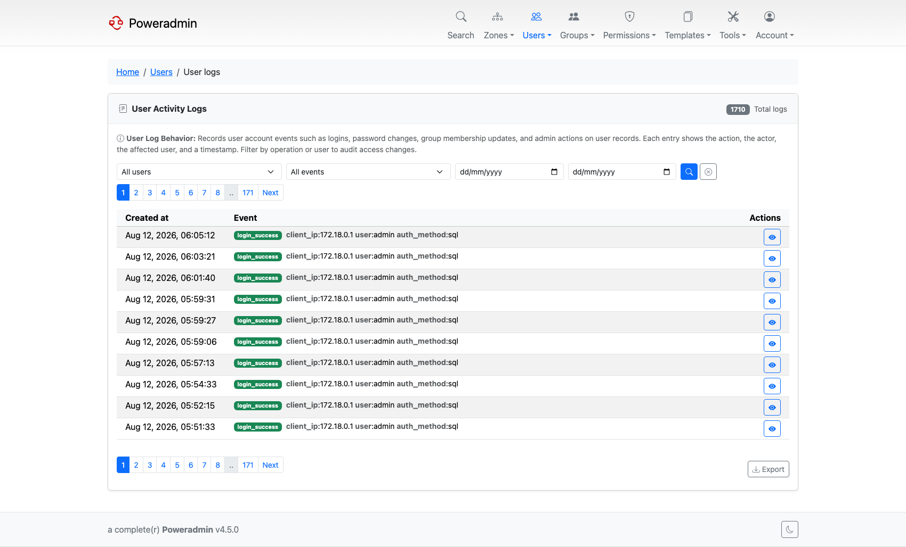
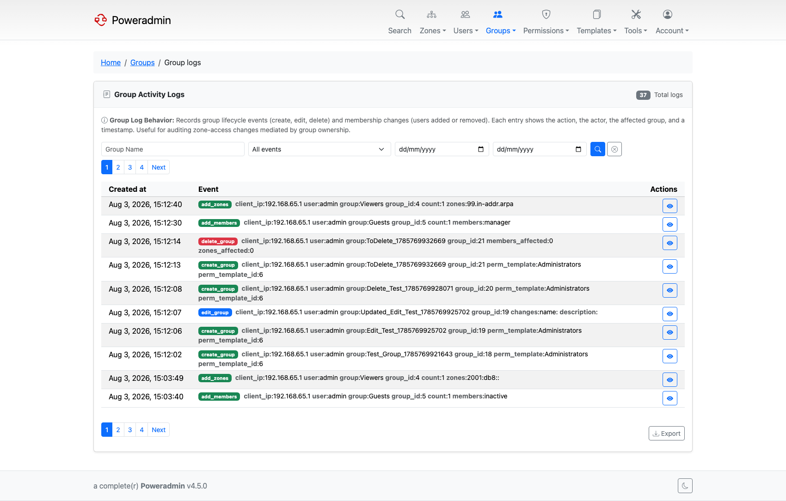

# Database Logging

Poweradmin can log operations to the database for auditing and tracking purposes.

## Overview

Database logging records operations across six log tables:

- **User events** (`log_users`): login/logout, user creation/editing/deletion, MFA, password resets
- **API events** (`log_api`): API key management, plus optional per-request public API audit entries and permission violations (401/403)
- **Zone events** (`log_zones`): zone and record creation, modification, and deletion
- **Group events** (`log_groups`): group creation/editing/deletion, membership and zone assignment changes
- **Record changes** (`log_record_changes`): the structured change log with before/after values per record
- **Changesets** (`log_changesets`): groups the record changes made in a single save, with the optional change comment

## Configuration

| Setting | Default | Description |
|---------|---------|-------------|
| `logging.database_enabled` | false | Enable database logging |
| `logging.api_request_logging` | false | Log every public API request to `log_api` (requires `database_enabled`); permission violations are logged regardless (added in v4.5.0) |
| `logging.api_log_retention_days` | 0 | Days to keep `log_api` rows; 0 = keep forever (added in v4.5.0) |

## Configuration

```php
return [
    'logging' => [
        'database_enabled' => true,
    ],
];
```

Upgrading from v3.x? The equivalent was the flat `$dblog_use` variable. That format was removed in
4.1.0 - see [Legacy Configuration](legacy-configuration.md) for the full variable mapping.

## Docker Configuration

```yaml
environment:
  PA_LOGGING_DATABASE_ENABLED: "true"
```

## Log Tables

### log_users

| Column | Type | Description |
|--------|------|-------------|
| `id` | int | Auto-increment ID |
| `event` | text | Description of the event |
| `priority` | int | Syslog priority level |
| `created_at` | timestamp | When the event occurred |

### log_api

| Column | Type | Description |
|--------|------|-------------|
| `id` | int | Auto-increment ID |
| `event` | text | Description of the event |
| `priority` | int | Syslog priority level |
| `created_at` | timestamp | When the event occurred |

### log_zones

| Column | Type | Description |
|--------|------|-------------|
| `id` | int | Auto-increment ID |
| `zone_id` | int | Affected zone ID |
| `event` | text | Description of the event |
| `priority` | int | Syslog priority level |
| `created_at` | timestamp | When the event occurred |

### log_groups

| Column | Type | Description |
|--------|------|-------------|
| `id` | int | Auto-increment ID |
| `group_id` | int | Affected group ID |
| `event` | text | Description of the event |
| `priority` | int | Syslog priority level |
| `created_at` | timestamp | When the event occurred |

## What Gets Logged

### User Events

- Login and logout (includes `auth_method` - sql, ldap, oidc, saml)
- User creation, editing, and deletion
- MFA enable/disable/verify
- Password changes and resets
- Username recovery

### API Events

- API key creation, editing, and deletion
- API key regeneration and toggling (enable/disable)
- Permission violations (401/403 responses) on the public API - logged whenever `database_enabled` is on
- Per-request public API calls (method, path, status, key id, user, client IP) - only when `api_request_logging` is enabled, since this is high volume

### Zone Events

- Zone creation with initial settings
- Zone type changes (MASTER, NATIVE, SLAVE)
- Zone deletion
- Record creation, modification, and deletion
- DNSSEC sign and unsign events (sign events added in v4.3.2; before that only unsign was recorded)

### Group Events

- Group creation, editing, and deletion
- User membership additions and removals
- Zone assignment additions and removals

## Viewing Logs

Administrators can view logs through the web interface:

- **Users** > **User logs** - user and authentication events
- **Tools** > **API Logs** - API key management, per-request API activity, and permission violations
- **Zones** > **Zone logs** - zone and record events
- **Groups** > **Group logs** - group membership and zone assignment events

Each log page supports filtering by user, event type, and date range, with CSV/JSON export.

From v4.4.0, zone owners can read the audit log for the zones they own (directly or via group ownership) without being administrators. They see only entries for their own zones - the filter is applied server-side. Administrators continue to see everything.

> **Note:** All of these pages need `logging.database_enabled` to be on. Without it the pages
> still exist but nothing is ever written to the log tables, so they stay empty.

### User activity log

`/users/logs`, reached from **Users → User logs**. Readable by administrators or by anyone
holding the `user_logs_view` permission.



Reads the `log_users` table. Filters are a **user dropdown**, an event-type dropdown, and a date
range (`date_from` / `date_to`, both `YYYY-MM-DD`).

Each row shows when the event happened and the event itself, broken into badges. Entries that
predate the structured format are marked `legacy` and shown as stored. **Details** opens the full
entry. An ID column appears when `interface.show_record_id` is on.

Results page by `interface.rows_per_page`, and **Export** writes CSV or JSON honouring whatever
filters are currently applied - not just the visible page.

### Group activity log

`/groups/logs`, reached from **Groups → Group logs**. Readable by administrators or by anyone
holding the `group_logs_view` permission. It additionally requires
`permissions.show_group_access_templates`, which is on by default; with group management disabled
the page reports that instead.



Reads the `log_groups` table, joined to the group so deleted groups drop out of the listing.

The columns, Details modal, pagination and CSV/JSON export match the user log. One difference is
worth knowing: **the group filter is a free-text field, not a dropdown**, so type the group name
rather than picking it from a list.

## Querying Logs

You can query logs directly from the database:

```sql
-- Recent user events
SELECT * FROM log_users
ORDER BY created_at DESC
LIMIT 100;

-- Recent zone events
SELECT * FROM log_zones
ORDER BY created_at DESC
LIMIT 100;

-- Events for a specific zone
SELECT * FROM log_zones
WHERE zone_id = 42
ORDER BY created_at DESC;

-- Recent group events
SELECT * FROM log_groups
ORDER BY created_at DESC
LIMIT 100;

-- Events in date range
SELECT * FROM log_users
WHERE created_at BETWEEN '2025-01-01' AND '2025-01-31';
```

## Log Retention

Database logs can grow large over time. Consider implementing a retention policy:

```sql
-- Delete logs older than 90 days
DELETE FROM log_users WHERE created_at < DATE_SUB(NOW(), INTERVAL 90 DAY);
DELETE FROM log_api WHERE created_at < DATE_SUB(NOW(), INTERVAL 90 DAY);
DELETE FROM log_zones WHERE created_at < DATE_SUB(NOW(), INTERVAL 90 DAY);
DELETE FROM log_groups WHERE created_at < DATE_SUB(NOW(), INTERVAL 90 DAY);
```

You can automate this with a cron job or scheduled task.

The `log_api` table has built-in retention: set `logging.api_log_retention_days` to a positive number of days and Poweradmin prunes older API log rows automatically (opportunistically, during API request logging). Leave it at `0` to keep API logs forever and manage them manually as above. This applies only to `log_api`; the other log tables have no built-in pruning.

## Performance Considerations

1. **Index optimization**: Ensure indexes on `zone_id`, `group_id`, and `created_at` columns
2. **Log rotation**: Implement retention policies for large deployments
3. **Disk space**: Monitor database size, especially with high change volume

## Combining with Syslog

For comprehensive auditing, combine database logging with syslog:

```php
'logging' => [
    'database_enabled' => true,
    'syslog_enabled' => true,
    'syslog_identity' => 'poweradmin',
    'syslog_facility' => LOG_USER,
],
```

This provides both persistent database records and real-time syslog events.

## Related Documentation

- [Logging Setup](logging.md)
- [Security Policies](security-policies.md)
