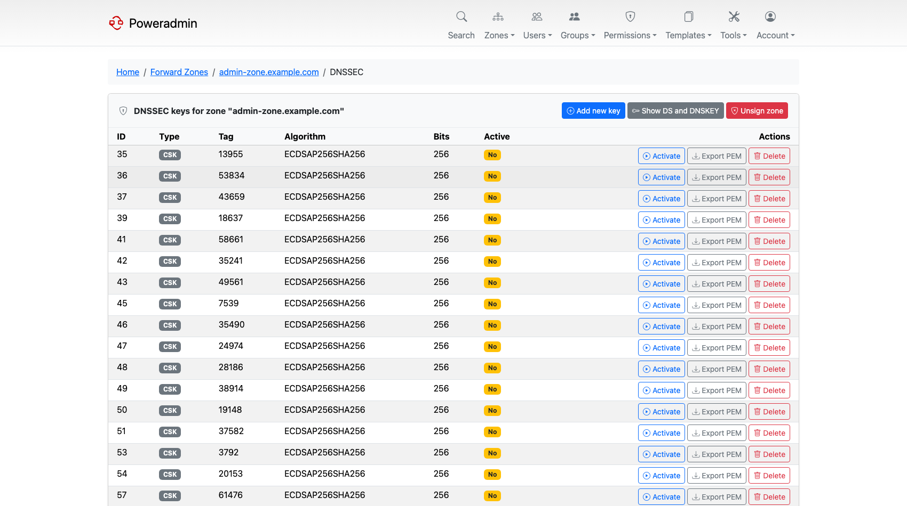

# DNSSEC Configuration

## Overview

Poweradmin provides comprehensive support for DNSSEC (Domain Name System Security Extensions) through a well-structured implementation that follows domain-driven design principles. All DNSSEC operations go through the PowerDNS REST API - there is no command-line code path.

> **Note:** DNSSEC requires a configured PowerDNS API connection. If `pdns_api.url` and `pdns_api.key` are not both set, DNSSEC is inactive no matter what `dnssec.enabled` says.

The DNSSEC implementation enables you to:

- Secure and unsecure zones
- Manage cryptographic keys (create, activate, deactivate, delete)
- View DS (Delegation Signer) and DNSKEY records
- Manage DNSSEC key rollovers

Each zone gets a key management page listing its keys with their type, tag, algorithm and
active state, alongside actions to add, activate, export or delete a key, show the DS and
DNSKEY records, and unsign the zone.



## Basic Concepts

These are PowerDNS's own terms; see the
[DNSSEC introduction](https://doc.powerdns.com/authoritative/dnssec/intro.html) for the full primer.

- **Zone Signing Keys (ZSK)**: Used to sign the actual DNS records
- **Key Signing Keys (KSK)**: Used to sign the ZSK and establish trust
- **DS Records**: Delegation Signer records that help establish the trust chain
- **Key Rotation**: Regular update of keys for enhanced security

## Prerequisites

- PowerDNS version 4.0.0 or higher
- PowerDNS with DNSSEC support
- Proper database configuration
- API access configured (see [PowerDNS API Configuration](./powerdns-api.md))

## Configuration Options

DNSSEC settings are configured in the `config/settings.php` file under the `dnssec` section.

| Setting | Default value | Description | Added in version |
|---------|---------------|-------------|-----------------|
| dnssec.enabled | false | Enable (true) or disable (false) DNSSEC support | 2.1.7 |
| dnssec.debug | false | Enable debug for DNSSEC operations. Has had no effect since the pdnsutil provider was dropped; removed in 4.6.0 | 2.1.9 |

## Enabling DNSSEC

To enable DNSSEC:

1. Configure your PowerDNS server with API access
2. Update your Poweradmin configuration file with the following settings:

    ```php
    return [
        'dnssec' => [
            'enabled' => true,
            'debug' => false,
        ],
        'pdns_api' => [
            'url' => 'http://localhost:8081',
            'key' => 'your-api-key',
        ],
    ];
    ```

Working through the API means:

- No need to configure special permissions for the web server user
- More secure as it doesn't require shell access
- Better error handling and feedback
- Full support for all DNSSEC operations

> **Warning:** Leaving `pdns_api.url` or `pdns_api.key` empty does not fall back to a command-line tool. Poweradmin loads a no-op DNSSEC provider instead, and every DNSSEC action silently does nothing.

## PowerDNS Configuration

DNSSEC processing is enabled per backend, not by a global switch - there is no `dnssec` setting in
`pdns.conf`. Use the setting that matches your backend:

```conf
# MySQL/MariaDB backend
gmysql-dnssec=yes

# PostgreSQL backend: gpgsql-dnssec=yes
# SQLite backend:     gsqlite3-dnssec=yes
# BIND backend:       bind-dnssec-db=/var/lib/powerdns/bind-dnssec.db
# GeoIP backend:      geoip-dnssec-keydir=/var/lib/powerdns/keys
# LMDB backend:       nothing to set, DNSSEC is always available

api=yes
api-key=your_api_key
```

See [gmysql-dnssec](https://doc.powerdns.com/authoritative/backends/generic-mysql.html#setting-gmysql-dnssec),
[gpgsql-dnssec](https://doc.powerdns.com/authoritative/backends/generic-postgresql.html#setting-gpgsql-dnssec)
and [gsqlite3-dnssec](https://doc.powerdns.com/authoritative/backends/generic-sqlite3.html#setting-gsqlite3-dnssec).
Poweradmin reads these settings from the PowerDNS API to decide whether DNSSEC is available, and
since 4.5.0 it also recognises the BIND, GeoIP and LMDB backends.
Your schema must include the DNSSEC tables (`domainmetadata`, `cryptokeys`, `tsigkeys`); see
[Enabling the API](https://doc.powerdns.com/authoritative/http-api/index.html#enabling-the-api)
for the `api` and `api-key` settings.

## Presigned Zones

A zone whose `PRESIGNED` metadata is set is signed somewhere else - typically at a primary that
transfers it in already signed - and PowerDNS serves the existing signatures rather than producing
its own. Poweradmin detects this and refuses key operations on such a zone instead of failing
halfway:

- Signing and unsigning are blocked, with "This zone is presigned; DNSSEC keys are managed at the
  primary server."
- Adding, editing, deleting, importing, exporting and activating keys are blocked the same way.
- The DNSSEC page still renders, so you can read the existing DS and DNSKEY records.

Manage the keys at the server that signs the zone. See
[PRESIGNED](https://doc.powerdns.com/authoritative/domainmetadata.html#metadata-presigned) and
[Pre-signed records](https://doc.powerdns.com/authoritative/dnssec/modes-of-operation.html).

> **Note:** `PRESIGNED` is one of the metadata kinds PowerDNS exposes read-only over the API, so
> Poweradmin can see it but cannot set or clear it. Use `pdnsutil` or the database for that.

## Automatic Rectify

Signed zones must be rectified after their contents change, or the NSEC/NSEC3 chain and the
`ordername` values go stale and resolvers start getting bogus denial-of-existence answers.
Poweradmin calls PowerDNS's rectify endpoint for you after record writes - adding, editing and
deleting single records, batch and bulk record operations, PTR creation, and zone creation from a
template. You do not need to run `pdnsutil rectify-zone` by hand for changes made through
Poweradmin.

Two things to know:

- Rectify goes through the PowerDNS API, so it only happens when `pdns_api.url` and `pdns_api.key`
  are set. Without them Poweradmin loads a no-op DNSSEC provider and rectify silently does nothing,
  along with every other DNSSEC action.
- Changes made outside Poweradmin - direct SQL, another tool - are not rectified by Poweradmin.
  Set the [`API-RECTIFY`](https://doc.powerdns.com/authoritative/domainmetadata.html#metadata-api-rectify)
  metadata on the zone so PowerDNS rectifies after its own API edits, or rectify manually, for
  example with `POST /api/v2/zones/{id}/dnssec/rectify` (4.5.0+).

## Verification

Check DNSSEC status using:

```bash
dig +dnssec example.com SOA
```

## Importing and Exporting Keys

From 4.5.0 the zone's DNSSEC page imports private keys into a zone and exports them back out, so you can move signed zones between servers without dropping out to `pdnsutil`. Both need PowerDNS 4.1 or newer; on older servers, or when version detection could not reach the API, the import form stays hidden.

In 4.4.x the import form took only PEM keys, which the PowerDNS API does not accept, so imports there always failed. Upgrade to 4.5.0 to import keys.

### Importing a Key

Open the zone's DNSSEC page and use the **Import key** form:

1. Pick the key type - **KSK**, **ZSK**, or **CSK**.
2. Pick the algorithm the key was made for. For RSA keys the hash (SHA1, SHA256 or SHA512) cannot be read from the key, so the selection decides it; for ECDSA and EdDSA keys a selection that does not match the key is refused.
3. Paste the private key, either in BIND format (`Private-key-format: v1.x`, as exported here or written by `dnssec-keygen`) or as an unencrypted PEM key: RSA, ECDSA P-256 or P-384, Ed25519 or Ed448, in PKCS#8, PKCS#1 or SEC1 form. A PEM key is converted to the BIND format before it is sent, because that is the only format the PowerDNS API reads. Encrypted PEM keys are refused.
4. Submit.

Imported keys start inactive; activate them from the key list. From 4.6.0, a key whose algorithm is not one offered for new keys on the connected PowerDNS version is refused before it is sent. If PowerDNS rejects the key, an error is shown above the form. Successful imports are recorded in the zone activity log as a key-add event.

Importing requires the `zone_dnssec_manage_own` permission on the zone (ueberusers always pass). This is a separate permission from zone editing: full zone-edit rights without it are refused, and content-edit rights with it are accepted. The same gate applies to export.

### Exporting a Key

Each key row on the DNSSEC page has an **Export** action. It downloads the private key in BIND format as `<zone>-key-<id>.private` (`Content-Type: text/plain`), the same format `dnssec-keygen` writes and the import form takes, so you can copy it into another server or store it offline. The key is never rendered inline in the page. Treat the export the same way you would treat any private key - whoever holds it can sign records for the zone.

### Notes

- Imports and exports go through the PowerDNS API, so a working `pdns_api.url` and `pdns_api.key` are required.
- DS and DNSKEY records on the same page can be copied to clipboard with a single click. This is handy when handing the DS record to a registrar.
- The CSK guidance alert that used to sit on top of every DNSSEC page only appears on legacy pre-4.0 PowerDNS servers now. On 4.x+ the Add key page instead explains how PowerDNS lists key types: a key shows as KSK or ZSK only while the zone has an active KSK and an active ZSK with the same algorithm, otherwise as CSK, even when KSK or ZSK was picked. PowerDNS stores only whether a key is a secure entry point and derives the type on every read.
- Sign and unsign actions are both recorded in the zone activity feed (sign was missing before 4.4.0).

## REST API

From 4.5.0 the v2 API covers the key management of the web pages: signing status, listing keys
with their DNSKEY and DS records, adding keys, activating and deactivating them, deleting them,
and rectifying a signed zone. Changes need `zone_dnssec_manage_own` on the zone, or administrator
rights. From 4.6.0 changing keys also needs view access to the zone, and keys can be imported
with `POST /zones/{id}/dnssec/keys/import`; export is still web-only. See
[API endpoints](../api/endpoints.md#zone-metadata-and-dnssec).

## More Information

For more details on DNSSEC and PowerDNS:

- [PowerDNS DNSSEC Documentation](https://doc.powerdns.com/authoritative/dnssec/index.html)
- [PowerDNS Cryptokey API](https://doc.powerdns.com/authoritative/http-api/cryptokey.html) - the endpoints behind the key import/export above
- [PowerDNS API Documentation](https://doc.powerdns.com/authoritative/http-api/index.html)