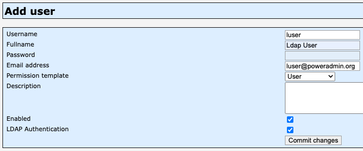
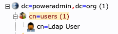

# LDAP Integration

Poweradmin supports LDAP (Lightweight Directory Access Protocol) authentication, allowing you to integrate with your existing directory service such as Active Directory or OpenLDAP.

## Configuration Options

LDAP settings can be configured in the `config/settings.php` file under the `ldap` section or through individual variables in the legacy configuration format.

| Legacy variable | Modern equivalent | Default value | Description | Added in version |
|----------------|-------------------|---------------|-------------|-----------------|
| $ldap_use | ldap.enabled | false | Enable LDAP authentication | 2.1.7 |
| $ldap_debug | ldap.debug | false | Enable debug for LDAP connection | 2.1.7 |
| $ldap_uri | ldap.uri | ldap://domaincontroller.example.com | LDAP server URI | 2.1.7 |
| $ldap_basedn | ldap.base_dn | ou=users,dc=example,dc=com | The top level of the LDAP directory tree | 2.1.7 |
| $ldap_search_filter | ldap.search_filter | no default | Filter for LDAP search | 2.1.7 |
| $ldap_binddn | ldap.bind_dn | cn=admin,dc=example,dc=com | LDAP user for binding | 2.1.7 |
| $ldap_bindpw | ldap.bind_password | some_password | Password for LDAP binding user | 2.1.7 |
| $ldap_user_attribute | ldap.user_attribute | uid | Username attribute used in LDAP search filter | 2.1.7 |
| $ldap_proto | ldap.protocol_version | 3 | LDAP protocol version | 2.1.7 |

## Modern Configuration Example

```php
return [
    'ldap' => [
        'enabled' => true,
        'debug' => false,
        'uri' => 'ldap://domaincontroller.example.com',
        'base_dn' => 'ou=users,dc=example,dc=com',
        'bind_dn' => 'cn=admin,dc=example,dc=com',
        'bind_password' => 'some_password',
        'user_attribute' => 'uid',
        'protocol_version' => 3,
        'search_filter' => '(objectClass=account)',
    ],
];
```

## LDAP Search Filter Examples

The search filter is used to limit which LDAP accounts can authenticate to Poweradmin:

```php
// Only users that are members of the 'powerdns' group
$ldap_search_filter = '(memberOf=cn=powerdns,ou=groups,dc=poweradmin,dc=org)';

// All accounts
$ldap_search_filter = '(objectClass=account)';

// Users that are both persons and members of the 'admins' group
$ldap_search_filter = '(objectClass=person)(memberOf=cn=admins,ou=groups,dc=poweradmin,dc=org)';

// Users with 'admin' in their common name
$ldap_search_filter = '(cn=*admin*)';
```

## Basic Setup

1. Enable LDAP authentication by setting `'enabled' => true` in the configuration array.
2. Configure your LDAP server URI and base DN.
3. Set appropriate search filters based on your directory structure.
4. Set binding credentials if required.
5. Specify the user attribute that matches your directory structure.

## Advanced Configuration

### SSL/TLS Connection

For secure LDAP (LDAPS), use the following configuration:

```php
'uri' => 'ldaps://domaincontroller.example.com',
```

### User Attribute Mapping

Configure how Poweradmin maps LDAP attributes to user properties:

- For OpenLDAP: `'user_attribute' => 'uid'`
- For Active Directory: `'user_attribute' => 'sAMAccountName'`

## Example Directory Configurations

### Active Directory

```php
return [
    'ldap' => [
        'enabled' => true,
        'uri' => 'ldap://ad.company.com',
        'base_dn' => 'DC=company,DC=com',
        'bind_dn' => 'CN=ServiceAccount,OU=Users,DC=company,DC=com',
        'bind_password' => 'password',
        'user_attribute' => 'sAMAccountName',
        'search_filter' => '(&(objectClass=user)(sAMAccountName=%s))',
    ],
];
```

### OpenLDAP

```php
return [
    'ldap' => [
        'enabled' => true,
        'uri' => 'ldap://ldap.company.com',
        'base_dn' => 'ou=users,dc=company,dc=com',
        'bind_dn' => 'cn=admin,dc=company,dc=com',
        'bind_password' => 'password',
        'user_attribute' => 'uid',
        'search_filter' => '(&(objectClass=posixAccount)(uid=%s))',
    ],
];
```

## Troubleshooting

Common LDAP issues and solutions:

- **Connection Failed**: Verify server URI and firewall settings
- **Binding Failed**: Check bind DN and password
- **User Not Found**: Verify search filter and user attribute
- **SSL Certificate Issues**: Ensure proper CA certificates are installed

## Security Considerations

- Always use LDAPS (LDAP over SSL/TLS) in production environments
- Implement least privilege access for binding
- Regularly rotate LDAP binding credentials
- Consider implementing connection timeout settings
- Monitor failed authentication attempts

## Adding Users to Poweradmin

Add a user to Poweradmin:



The same user should exist in the LDAP schema:

