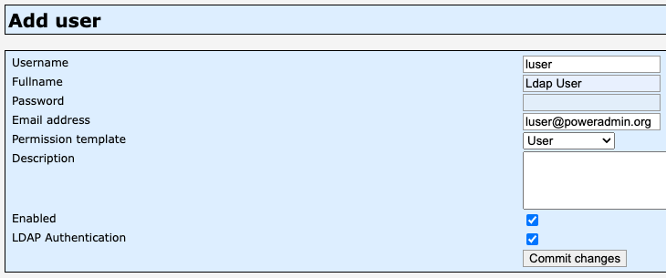
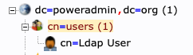

# LDAP Integration

Poweradmin supports LDAP (Lightweight Directory Access Protocol) authentication, allowing you to integrate with your existing directory service such as Active Directory or OpenLDAP.

## Configuration Options

LDAP settings can be configured in the `config/settings.php` file under the `ldap` section or through individual variables in the legacy configuration format.

| Legacy variable | Modern equivalent | Default value | Description | Added in version |
|----------------|-------------------|---------------|-------------|-----------------|
| $ldap_use | ldap.enabled | false | Enable LDAP authentication | 2.1.7 |
| $ldap_debug | ldap.debug | false | Enable debug for LDAP connection | 2.1.7 |
| $ldap_uri | ldap.uri | ldap://domaincontroller.example.com | LDAP server URI | 2.1.7 |
| $ldap_basedn | ldap.base_dn | ou=users,dc=example,dc=com | The top level of the LDAP directory tree | 2.1.7 |
| $ldap_search_filter | ldap.search_filter | no default | Filter for LDAP search | 2.1.7 |
| $ldap_binddn | ldap.bind_dn | cn=admin,dc=example,dc=com | LDAP user for binding | 2.1.7 |
| $ldap_bindpw | ldap.bind_password | some_password | Password for LDAP binding user | 2.1.7 |
| $ldap_user_attribute | ldap.user_attribute | uid | Username attribute used in LDAP search filter | 2.1.7 |
| $ldap_proto | ldap.protocol_version | 3 | LDAP protocol version | 2.1.7 |
| N/A | ldap.session_cache_timeout | 300 | Cache LDAP validation results (seconds, 0 = disabled) | 4.1.0 |
| N/A | ldap.sync_user_info | false | Sync fullname/email from LDAP on every login | 4.5.0 |
| N/A | ldap.fullname_attribute | displayName | LDAP attribute for full name (`displayName` for AD, `cn` for OpenLDAP) | 4.5.0 |
| N/A | ldap.email_attribute | mail | LDAP attribute for email address | 4.5.0 |
| N/A | ldap.auto_provision | false | Create missing users on first successful LDAP login | 4.5.0 |
| N/A | ldap.default_permission_template | Guest | Template for auto-provisioned users when no mapping matches | 4.5.0 |
| N/A | ldap.groups_attribute | memberOf | LDAP attribute holding group memberships | 4.5.0 |
| N/A | ldap.permission_template_mapping | [] | Maps LDAP groups to permission template names | 4.5.0 |
| N/A | ldap.group_mapping | [] | Maps LDAP groups to Poweradmin group(s) | 4.5.0 |

## Modern Configuration Example

```php
return [
    'ldap' => [
        'enabled' => true,
        'debug' => false,
        'uri' => 'ldap://domaincontroller.example.com',
        'base_dn' => 'ou=users,dc=example,dc=com',
        'bind_dn' => 'cn=admin,dc=example,dc=com',
        'bind_password' => 'some_password',
        'user_attribute' => 'uid',
        'protocol_version' => 3,
        'search_filter' => '(objectClass=account)',
        'session_cache_timeout' => 300,  // Cache for 5 minutes (v4.1.0+)
    ],
];
```

## LDAP Search Filter Examples

The search filter is used to limit which LDAP accounts can authenticate to Poweradmin:

```php
// Only users that are members of the 'powerdns' group
$ldap_search_filter = '(memberOf=cn=powerdns,ou=groups,dc=poweradmin,dc=org)';

// All accounts
$ldap_search_filter = '(objectClass=account)';

// Users that are both persons and members of the 'admins' group
$ldap_search_filter = '(objectClass=person)(memberOf=cn=admins,ou=groups,dc=poweradmin,dc=org)';

// Users with 'admin' in their common name
$ldap_search_filter = '(cn=*admin*)';
```

## Basic Setup

1. Enable LDAP authentication by setting `'enabled' => true` in the configuration array.
2. Configure your LDAP server URI and base DN.
3. Set appropriate search filters based on your directory structure.
4. Set binding credentials if required.
5. Specify the user attribute that matches your directory structure.

## Advanced Configuration

### SSL/TLS Connection

For secure LDAP (LDAPS), use the following configuration:

```php
'uri' => 'ldaps://domaincontroller.example.com',
```

### User Attribute Mapping

Configure how Poweradmin maps LDAP attributes to user properties:

- For OpenLDAP: `'user_attribute' => 'uid'`
- For Active Directory: `'user_attribute' => 'sAMAccountName'`

## Example Directory Configurations

### Active Directory

```php
return [
    'ldap' => [
        'enabled' => true,
        'uri' => 'ldap://ad.company.com',
        'base_dn' => 'DC=company,DC=com',
        'bind_dn' => 'CN=ServiceAccount,OU=Users,DC=company,DC=com',
        'bind_password' => 'password',
        'user_attribute' => 'sAMAccountName',
        'search_filter' => '(&(objectClass=user)(sAMAccountName=%s))',
    ],
];
```

### OpenLDAP

```php
return [
    'ldap' => [
        'enabled' => true,
        'uri' => 'ldap://ldap.company.com',
        'base_dn' => 'ou=users,dc=company,dc=com',
        'bind_dn' => 'cn=admin,dc=company,dc=com',
        'bind_password' => 'password',
        'user_attribute' => 'uid',
        'search_filter' => '(&(objectClass=posixAccount)(uid=%s))',
    ],
];
```

## User Info Sync, Auto-Provisioning and Group Mapping (v4.5.0+)

Since 4.5.0, LDAP can drive user identity, permissions and group membership the same way OIDC/SAML do. All features are off by default, preserving the classic "admin pre-creates the account" workflow.

### Syncing name and email

```php
'ldap' => [
    // ...
    'sync_user_info' => true,
    'fullname_attribute' => 'displayName',  // 'cn' for OpenLDAP
    'email_attribute' => 'mail',
],
```

On every (non-cached) login, the user's fullname and email are refreshed from the directory. Empty attributes never blank existing values. With this enabled, the profile fields stay read-only in Poweradmin and the directory is the source of truth.

### Auto-provisioning users

```php
'ldap' => [
    // ...
    'auto_provision' => true,
    'default_permission_template' => 'Guest',
],
```

A user who authenticates successfully against LDAP but has no Poweradmin account gets one created automatically (with `use_ldap` enabled). The permission template comes from `permission_template_mapping` when a group matches, otherwise from `default_permission_template`. Provisioning fails if the username is already taken by a local (non-LDAP) account.

### Mapping LDAP groups

```php
'ldap' => [
    // ...
    'groups_attribute' => 'memberOf',
    'permission_template_mapping' => [
        'dns-admins' => 'Administrator',
        'cn=dns-operators,ou=groups,dc=example,dc=com' => 'Viewer',
    ],
    'group_mapping' => [
        'dns-admins' => 'Administrators',
        'dns-operators' => ['Zone Managers', 'Editors'],  // 1:n mapping
    ],
],
```

Mapping keys match a group value exactly (full DN) or the first RDN value of a DN, so `dns-admins` matches `cn=dns-admins,ou=groups,dc=example,dc=com`. Semantics mirror the [OIDC](oidc.md) settings:

- `permission_template_mapping` assigns **one** permission template per user; the first matching entry wins.
- `group_mapping` assigns **multiple** Poweradmin groups; memberships are re-evaluated (added and removed) on every login.
- A template assigned via mapping is revoked back to `default_permission_template` if the user later matches no mapping; admin-assigned templates are never touched.

> **Note:** `memberOf` requires the overlay to be enabled on OpenLDAP; it is available out of the box on Active Directory. Nested group membership is not expanded.

## Security Considerations

- Always use LDAPS (LDAP over SSL/TLS) in production environments
- Implement least privilege access for binding
- Regularly rotate LDAP binding credentials
- Consider implementing connection timeout settings
- Monitor failed authentication attempts

## Adding Users to Poweradmin

Add a user to Poweradmin:



The same user should exist in the LDAP schema:

