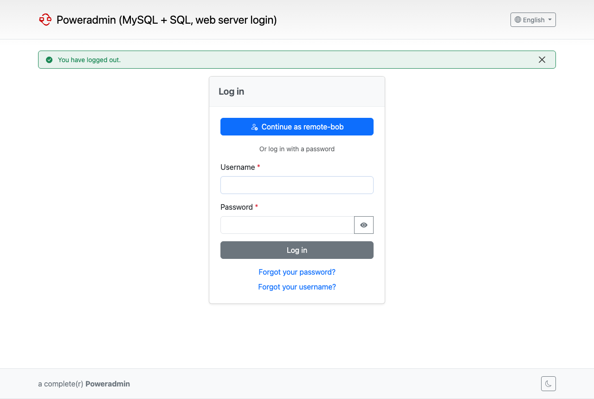

# Web Server Authentication (REMOTE_USER)

Poweradmin can sign users in as the user your web server or an authenticating reverse proxy has already verified. Added in 4.6.0.

## Overview

When `remote_user.enabled` is on, Poweradmin reads the user name from the web server (the `REMOTE_USER` server variable) or from a header set by a trusted proxy. It then starts a session for that user. Nobody types a password into Poweradmin.

Key features:

- Works with any front end that sets `REMOTE_USER`: Apache basic auth, `mod_auth_mellon`, `mod_auth_gssapi`, nginx `auth_basic`
- Header mode for proxies such as Authelia and oauth2-proxy, accepted only from addresses you list
- Optional email, full name and group attributes from the same source
- Automatic account creation, with group mapping to permission templates and groups as for [SAML](saml.md)
- Per-account opt-in: only accounts set to "web server" sign-in are signed in this way
- Works with MFA, idle timeout and the disabled-account check

## Requirements and Security

Poweradmin believes whatever the web server tells it. Anyone who can reach PHP without going through the authenticating server can be any user.

- Enable the feature only when PHP cannot be reached except through the authenticating server or proxy. Do not publish the PHP-FPM port or the container port directly.
- The server variable must be set by the web server itself. Names starting with `HTTP_` or `PHP_AUTH_` (and Apache's `REDIRECT_` copies of them) are refused, because a client can set them.
- A proxy header is believed only when the request comes from an address in `remote_user.trusted_proxies`. The list is explicit and nothing is trusted implicitly. Addresses are compared as PHP sees them, so `::ffff:10.0.0.5` does not match `10.0.0.5`.
- The proxy must overwrite the header on every request, not append to it.
- Exclude `/api/v2` from the web server's authentication. API v2 uses API keys (or Basic auth) as before and is not affected by this feature.
- `/api/internal` must stay protected like the rest of the web interface.

### nginx

nginx fills `$remote_user` from any client's `Authorization` header, whether or not the password was checked. Pass `REMOTE_USER` to PHP only in locations protected by `auth_basic`.

This pattern comes from the Poweradmin devcontainer. `auth_basic` covers the whole site and hands the checked user to PHP. `/api/v2/` is exempted in a prefix `location`, which nginx matches on the normalised path, so `/api/v2/../index.php` cannot slip past `auth_basic`. Do not key the exemption on `$request_uri`, which is not normalised.

```nginx
server {
    auth_basic "Poweradmin";
    auth_basic_user_file /etc/nginx/htpasswd;

    # API v2 uses its own keys; the user is blanked where auth_basic is off
    location ^~ /api/v2/ {
        auth_basic off;
        fastcgi_pass unix:/run/php/php-fpm.sock;
        include fastcgi_params;
        fastcgi_param SCRIPT_FILENAME $document_root/index.php;
        fastcgi_param SCRIPT_NAME /index.php;
        fastcgi_param REMOTE_USER "";
    }

    location / {
        try_files $uri $uri/ /index.php$is_args$args;
    }

    location ~ \.php$ {
        fastcgi_pass unix:/run/php/php-fpm.sock;
        include fastcgi_params;
        fastcgi_param SCRIPT_FILENAME $document_root$fastcgi_script_name;
        fastcgi_param REMOTE_USER $remote_user;
    }
}
```

With `auth_request` (oauth2-proxy, Authelia) use [header mode](#authelia-and-oauth2-proxy-header-mode) instead.

### Apache

`Require valid-user`, `mod_auth_mellon` and `mod_auth_gssapi` set `REMOTE_USER` natively. No extra step is needed.

## Settings

Settings live in `config/settings.php` under the `remote_user` section.

| Setting | Default | Description |
|---------|---------|-------------|
| `remote_user.enabled` | false | Sign users in from the web server's authenticated user |
| `remote_user.server_variable` | "REMOTE_USER" | Server variable holding the user name. `HTTP_*` and `PHP_AUTH_*` names are refused |
| `remote_user.header` | "" | Read the user from this proxy header instead (for example `Remote-User`). Empty means use `server_variable` |
| `remote_user.trusted_proxies` | [] | Proxy IPs or CIDRs allowed to send `header`. Empty means the header is ignored |
| `remote_user.strip_realm` | false | Turn `user@REALM` and `DOMAIN\user` into `user`. Use with a single realm only: `alice@A` and `alice@B` become the same account |
| `remote_user.email_attribute` | "" | Variable (or header, in header mode) holding the email address, for example `Remote-Email` |
| `remote_user.name_attribute` | "" | Variable (or header) holding the full name, for example `Remote-Name` |
| `remote_user.groups_attribute` | "" | Variable (or header) holding the groups, for example `Remote-Groups` |
| `remote_user.groups_separator` | "," | Separator between groups in `groups_attribute` |
| `remote_user.logout_url` | "" | Where to send users after logout, to end the web server's own session. Empty means the Poweradmin login page. Must be an http or https URL |
| `remote_user.hide_login_form` | false | Hide the password form while the web server signs someone in |
| `remote_user.auto_provision` | true | Create an account on first sign-in |
| `remote_user.allow_superuser_provisioning` | false | Let mappings grant `user_is_ueberuser` |
| `remote_user.sync_user_info` | true | Update name and email from the attributes on each sign-in |
| `remote_user.default_permission_template` | "Guest" | Permission template for new accounts (no permissions until an admin assigns a role) |
| `remote_user.permission_template_mapping` | [] | Group to permission template name, as for `saml` |
| `remote_user.group_mapping` | [] | Group to Poweradmin group name, or a list of names, as for `saml` |

Names read from the source are limited to 64 characters and may not contain whitespace or control characters. Such a name is ignored and logged.

## How Accounts Are Matched

Poweradmin looks up the account by user name. Only accounts whose sign-in method is **web server** are signed in this way.

- A local (SQL), LDAP, OIDC or SAML account with the same name is refused. It is never taken over.
- Email is not used to link accounts.
- With `auto_provision` on, an unknown user gets a new account with `default_permission_template` (Guest by default), or the templates and groups picked by the mappings.
- With `auto_provision` off, the user must already have an account set to web server sign-in.
- Superuser rights are never granted from the web server unless `allow_superuser_provisioning` is `true`. Otherwise an administrator grants them in Poweradmin. See [Superuser rights are never provisioned from an identity provider](saml.md#superuser-rights-are-never-provisioned-from-an-identity-provider) for the reasoning.

Groups from `groups_attribute` feed `permission_template_mapping` and `group_mapping` the same way as for [SAML](saml.md#permission-template-mapping).

### Converting existing accounts

An administrator can switch an account to web server sign-in:

1. Open the account on the Add user or Edit user page.
2. Tick **Web server authentication**. The checkbox appears only when `remote_user.enabled` is on.
3. Save.

Changing another account's sign-in method needs the right to change other users' passwords (`user_passwd_edit_others`), because it hands the account to whoever holds that name on the web server. The same now applies to the LDAP box. Turning it on disables the account's local password. Turning it off again requires setting a new password. The box cannot be combined with the LDAP box, and it is hidden on a superuser's own profile, as the LDAP box is. The users list shows a **Web server** badge for these accounts.

## Sessions

- The session starts automatically on the first page. There is no login step.
- It ends when the web server stops sending the user. When it sends a different user, that user's own session replaces it.
- The idle timeout is renewed while the web server still sends the same user.
- A disabled account is refused, and its open session ends.
- Users with MFA enabled verify the second factor after sign-in. `security.mfa.skip_for_external_auth` applies as it does for LDAP and SSO.

### Login page



When the web server sends a user, the login page shows a **Continue as <user>** button. With `hide_login_form` on, the password form is hidden only while a web server user is present. Posted passwords still work, so a broken proxy cannot lock administrators out.

### Logout

Logging out marks the session as signed out, so the user is not signed straight back in. The login page then offers **Continue as <user>**.

Set `logout_url` to send users to the proxy's logout endpoint instead, which ends the proxy's own session too. Examples:

- Authelia: `https://auth.example.com/logout`
- oauth2-proxy: `https://dns.example.com/oauth2/sign_out`
- mod_auth_mellon: `https://dns.example.com/mellon/logout`

## Examples

### Apache basic auth

```apache
<Location />
    AuthType Basic
    AuthName "Poweradmin"
    AuthUserFile /etc/apache2/htpasswd
    Require valid-user
</Location>

# API v2 uses API keys
<Location /api/v2>
    Require all granted
</Location>
```

```php
'remote_user' => [
    'enabled' => true,
],
```

### Apache with mod_auth_mellon

`mod_auth_mellon` sets `REMOTE_USER` and exposes SAML attributes as `MELLON_*` variables. The attribute names depend on your identity provider.

```php
'remote_user' => [
    'enabled' => true,
    'email_attribute' => 'MELLON_mail',
    'name_attribute' => 'MELLON_cn',
    'groups_attribute' => 'MELLON_groups',
    'groups_separator' => ';',
    'logout_url' => 'https://dns.example.com/mellon/logout',
],
```

### nginx auth_basic

Use the nginx configuration shown under [Requirements and Security](#nginx), with:

```php
'remote_user' => [
    'enabled' => true,
],
```

### Authelia and oauth2-proxy (header mode)

Behind `auth_request`, the proxy sets headers such as `Remote-User`. Use header mode and list the proxy's address.

```php
'remote_user' => [
    'enabled' => true,
    'header' => 'Remote-User',
    'trusted_proxies' => ['172.20.0.5'],
    'email_attribute' => 'Remote-Email',
    'name_attribute' => 'Remote-Name',
    'groups_attribute' => 'Remote-Groups',
    'permission_template_mapping' => [
        'dns-admins' => 'Administrator',
    ],
    'logout_url' => 'https://auth.example.com/logout',
],
```

The proxy must overwrite the headers. With nginx, copy the values from the auth response and set them with `proxy_set_header`, which replaces anything the client sent:

```nginx
auth_request /authelia;
auth_request_set $pa_user   $upstream_http_remote_user;
auth_request_set $pa_email  $upstream_http_remote_email;
auth_request_set $pa_name   $upstream_http_remote_name;
auth_request_set $pa_groups $upstream_http_remote_groups;

proxy_set_header Remote-User   $pa_user;
proxy_set_header Remote-Email  $pa_email;
proxy_set_header Remote-Name   $pa_name;
proxy_set_header Remote-Groups $pa_groups;
```

oauth2-proxy uses different header names (for example `X-Forwarded-User`). Set `header` and the attribute settings to the names your proxy sends.

## Docker

The image's Caddy server does not authenticate users itself, so in Docker this is normally used in header mode behind an authenticating proxy. Set the `PA_REMOTE_USER_*` variables. See [Docker installation](../installation/docker.md#web-server-authentication-remote_user) for the full list.

## Troubleshooting

### Nobody is signed in and the login page shows

- Check that `remote_user.enabled` is on.
- In header mode, check that the proxy address, as PHP sees it, is in `trusted_proxies`. With debug logging you will see:

    ```
    Ignoring the remote_user header from 10.0.0.5, which is not in remote_user.trusted_proxies
    ```

    Behind a Docker network the address is the proxy container's address. IPv4-mapped IPv6 (`::ffff:10.0.0.5`) does not match `10.0.0.5`.

- Check that the web server really sets the variable. Names starting with `HTTP_` or `PHP_AUTH_` are refused, with this log line:

    ```
    Ignoring remote_user variable HTTP_X_USER: the client can set it, configure remote_user.header for a proxy header instead
    ```

- A user name with spaces, control characters or more than 64 characters is ignored: `Ignoring unusable remote_user name ...`

### User is refused and no account is created

```
Cannot auto-provision REMOTE_USER user alice: username is taken by another account
```

An account with that name already exists and its sign-in method is not web server. Either switch that account to web server sign-in (see [Converting existing accounts](#converting-existing-accounts)) or rename it. Web server sign-in never takes over an existing account.

```
Default permission template Guest not found in database; refusing to provision user.
```

`remote_user.default_permission_template` must name a template that exists. A new user who matches no mapping is refused rather than given an arbitrary template.

### The user is signed back in after logout

Without `logout_url`, the web server still sends the user, so Poweradmin offers **Continue as <user>** on the login page. Set `logout_url` to the proxy's logout endpoint to end its session as well.

### API calls fail

Exclude `/api/v2` from the web server's authentication. API v2 does not use this feature.

## Related Documentation

- [SAML Authentication](saml.md)
- [OIDC Authentication](oidc.md)
- [LDAP Integration](ldap.md)
- [Security Policies](security-policies.md)
