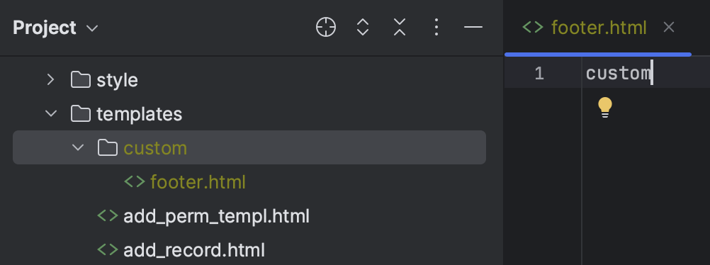
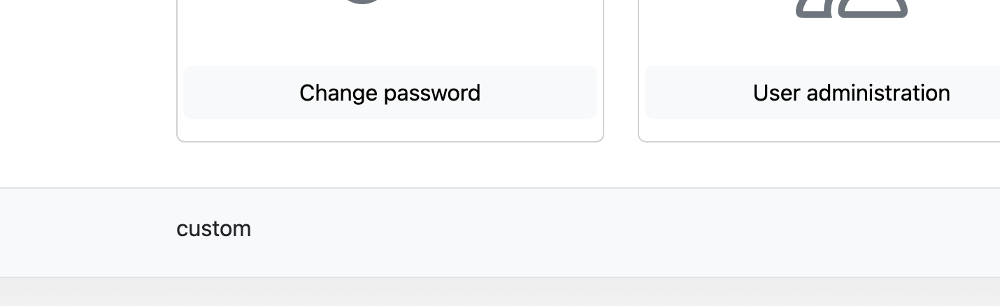

# Layout Customization

Poweradmin allows you to customize various layout aspects to better fit your workflow. These settings are configured in the `settings.php` file under the `interface` section.

## Customizing Header and Footer

Poweradmin supports custom header and footer templates through the theme system.

### Configuration

First, configure your theme settings in `settings.php`:

```php
return [
    'interface' => [
        'theme' => 'custom',  // Set to 'custom' to use your custom templates
        'style' => 'light',   // Options: 'light', 'dark'
        'theme_base_path' => 'templates', // Base path for theme templates
        'title' => 'DNS Server 1', // Custom title to distinguish multiple server instances
    ],
];
```

**Tip**: If you manage multiple DNS servers, customize the `title` setting to easily distinguish between them. For example, use server names like "Production DNS", "ns1.example.com", or "DNS Server - East Coast" to quickly identify which server you're managing.

### Creating Custom Templates

1. Create a directory structure for your custom theme:

    ```
    templates/
    └── custom/
        ├── header.html
        ├── footer.html
        └── other template files...
    ```

2. Create the following files:

#### Custom Header (templates/custom/header.html)

```html
<!-- Your custom header content goes here -->

<span class="fs-4">Your Custom Title</span>
```

#### Custom Footer (templates/custom/footer.html)

```html
<!-- Your custom footer content goes here -->
<p>© 2025 Your Organization - Powered by <strong>Poweradmin</strong></p>
```

Here are examples of custom templates in action:

#### Custom Header File Structure


#### Custom Footer Example


### Template Variables

The following template variables are available in your custom templates:

#### Header Template Variables

- `{{ iface_title }}` - Application title from configuration settings (appears in browser tab and header)
- `{{ iface_style }}` - Current theme style (light or dark)
- `{{ file_version }}` - File version timestamp for cache busting

#### Footer Template Variables

- `{{ version }}` - Poweradmin version
- `{{ iface_style }}` - Current theme style
- `{{ file_version }}` - File version timestamp for cache busting

### Examples

#### Corporate Branding Header

```html

<span class="fs-4 ms-2">Corporate DNS Management Portal</span>
```

#### Extended Footer with Links

```html
<div class="d-flex flex-column">
  <p class="mb-1">© 2025 Your Organization - DNS Management</p>
  <p class="mb-0 small">
    <a href="https://support.example.com" class="text-decoration-none">Support</a> |
    <a href="https://docs.example.com" class="text-decoration-none">Documentation</a> |
    <a href="mailto:dns-admin@example.com" class="text-decoration-none">Contact</a>
  </p>
</div>
```

## UI Element Positioning

### Form Element Positioning

Control the positioning of key UI elements:

- **position_record_form_top**: Place the "Add record" form at the top of the page. Default: `false`
- **position_save_button_top**: Place the "Save changes" button at the top of the page. Default: `false`

```php
return [
    'interface' => [
        'position_record_form_top' => true,
        'position_save_button_top' => true,
    ],
];
```

### Content Display Options

Configure which information is displayed in the user interface:

- **show_record_id**: Show record ID column in edit mode. Default: `true`
- **show_zone_comments**: Show zone comments. Default: `true`
- **show_record_comments**: Show record comments. Default: `false`
- **display_serial_in_zone_list**: Show serial number in zone list. Default: `false`
- **display_template_in_zone_list**: Show template information in zone list. Default: `false`

```php
return [
    'interface' => [
        'show_record_id' => true,
        'show_zone_comments' => true,
        'show_record_comments' => true,
        'display_serial_in_zone_list' => true,
    ],
];
```

## Display Mode

Configure how the main index page displays information:

- **index_display**: Choose between card view or list view. Options: `cards`, `list`. Default: `cards`

```php
return [
    'interface' => [
        'index_display' => 'list',
    ],
];
```

## Pagination

Control how many items appear per page:

- **rows_per_page**: Number of items displayed per page. Default: `10`

```php
return [
    'interface' => [
        'rows_per_page' => 20,
    ],
];
```

## Zone Editing Features

Enable or disable special editing features:

- **add_reverse_record**: Add the checkbox option to create PTR records from A/AAAA record view. Default: `true`
- **add_domain_record**: Add the checkbox option to create A/AAAA records from PTR record view. Default: `true`

```php
return [
    'interface' => [
        'add_reverse_record' => true,
        'add_domain_record' => true,
    ],
];
```

## Notes

- The custom templates use a simple templating system
- Changes may be overwritten during updates - keep backups of your custom files
- You can include custom JavaScript in your header/footer templates if needed