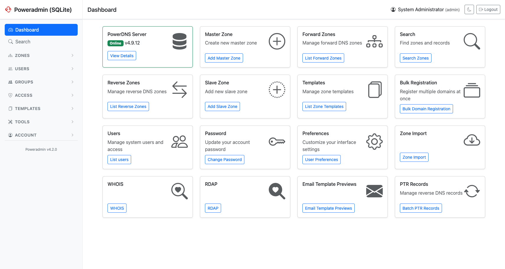
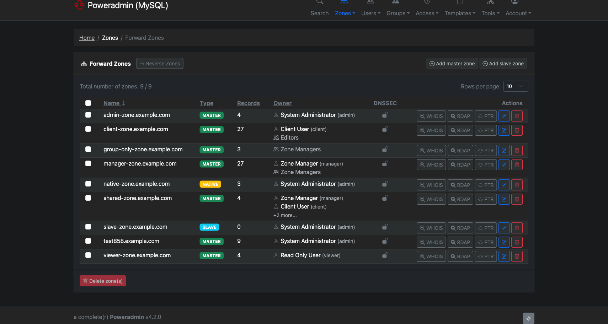

# Themes

Poweradmin includes built-in themes that can be selected through the configuration file to change the application's visual appearance.

## Available Themes

Poweradmin ships two complete themes:

- **default**: The standard theme, with navigation across the top of the page.
- **modern** *(since v4.1.0)*: A Bootstrap 5 layout with a collapsible sidebar instead of a
  top bar, tuned for smaller screens. It carries the same set of templates as `default` and
  is kept in sync with it, so every page exists in both.

A third value, **custom**, points Poweradmin at your own template directory - see
[Creating Custom Themes](#creating-custom-themes) below.

Both shipped themes support the light and dark styles, and both can be restyled without
forking through [Custom CSS](custom-css.md).

## Theme Configuration

Configure your preferred theme in the `settings.php` file under the `interface` section:

```php
return [
    'interface' => [
        'theme' => 'default',  // Options: 'default', 'modern', 'custom'
        'style' => 'light',    // Options: 'light', 'dark'
        'theme_base_path' => 'templates', // Base path for theme templates
    ],
];
```

> **Note:** The theme sets the layout. The style (light or dark) is a separate setting, and
> users can override it for themselves from the toggle in the page footer.

## Theme Screenshots

### Light Style


### Dark Style


## Theme Components

Each theme includes consistent styling for:

- Navigation menus
- Form elements
- Buttons and controls
- Tables and data views
- Modals and dialogs
- Notifications and alerts

## Creating Custom Themes

Poweradmin supports custom themes through the theme templates system. To create a custom theme:

1. Set the theme to `custom` in your settings
2. Create a directory structure in your theme base path (see below)
3. Customize the template files to match your organization's branding

    ```
    templates/
    └── custom/
        ├── header.html
        ├── footer.html
        └── other template files...
    ```

## Theme Customization

For more information on customizing themes, see:

- [Custom UI Layout](./layout.md) (includes custom header and footer setup)
- [Custom CSS](./custom-css.md) (for additional style customization)