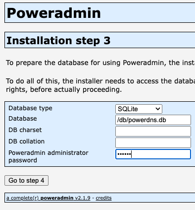
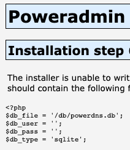

# SQLite Configuration Guide for PowerAdmin

## Overview

This guide explains how to configure PowerAdmin to use SQLite as your database backend.

## Requirements

- PHP with PDO SQLite extension enabled
- Write permissions on the directory where the SQLite database will be stored

## Configuration Steps

1. Create a configuration file at `/config/settings.php` based on the example below:

```php
<?php
/**
 * PowerAdmin SQLite Configuration
 */
return [
    /**
     * Database Settings
     */
    'database' => [
        'type' => 'sqlite',           // Set database type to SQLite
        'file' => '/path/to/your/poweradmin.sqlite',  // Absolute path to SQLite database file
        'host' => '',                 // Not used for SQLite
        'port' => '',                 // Not used for SQLite
        'user' => '',                 // Not used for SQLite
        'password' => '',             // Not used for SQLite
        'name' => '',                 // Not used for SQLite
        'charset' => 'utf8',          // Character set
        'debug' => false,             // Set to true to debug SQL queries
    ],
    
    // Other configuration sections remain the same as in settings.defaults.php
];
```

2. Ensure the directory containing the SQLite database file has appropriate permissions:
    - The web server user (e.g., www-data, apache, nginx) needs read/write access to both the directory and database
      file

3. Initialize your database structure using the appropriate SQL file:
    - Use `sql/poweradmin-sqlite-db-structure.sql` for a new installation
    - For upgrades, use the appropriate upgrade script from the `sql/` directory

## Database Initialization

You have two options to initialize a new SQLite database:

### Option 1: Manual Setup

```bash
# Create the database file
touch /path/to/your/poweradmin.sqlite

# Set proper permissions
chmod 664 /path/to/your/poweradmin.sqlite
chown www-data:www-data /path/to/your/poweradmin.sqlite  # Replace with your web server user

# Import the schema
sqlite3 /path/to/your/poweradmin.sqlite < /path/to/poweradmin/sql/poweradmin-sqlite-db-structure.sql
```

### Option 2: Using the Automated Script

You can use the provided script from the PowerAdmin repository:
https://github.com/poweradmin/poweradmin-scripts/blob/master/create_sqlite_db.sh

### Running the Installer

After creating your SQLite database, run the PowerAdmin installer and select SQLite as the database type, then provide
the full path to your database file:



When the installation is complete, copy the generated configuration to inc.config.php:



## Performance Considerations

- Enable SQLite's WAL (Write-Ahead Logging) mode for better concurrency:
  ```php
  // Can be added to your application initialization code
  $pdo->exec('PRAGMA journal_mode=WAL;');
  ```

- Regularly perform VACUUM operations to optimize database size:
  ```sql
  VACUUM;
  ```

- For larger deployments, consider using MySQL or PostgreSQL instead

## Troubleshooting

- Check file permissions if you encounter "unable to open database file" errors
- Verify that the PHP PDO SQLite extension is enabled with `php -m | grep pdo_sqlite`
- Ensure the path to the SQLite file is absolute and accessible to the web server user
- Check PHP error logs for detailed error messages
