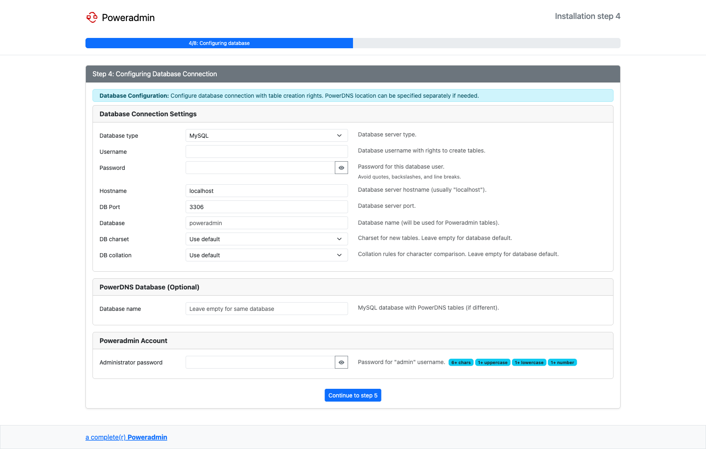
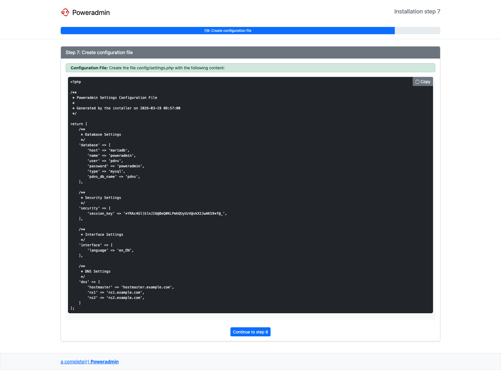

# SQLite Configuration Guide for Poweradmin

## Overview

This guide explains how to configure Poweradmin to use SQLite as your database backend.

## Requirements

- PHP with PDO SQLite extension enabled
- Write permissions on the directory where the SQLite database will be stored

## Configuration Steps

1. Create a configuration file at `/config/settings.php` based on the example below:

    ```php
    <?php
    /**
     * Poweradmin SQLite Configuration
     */
    return [
        /**
         * Database Settings
         */
        'database' => [
            'type' => 'sqlite',           // Set database type to SQLite
            'file' => '/path/to/your/poweradmin.sqlite',  // Absolute path to SQLite database file
            'host' => '',                 // Not used for SQLite
            'port' => '',                 // Not used for SQLite
            'user' => '',                 // Not used for SQLite
            'password' => '',             // Not used for SQLite
            'name' => '',                 // Not used for SQLite
            'charset' => 'utf8',          // Character set
            'debug' => false,             // Set to true to debug SQL queries
        ],
    
        // Other configuration sections remain the same as in settings.defaults.php
    ];
    ```

2. Ensure the directory containing the SQLite database file has appropriate permissions:
    - The web server user (e.g., www-data, apache, nginx) needs read/write access to both the directory and database
      file

3. Initialize your database structure using the appropriate SQL file:
    - Use `sql/poweradmin-sqlite-db-structure.sql` for a new installation
    - For upgrades, use the appropriate upgrade script from the `sql/` directory

## Database Initialization

You have two options to initialize a new SQLite database:

### Option 1: Manual Setup

```bash
# Create the database file
touch /path/to/your/poweradmin.sqlite

# Set proper permissions
chmod 664 /path/to/your/poweradmin.sqlite
chown www-data:www-data /path/to/your/poweradmin.sqlite  # Replace with your web server user

# Import the schema
sqlite3 /path/to/your/poweradmin.sqlite < /path/to/poweradmin/sql/poweradmin-sqlite-db-structure.sql
```

### Option 2: Using the Automated Script

You can use the provided script from the Poweradmin repository:
https://github.com/poweradmin/poweradmin-scripts/blob/master/create_sqlite_db.sh

### Running the Installer

After creating your SQLite database, run the Poweradmin installer and select SQLite as the database type in step 4, then provide the full path to your database file:



When the installation is complete, the installer will generate the configuration file content. Create the `config/settings.php` file with the provided content:



## Write-ahead logging

From 4.6.0 Poweradmin opens SQLite in WAL mode. PowerDNS reads the same file
Poweradmin writes, and in SQLite's default rollback journal a reader blocks a
writer outright, so a zone save could fail with `database is locked`. WAL lets a
reader and a writer work at the same time. Recent PowerDNS already opens its own
connection in WAL by default, so many databases are in this mode already.

The switch happens on connect and is a one-off: WAL is a property of the file,
not of the connection. If the file or its directory is not writable, or another
connection is mid-read at that moment, Poweradmin keeps the existing journal mode
and carries on rather than failing to start.

### Backups

WAL keeps recently written pages in a `poweradmin.sqlite-wal` file next to the
database, and a long-lived PowerDNS connection means that file is never fully
folded back in. Copying the `.sqlite` file alone can therefore miss the most
recent commits. Back up with:

```bash
sqlite3 /path/to/your/poweradmin.sqlite ".backup '/path/to/backup.sqlite'"
```

or stop both services and copy the `.sqlite`, `-wal` and `-shm` files together.

### Network filesystems

Do not run a WAL database from NFS, SMB or any other network filesystem. WAL
coordinates readers and writers through shared memory, which those filesystems do
not provide reliably, and SQLite cannot detect them, so the switch appears to
succeed. Keep the database on local storage, or force the old journal mode:

```bash
sqlite3 /path/to/your/poweradmin.sqlite "PRAGMA journal_mode = DELETE;"
```

### Serving the database over the web

Keep the database outside the web root. If it must live inside, note that the
bundled `.htaccess`, Dockerfile and devcontainer web server configuration deny
`-wal` and `-shm` alongside the database file itself. A custom web server
configuration needs the same patterns, because the `-wal` file holds recently
written rows.
