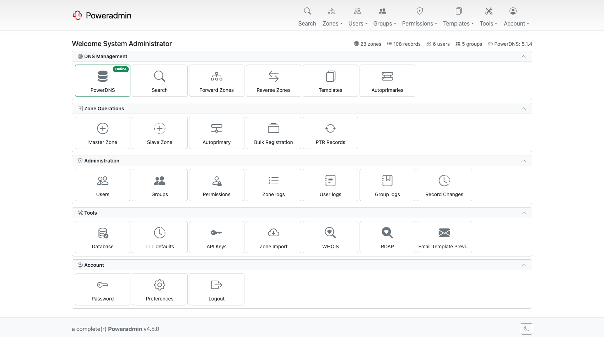

# Poweradmin Features

A catalogue of what Poweradmin does, grouped by area. Each entry is marked with the release
that introduced it, so you can tell at a glance whether your installation has it. For what a
particular release added, see [What's New](../whats-new/index.md).

Features without a version marker have been present since 3.x or earlier.

## Zone and record management

| Feature | Since | More |
|---|---|---|
| Master, Native and Slave zones | | [Zone Management](../user-guide/zones.md) |
| Supermasters for automatic slave provisioning | | [Users and Roles](../user-guide/users-roles.md) |
| Validation for A, AAAA, CNAME, HINFO, MX, NS, PTR, SOA, SRV, TXT and more | | [Record Type Customization](../configuration/record-types.md) |
| IPv6 throughout | | [Reverse DNS](../user-guide/reverse-dns.md) |
| Configurable record type lists, separately for forward and reverse zones | 4.0.0 | [Record Type Customization](../configuration/record-types.md) |
| Separate reverse zone list with natural or hierarchical sorting | 4.0.0 | [Reverse DNS](../user-guide/reverse-dns.md) |
| Editable supermasters | 4.0.0 | [Users and Roles](../user-guide/users-roles.md) |
| Disabled records | 4.1.0 | [Zone Management](../user-guide/zones.md) |
| Custom TLD whitelist for internal names | 4.1.0 | [DNS Settings](../configuration/dns-settings.md) |
| RFC 2317 classless reverse delegation | 4.1.0 | [Reverse DNS](../user-guide/reverse-dns.md) |
| Per-record comments | 4.2.0 | [Zone Management](../user-guide/zones.md) |
| IDN and punycode support for record names and content | 4.2.1 | [Zone Management](../user-guide/zones.md) |
| Zone metadata editor for PowerDNS `domainmetadata` | 4.3.0 | [Zone Metadata](../user-guide/zones.md#zone-metadata) |
| Zone health markers for disabled zones and missing SOA | 4.4.0 | [Zone Management](../user-guide/zones.md) |
| Zone ownership modes: users only, groups only, or both | 4.4.0 | [DNS Settings](../configuration/dns-settings.md) |
| Pinned record types at the top of every selector | 4.4.0 | [Record Type Customization](../configuration/record-types.md) |
| IP-aware search | 4.4.0 | [Zone Management](../user-guide/zones.md) |
| Views and networks for split-horizon DNS | 4.4.0 | [Views and Networks](../user-guide/views-networks.md) |
| Per-record-type default TTLs | 4.5.0 | [Reverse DNS](../user-guide/reverse-dns.md#per-record-type-default-ttls-450) |
| Read-only replicated zones with a Read-only badge | 4.5.0 | [Zone Management](../user-guide/zones.md) |
| Zone overlap guard on creation | 4.5.0 | [DNS Settings](../configuration/dns-settings.md) |
| Secondary zone import over AXFR | 4.5.0 | [Secondary Zone Import](../user-guide/secondary-zone-import.md) |
| Serial policies: per-zone SOA-EDIT and signed serial display | 4.5.0 | [DNS Settings](../configuration/dns-settings.md) |

## Bulk operations and templates

| Feature | Since | More |
|---|---|---|
| DNS record templates with placeholder substitution | | [DNS Templates](../user-guide/dns-templates.md) |
| Bulk record add, bulk delete and batch PTR creation | 4.0.0 | [Bulk Operations](../user-guide/bulk-operations.md) |
| CSV export of a zone's records | 4.0.0 | [Zone Import/Export](../configuration/zone-import-export.md) |
| Zones-per-template page with unlink | 4.0.0 | [DNS Templates](../user-guide/dns-templates.md) |
| DNS record wizards for DMARC, SPF, DKIM, CAA, TLSA and SRV | 4.1.0 | [DNS Wizards](../configuration/dns-wizards.md) |
| BIND zone file import and export, including merge into an existing zone | 4.2.0 | [Zone Import/Export](../configuration/zone-import-export.md) |
| Save an existing zone as a template | 4.2.0 | [DNS Templates](../user-guide/dns-templates.md) |
| Selective template updates instead of full replacement | 4.3.0 | [DNS Templates](../user-guide/dns-templates.md) |
| Default zone template pre-selected on the add-zone forms | 4.4.0 | [DNS Templates](../user-guide/dns-templates.md) |
| SOA serial placeholders in templates | 4.5.0 | [DNS Templates](../user-guide/dns-templates.md) |

## DNSSEC

| Feature | Since | More |
|---|---|---|
| DNSSEC configuration and key management | | [DNSSEC](../configuration/dnssec.md) |
| Pre-flight zone validation before signing | 4.1.0 | [DNSSEC](../configuration/dnssec.md) |
| PEM private key import and export, PowerDNS 4.7+ | 4.4.0 | [DNSSEC](../configuration/dnssec.md) |
| Copy DS and DNSKEY records to the clipboard | 4.4.0 | [DNSSEC](../configuration/dnssec.md) |
| Presigned zone awareness | 4.5.0 | [DNSSEC](../configuration/dnssec.md) |
| Delegated key management through `zone_dnssec_manage_own` | 4.5.0 | [Permissions](../user-guide/permissions.md) |

## Users, groups and permissions

| Feature | Since | More |
|---|---|---|
| Users with per-permission templates | | [Users and Roles](../user-guide/users-roles.md) |
| User agreements with an audit trail | 4.0.0 | [User Agreements](../configuration/user-agreements.md) |
| Per-user preferences stored in the database | 4.0.0 | [Basic Configuration](../configuration/basic.md) |
| Zone deletion separated from edit permission | 4.1.0 | [Permissions](../user-guide/permissions.md) |
| Preconfigured permission templates for common roles | 4.1.0 | [Permissions](../user-guide/permissions.md) |
| User groups with their own permission templates | 4.2.0 | [User Groups](../user-guide/groups.md) |
| Group-based zone ownership | 4.2.0 | [User Groups](../user-guide/groups.md) |
| Access template visibility toggles | 4.3.0 | [Permissions](../configuration/permissions.md) |
| Zone owners can read the audit log for their own zones | 4.4.0 | [Permissions](../user-guide/permissions.md) |
| Log-view, metadata-view and ownership-view permissions | 4.5.0 | [Permissions](../user-guide/permissions.md) |
| Delegation NS editing below the apex | 4.5.0 | [Permissions](../user-guide/permissions.md) |

## Authentication and security

| Feature | Since | More |
|---|---|---|
| LDAP and Active Directory integration with a custom filter | | [LDAP Integration](../configuration/ldap.md) |
| CSRF protection, session security, SSL/TLS | | [Security Policies](../configuration/security-policies.md) |
| Multi-factor authentication: authenticator apps, email codes, recovery codes | 4.0.0 | [Multi-Factor Authentication](../user-guide/mfa.md) |
| Self-service password reset over email | 4.0.0 | [Security Policies](../configuration/security-policies.md) |
| Account lockout with IP tracking, allow and deny lists | 4.0.0 | [Security Policies](../configuration/security-policies.md) |
| Password policies for length and character classes | 4.0.0 | [Password Policies](../configuration/password-policies.md) |
| Google reCAPTCHA v2 and v3 on the login form | 4.0.0 | [Security Policies](../configuration/security-policies.md) |
| SAML 2.0 single sign-on with auto-provisioning | 4.1.0 | [SAML Authentication](../configuration/saml.md) |
| OpenID Connect with presets for six providers plus generic | 4.1.0 | [OIDC Authentication](../configuration/oidc.md) |
| Username recovery over email | 4.1.0 | [Username Recovery](../configuration/username-recovery.md) |
| LDAP session caching | 4.1.0 | [LDAP Integration](../configuration/ldap.md) |
| MFA enforcement per user and per group | 4.2.0 | [Multi-Factor Authentication](../user-guide/mfa.md) |
| SSO group to permission template mapping, with source tracking | 4.3.0 | [OIDC](../configuration/oidc.md), [SAML](../configuration/saml.md) |
| bcrypt, argon2i and argon2id only for new password hashes | 4.3.0 | [Security Policies](../configuration/security-policies.md) |
| One IdP group mapped to several Poweradmin groups | 4.4.0 | [OIDC](../configuration/oidc.md), [SAML](../configuration/saml.md) |
| LDAP user-info sync, auto-provisioning and group mapping | 4.5.0 | [LDAP Integration](../configuration/ldap.md) |
| MFA verification rate limiting | 4.5.0 | [Security Policies](../configuration/security-policies.md) |
| Trusted proxy allowlist for forwarded-IP headers | 4.5.0 | [Reverse Proxy](../installation/reverse-proxy.md) |
| IdP superuser provisioning off unless opted into | 4.5.0 | [OIDC](../configuration/oidc.md), [SAML](../configuration/saml.md) |

## API

| Feature | Since | More |
|---|---|---|
| REST API with per-key authentication and OpenAPI documentation | 4.0.0 | [API Overview](../api/overview.md) |
| API v2 with a consistent response envelope, RRsets and bulk records | 4.1.0 | [Endpoints](../api/endpoints.md) |
| `api_manage_keys` permission and a per-user key quota | 4.1.0 | [API Configuration](../configuration/api.md) |
| Zone owner, zone template and group endpoints | 4.2.0 | [Endpoints](../api/endpoints.md) |
| Zone metadata endpoints; every v2 operation audited | 4.3.0 | [Endpoints](../api/endpoints.md) |
| Accurate HTTP status codes from the service layer | 4.4.0 | [API Overview](../api/overview.md) |
| Granular API keys: read-only, operation-scoped, zone-scoped | 4.5.0 | [Authentication](../api/authentication.md#restricting-what-a-key-can-do) |
| DNSSEC and dynamic DNS endpoints | 4.5.0 | [Endpoints](../api/endpoints.md) |
| API v1 removed; `/api/v1/*` answers 410 Gone | 4.5.0 | [API Overview](../api/overview.md) |

## Logging and monitoring

| Feature | Since | More |
|---|---|---|
| Change tracking to database or syslog, with configurable levels | | [Logging Setup](../configuration/logging.md) |
| Database consistency checks | 4.0.0 | [Maintenance](../maintenance/index.md) |
| PowerDNS server status page | 4.0.0 | [PowerDNS API](../configuration/powerdns-api.md) |
| Group activity log | 4.2.0 | [Database Logging](../configuration/database-logging.md) |
| Structured audit events across users, zones, templates, DNSSEC, MFA and SSO | 4.3.0 | [Database Logging](../configuration/database-logging.md) |
| Log filters, CSV and JSON export, details modal, client IP and auth method | 4.3.0 | [Database Logging](../configuration/database-logging.md) |
| Dedicated API log page | 4.3.0 | [Database Logging](../configuration/database-logging.md) |
| Record change log with before and after snapshots | 4.5.0 | [Record Change Log](../user-guide/record-change-log.md) |
| Changesets with an optional or required reason | 4.5.0 | [Record Change Log](../user-guide/record-change-log.md) |
| Emailed change digest from cron | 4.5.0 | [Record Change Log](../user-guide/record-change-log.md) |
| Per-request API logging with retention | 4.5.0 | [Database Logging](../configuration/database-logging.md) |

## Interface

| Feature | Since | More |
|---|---|---|
| Bootstrap-based responsive interface with a card dashboard | 4.0.0 | [UI Overview](../configuration/ui/overview.md) |
| Light and dark styles, selectable per user | 4.0.0 | [Themes](../configuration/ui/themes.md) |
| Email template previews | 4.0.0 | [Mail Configuration](../configuration/mail.md) |
| Clean URLs, subdirectory and reverse-proxy deployment | 4.1.0 | [Layout](../configuration/ui/layout.md) |
| The `modern` sidebar theme | 4.1.0 | [Themes](../configuration/ui/themes.md) |
| Custom CSS overrides without forking a theme | 4.1.0 | [Custom CSS](../configuration/ui/custom-css.md) |
| User avatars from OAuth or Gravatar | 4.1.0 | [Avatar System](../configuration/avatars.md) |
| Module system to enable, disable and restrict optional features | 4.2.0 | [Basic Configuration](../configuration/basic.md) |
| Dashboard statistics toggle | 4.3.0 | [UI Overview](../configuration/ui/overview.md) |
| Custom favicon and logo | 4.4.0 | [Layout](../configuration/ui/layout.md) |
| Full-width layout, per user or site-wide | 4.5.0 | [Layout](../configuration/ui/layout.md) |
| Zone list column toggles | 4.5.0 | [UI Overview](../configuration/ui/overview.md) |
| 43 languages, including right-to-left | 4.5.0 | [Basic Configuration](../configuration/basic.md) |

## Integrations and lookups

| Feature | Since | More |
|---|---|---|
| Dynamic DNS updates | | [Dynamic DNS](../user-guide/ddns/overview.md) |
| PowerDNS API integration | | [PowerDNS API](../configuration/powerdns-api.md) |
| WHOIS lookup with configurable servers | 4.0.0 | [WHOIS Configuration](../configuration/whois.md) |
| RDAP lookup | 4.0.0 | [RDAP Configuration](../configuration/rdap.md) |
| Email through Symfony Mailer, with several transports | 4.1.0 | [Mail Configuration](../configuration/mail.md) |
| Custom TLD to server mapping for WHOIS and RDAP | 4.3.0 | [WHOIS](../configuration/whois.md), [RDAP](../configuration/rdap.md) |
| PowerDNS API backend mode, no direct database access | 4.3.0 | [PowerDNS API](../configuration/powerdns-api.md) |
| PowerDNS version detection and capability-adaptive interface | 4.4.0 | [PowerDNS API](../configuration/powerdns-api.md) |

## Deployment

| Feature | Since | More |
|---|---|---|
| MySQL, MariaDB, PostgreSQL and SQLite | | [Database Configuration](../configuration/database.md) |
| Tested with 15,000+ zones and 150,000+ records | | [System Requirements](requirements.md) |
| Structured configuration in `config/settings.php` | 4.0.0 | [Basic Configuration](../configuration/basic.md) |
| Guided installer with requirements validation | 4.0.0 | [Web Installer Wizard](../installation/wizard.md) |
| FrankenPHP Docker image with environment and secrets configuration | 4.0.0 | [Docker Installation](../installation/docker.md) |
| Separate PowerDNS database | 4.0.1 | [Database Configuration](../configuration/database.md) |
| Database SSL/TLS for MySQL and PostgreSQL | 4.1.0 | [MySQL](../database/mysql-configuration.md), [PostgreSQL](../database/postgresql-configuration.md) |
| Immutable and read-only container deployments | 4.1.0 | [Docker Installation](../installation/docker.md) |
| Non-root and rootless container execution | 4.1.3 | [Docker Installation](../installation/docker.md) |
| Custom CA certificate bundle | 4.2.0 | [Docker Installation](../installation/docker.md) |
| Automatic schema initialisation on first container start | 4.3.3 | [Docker Installation](../installation/docker.md) |
| Configurable PowerDNS API timeout with retry | 4.4.0 | [PowerDNS API](../configuration/powerdns-api.md) |
| Admin-managed settings groundwork | 4.5.0 | [Admin-Managed Settings](../configuration/admin-managed-settings.md) |
