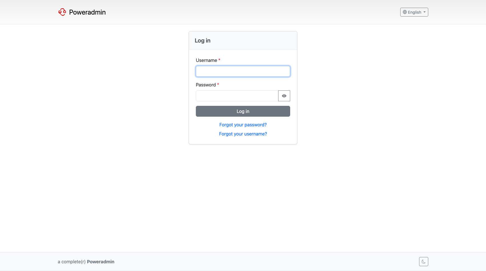

# First Steps

Poweradmin is installed and you can reach it in a browser. This page takes you from there to a
working zone that PowerDNS is answering for. It should take a few minutes.

If you have not installed anything yet, start with [Installation](../installation/index.md) - or
with the [Docker Demo](docker-demo.md) if you only want to look around.

## 1. Sign in



Go to `/login`. The first account is **`admin`**, with the password you chose during the
[installation wizard](../installation/wizard.md). A Docker demo install uses the credentials printed
by the container instead.

If the password is lost, it can be reset directly in the database - see
[Reset Admin Password](../troubleshooting/reset-admin-password.md).

> **Note:** The `admin` account is an *uberuser*: it bypasses every permission check. Create
> ordinary accounts for day-to-day work rather than sharing it. See
> [Users and Roles](../user-guide/users-roles.md).

## 2. Get your bearings


The dashboard is the hub. What appears here depends on your permissions and on which features are
enabled, so an ordinary user sees fewer cards than `admin` does.

The parts you will use immediately:

- **Zones** - list, search and edit your zones
- **Add master zone** - create a zone this server is authoritative for
- **Administration** - users, groups, permission templates, and the logs

## 3. Set your DNS defaults first

Worth doing before you create anything. Poweradmin stamps new zones with the hostmaster address and
nameservers from your configuration, and fixing those afterwards means editing every zone you have
already made.

Set `dns.hostmaster`, `dns.ns1` and `dns.ns2` in `config/settings.php` - see
[DNS Settings](../configuration/dns-settings.md).

## 4. Create your first zone


From **Zones**, choose **Add master zone**, enter a zone name such as `example.com`, pick an owner,
and submit. Leave the template empty for now.

You get a zone containing a SOA record built from your DNS defaults. Nameserver records come from a
template, so a zone created without one has none yet - which is what step 5 fixes.

For secondary zones, catalog zones and the other kinds, see
[Zone Management](../user-guide/zones.md).

## 5. Add records


Open the zone to reach the editor. Add the records the zone needs - at minimum the NS records for
your nameservers, then an A record or two:

| Name | Type | Content |
|---|---|---|
| `example.com` | NS | `ns1.example.com` |
| `example.com` | NS | `ns2.example.com` |
| `www.example.com` | A | `192.0.2.10` |

Poweradmin validates each record as you save it, so a malformed value is refused rather than
written and left for PowerDNS to reject later.

Then confirm PowerDNS is actually serving it:

```bash
dig @127.0.0.1 www.example.com A
```

If the query returns nothing, the problem is almost always that PowerDNS is not reading the
database Poweradmin wrote to. [Debugging](../troubleshooting/debugging.md) covers how to tell.

## 6. Stop using the admin account

Create a real account for yourself and for anyone else who needs access, and give each one only the
permissions their job needs. Poweradmin's permission model is per-user and reasonably fine-grained,
including a client-level role that can edit records but not the zone's authority or delegation.

Start at [Users and Roles](../user-guide/users-roles.md) and
[Permissions](../user-guide/permissions.md).

## Where to go next

Once the basics work, these are the things most installs want:

- [DNS Templates](../user-guide/dns-templates.md) - stop retyping the same NS and MX records for
  every zone
- [Reverse DNS](../user-guide/reverse-dns.md) - PTR records, including creating them automatically
  alongside A and AAAA records
- [DNSSEC](../user-guide/dnssec.md) - sign your zones
- [Multi-Factor Authentication](../user-guide/mfa.md) - worth enabling before the tool holds
  anything you care about
- [PowerDNS API](../configuration/powerdns-api.md) - required for DNSSEC, and for running
  Poweradmin without database access to PowerDNS
