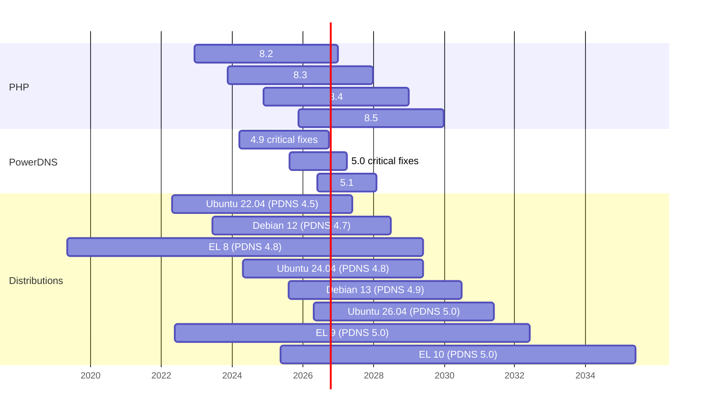

# Platform Lifecycle

This page shows when PHP, PowerDNS and the common Linux distributions stop getting updates, and
what that means for Poweradmin. Use it to plan upgrades. Dates come from
[php.net](https://www.php.net/supported-versions.php), the
[PowerDNS EOL page](https://doc.powerdns.com/authoritative/appendices/EOL.html) and
[endoflife.date](https://endoflife.date/). They were checked in October 2026 and move as projects
publish new plans.

For the Poweradmin release lines themselves, see
[Version Support](https://github.com/poweradmin/poweradmin#version-support) in the README.

## Timeline

## PHP

Poweradmin follows the PHP release calendar. When a PHP version reaches end of life, the next
Poweradmin minor release drops it.

| PHP | Security fixes until | Poweradmin                       |
|-----|----------------------|----------------------------------|
| 8.5 | 31 December 2029     | Supported                        |
| 8.4 | 31 December 2028     | Supported                        |
| 8.3 | 31 December 2027     | Supported                        |
| 8.2 | 31 December 2026     | Supported up to 4.6.x, dropped in 4.7.0 |
| 8.1 | 31 December 2025     | Not supported since 4.2.0        |

## PowerDNS

| PowerDNS | Upstream status     | Updates until                     |
|----------|---------------------|-----------------------------------|
| 5.1      | Supported           | about January 2028                |
| 5.0      | Critical fixes only | until 5.3 is released (about March 2027) |
| 4.9      | Critical fixes only | until 5.2 is released             |
| 4.8      | End of life         | June 2026                         |
| 4.7      | End of life         | August 2025                       |

Poweradmin supports PowerDNS 4.x and 5.x and is tested from 4.5 onward. Many supported
distributions still ship 4.x, so Poweradmin keeps 4.x support while they do. Features that need a
newer PowerDNS are listed in
[System Requirements](requirements.md#features-that-need-a-newer-powerdns).

## Distributions

Versions are from each distribution's default repositories. "Supported until" is the end of the
normal or LTS security support, without paid extended support.

| Distribution              | Supported until | PHP          | PowerDNS |
|---------------------------|-----------------|--------------|----------|
| Debian 13 (Trixie)        | June 2030 (LTS) | 8.4          | 4.9      |
| Debian 12 (Bookworm)      | June 2028 (LTS) | 8.2          | 4.7      |
| Ubuntu 26.04 LTS          | May 2031        | 8.5          | 5.0      |
| Ubuntu 24.04 LTS          | May 2029        | 8.3          | 4.8      |
| Ubuntu 22.04 LTS          | June 2027       | 8.1          | 4.5      |
| RHEL/Rocky/AlmaLinux 10   | May 2035        | 8.3          | 5.0 (EPEL) |
| RHEL/Rocky/AlmaLinux 9    | May 2032        | 8.0 (8.2/8.3 as modules) | 5.0 (EPEL) |
| RHEL/Rocky/AlmaLinux 8    | May 2029        | 7.2 (8.2 as module) | 4.8 (EPEL) |
| Fedora 44                 | June 2027       | 8.5          | 5.0      |
| FreeBSD 15                | December 2029   | 8.4          | 5.1      |

On Ubuntu, PowerDNS is in the `universe` component, which gets security fixes from the community
or through Ubuntu Pro rather than standard Canonical support.

If your distribution ships an older PHP or PowerDNS than you need:

- **PHP**: [sury.org](https://deb.sury.org/) for Debian, the
  [ondrej/php PPA](https://launchpad.net/~ondrej/+archive/ubuntu/php) for Ubuntu,
  [Remi](https://rpms.remirepo.net/) for RHEL-based systems.
- **PowerDNS**: the official [PowerDNS repositories](https://repo.powerdns.com/) provide 5.1 for
  Debian 11-13, Ubuntu 22.04-26.04 and EL 8-10.
- **Docker**: the Poweradmin image ships its own PHP, and PowerDNS publishes official images.

## What to plan for

- **End of 2026**: PHP 8.2 reaches end of life. Poweradmin 4.7.0 needs PHP 8.3. This affects
  Debian 12 and RHEL 8 users on the default PHP.
- **June 2027**: Ubuntu 22.04 standard support ends. It is the last supported distribution that
  ships PowerDNS older than 4.7.
- **June 2028**: Debian 12 LTS ends. After that, every supported major distribution ships
  PowerDNS 4.8 or newer.
