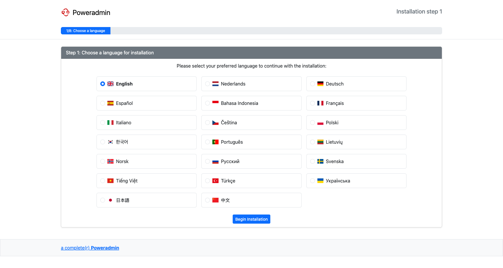
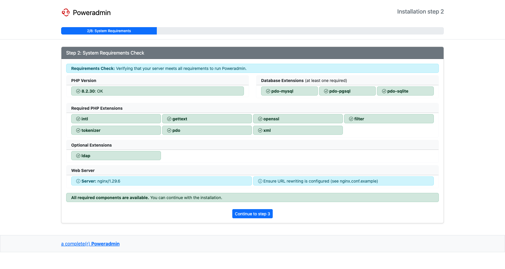
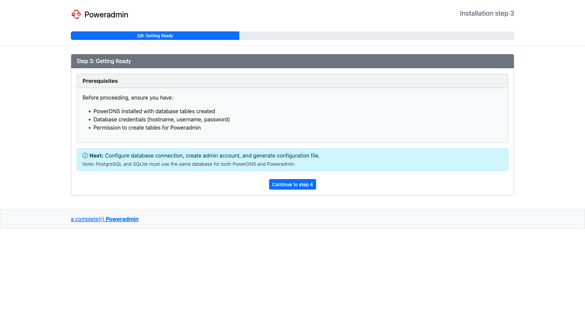
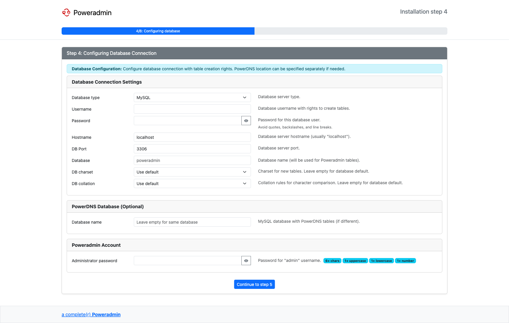
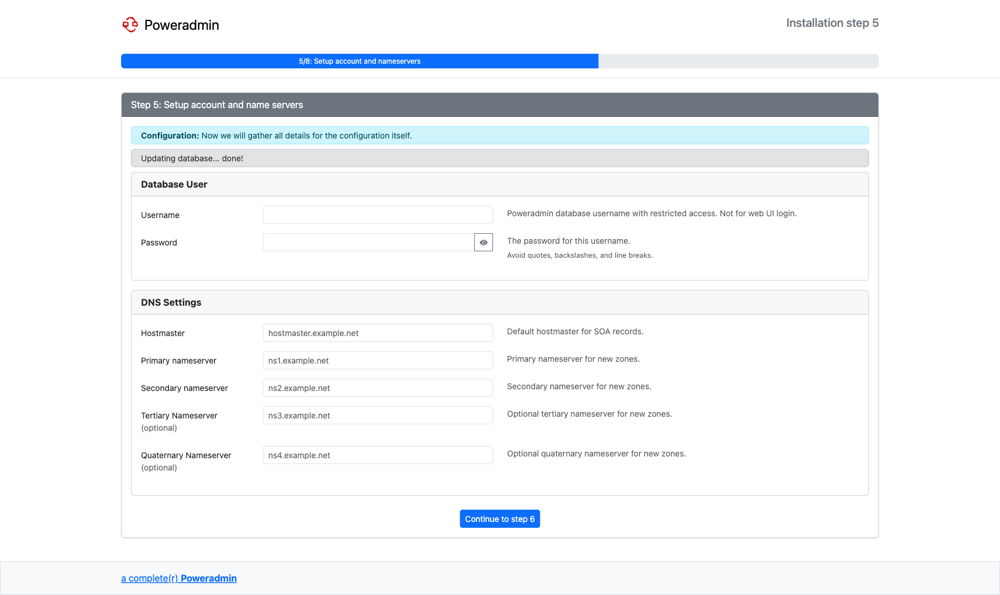
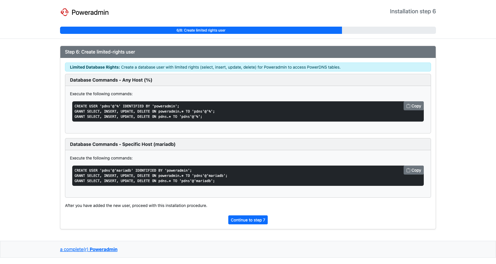
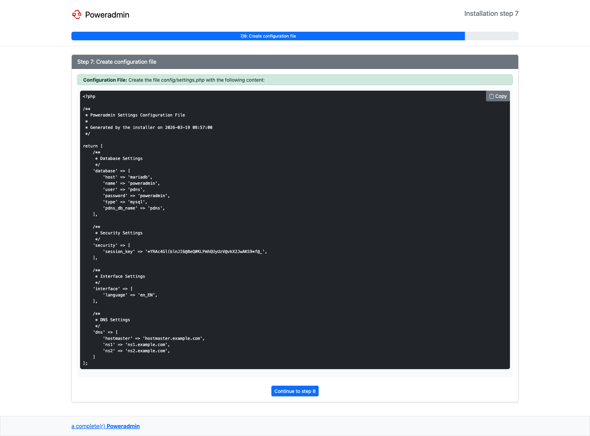
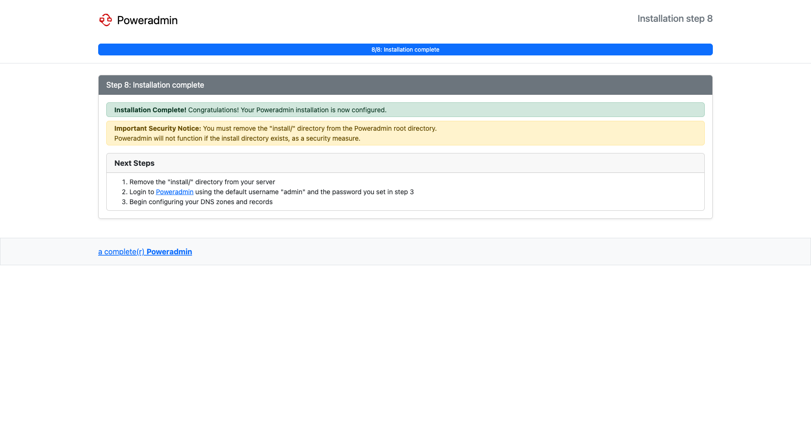

# Web Installer Wizard

For most installations, the web-based installer is the recommended path. After you have deployed the Poweradmin source files to your web server (see the [Ubuntu](ubuntu.md), [Debian](debian.md), or [CentOS/RHEL](centos.md) guides), navigate to `http://your-server/install/` in a browser and the wizard will walk you through eight steps.

If you would rather configure everything by hand, see [Manual Installation](manual.md) instead.

## Step 1: Language Selection

Choose your preferred language for the installation process. The selected language is used for the remaining wizard steps; you can change Poweradmin's interface language later from the user interface.

## Step 2: System Requirements

The installer checks that your server meets all requirements, including PHP version, required extensions, and database drivers. If any check fails, install the missing component and reload the page before continuing.

## Step 3: Getting Ready

A checklist reminding you to have the following in place before going further:

- PowerDNS installed with database tables created (or a reachable PowerDNS API if you plan to use the API backend).
- Database credentials (hostname, username, password).
- A database user with permission to create Poweradmin's tables.

> **Note:** For PostgreSQL and SQLite, PowerDNS and Poweradmin must share the same database.

## Step 4: Database Configuration

Configure your database connection, select the database type (MySQL, PostgreSQL, or SQLite), and set the administrator password.

This step asks for two distinct sets of credentials. They are not interchangeable - confusing them is the most common cause of "I cannot log in after installation" reports.

| Block on the form | What it is | Used for |
|---|---|---|
| **Database Connection Settings** (username / password) | A MySQL or PostgreSQL account with `CREATE TABLE` rights | One-time use by the installer to create Poweradmin's tables. Not used to log in to the web interface. |
| **Poweradmin Account** (administrator password) | The password for the built-in **`admin`** user | Logging in to the Poweradmin web interface. The username is hard-coded as `admin` and cannot be changed here. |

After the installer finishes, you log in at `/login` with username **`admin`** and the password you typed into the "Poweradmin Account" block - not the database username. You can then create additional Poweradmin users from `Users > Add user` in the web interface.

## Step 5: Setup Account and Nameservers

Enter the username and password for a database user with limited rights that Poweradmin will use at runtime (you will create this user in step 6). Also set the default DNS settings used as defaults when creating new zones: hostmaster email, primary nameserver, and secondary nameserver.

## Step 6: Create Limited-Rights User

The installer **does not create the limited-rights database user for you.** Instead it generates the SQL commands you need to run as a database superuser, customized for your chosen database engine. Copy the commands, run them in your database client, then click continue.

If you are using SQLite, this step is skipped because file permissions are managed at the filesystem level rather than via database grants.

## Step 7: Configuration File

The installer generates the contents of `config/settings.php`. Copy the displayed text into that file on the server (it is not written automatically) and verify the file is readable by the web server user.

## Step 8: Installation Complete

Once `config/settings.php` is in place, the installation is finished. For security, remove or rename the `install/` directory so that the wizard cannot be re-run.

## Post-Installation

1. Log in at `/login` with username **`admin`** and the Poweradmin account password from step 4.
2. Configure web server permissions (see your distribution's installation guide).
3. Set up DNS defaults (see [DNS Settings](../configuration/dns-settings.md)).
4. Configure additional features as needed:
    - [LDAP Integration](../configuration/ldap.md)
    - [PowerDNS API](../configuration/powerdns-api.md)
    - [DNSSEC](../configuration/dnssec.md)
