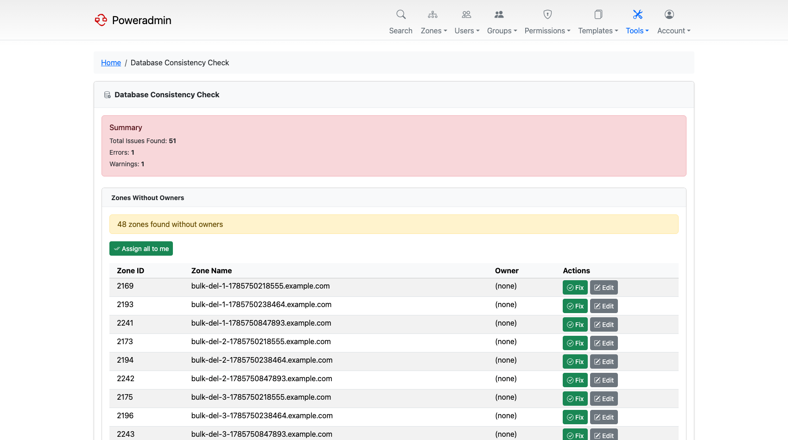

# Database Consistency Check

The consistency check looks for zones and records that are structurally broken - a zone nobody
owns, a slave zone with no master, records left behind by a deleted zone - and offers a one-click
fix for each. It is reached from **Tools → Database Consistency Check** (`/tools/database-consistency`).



## Enabling it

The page is disabled by default. Turn it on in `config/settings.php`:

```php
'interface' => [
    'enable_consistency_checks' => true,
],
```

Without this setting the menu entry does not appear and the page reports that consistency checks
are disabled.

Access is restricted to **administrators** (`user_is_ueberuser`). There is no separate permission,
so it cannot be delegated through a permission template.

## What it checks

Each check reports success, a warning, or an error, and the summary panel at the top counts the
total issues, errors and warnings.

| Check | Severity | What it finds | Available fix |
|-------|----------|---------------|---------------|
| Zones without owners | Warning | Zones with no user owner | **Fix** assigns the zone to you; **Assign all to me** does the whole list at once |
| Slave zones without masters | Warning | Slave zones with no master IP set, which can never transfer | **Delete** the zone |
| Orphaned records | Error | Records whose zone no longer exists | **Delete** the record |
| Duplicate SOA records | Error | Zones carrying more than one SOA | **Fix** keeps the first SOA and deletes the rest |
| Zones without SOA | Error | Zones missing an SOA record entirely | **Fix** creates a default SOA |

Every fix is a POST protected by a CSRF token, and destructive actions ask for confirmation first.

## Behaviour in API backend mode

The checks run against whichever backend is configured, so they work in
[API backend mode](../configuration/powerdns-api.md) as well as against the database.

Two differences apply there:

- The orphaned-records check is skipped and always reports success. PowerDNS owns the
  zone-to-record relationship in API mode, so the condition cannot arise.
- If the PowerDNS API is unreachable, or any zone read fails partway through, the page reports a
  single error instead of results. This is deliberate: a partial read could otherwise make a
  healthy zone look like it was missing its SOA.

## When to run it

Consistency problems are usually the result of something interrupted - a failed bulk delete, a
restored backup, a partial migration, or direct changes made in the database rather than through
Poweradmin. It is worth running after any of those, and after upgrading across a major version.

Zones without owners are the most common finding. They are harmless to PowerDNS but invisible to
non-administrator users, since Poweradmin scopes most views by ownership.

## Related pages

- [Maintenance Guide](index.md)
- [Zone Management](../user-guide/zones.md)
- [Users and Roles](../user-guide/users-roles.md)
