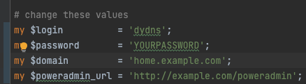
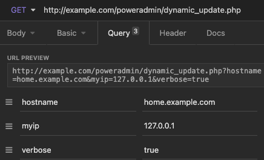

# Client Setup

## Update Methods

The Dynamic DNS update system supports several ways to update records:

1. HTTP Basic Authentication
2. URL parameters
3. Automatic IP detection

### Supported Parameters

* `username` - Your Poweradmin username (if not using HTTP Basic Auth)
* `password` - Your Poweradmin password (if not using HTTP Basic Auth)
* `hostname` - The FQDN to update
* `myip` or `ip` - IPv4 address(es), comma-separated
* `myip6` or `ip6` - IPv6 address(es), comma-separated
* `dualstack_update` - Set to 1 to update both IPv4 and IPv6
* `verbose` - Enable verbose response messages

### Special Values

You can use `whatismyip` for the IP parameters to automatically detect your address:

```bash
curl "https://dns.example.com/dynamic_update.php?hostname=host.example.com&myip=whatismyip"
```

### Multiple IP Management

The system supports managing multiple IP addresses per host:

```bash
# Update multiple IPv4 addresses
curl "https://dns.example.com/dynamic_update.php?hostname=host.example.com&myip=192.0.2.1,192.0.2.2"

# Update multiple IPv6 addresses
curl "https://dns.example.com/dynamic_update.php?hostname=host.example.com&myip6=2001:db8::1,2001:db8::2"

# Update both IPv4 and IPv6 with cleanup
curl "https://dns.example.com/dynamic_update.php?hostname=host.example.com&myip=192.0.2.1,192.0.2.2&myip6=2001:db8::1,2001:db8::2&dualstack_update=1"
```

When using multiple IPs:

* Omitted record types are preserved
* Use `dualstack_update=1` to clean up both A and AAAA records
* Records not included in the update are automatically removed
* Changes are atomic and maintain zone consistency

## Using the Shell Script

1. Download the dynamic DNS client script
2. Make it executable and run:

```bash
chmod 755 dynamic_dns_client.sh
./dynamic_dns_client.sh
```



## Basic Authentication

You can also create a client that uses HTTP basic authentication with username and password.



## Client Script Installation

### Shell Script

```bash
chmod 755 dynamic_dns_client.sh
./dynamic_dns_client.sh
```

### Python Script

1. Install required dependencies:

```bash
pip install requests
```

2. Run the script:

```bash
python dynamic_dns_client.py
```

### Perl Script

1. Install required modules:

```bash
cpan install LWP::UserAgent
```

2. Run the script:

```bash
perl dynamic_dns_client.pl
```
