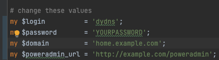
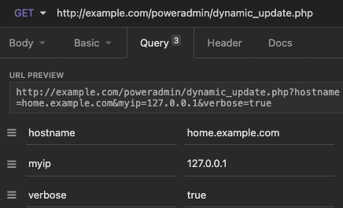

# Client Setup

## Update Methods

The Dynamic DNS update system supports several ways to update records:

1. HTTP Basic Authentication
2. URL parameters
3. Automatic IP detection

### Supported Parameters

* `username` - Your Poweradmin username (if not using HTTP Basic Auth)
* `password` - Your Poweradmin password (if not using HTTP Basic Auth)
* `hostname` - The FQDN to update
* `myip` or `ip` - IPv4 address(es), comma-separated
* `myip6` or `ip6` - IPv6 address(es), comma-separated
* `dualstack_update` - Set to 1 to update both IPv4 and IPv6
* `verbose` - Set to 1 to receive human-readable response messages

### Response Codes

Without `verbose=1` the endpoint returns one of these short codes followed by a newline:

| Code | Meaning |
|------|---------|
| `good <ip>` | Update applied. The applied IPv4 (or IPv6) address follows. |
| `nochg <ip>` | No change required; the records already match. |
| `nohost` | Hostname does not exist in any zone you own. |
| `!yours` | You authenticated, but you do not own a zone containing this hostname. |
| `notfqdn` | The supplied hostname is not a fully-qualified domain name. |
| `badauth` | Missing credentials. |
| `badauth2` | Credentials supplied but did not validate. |
| `badagent` | Request had no `User-Agent` header. |
| `dnserr` | A server-side validation or write error occurred. |

When debugging, always append `&verbose=1` so you get the readable equivalent instead of a two-letter code.

### Special Values

You can use `whatismyip` for the IP parameters to automatically detect your address:

```bash
curl "https://dns.example.com/dynamic_update.php?hostname=host.example.com&myip=whatismyip&verbose=1"
```

### Multiple IP Management

The system supports managing multiple IP addresses per host:

```bash
# Update multiple IPv4 addresses
curl "https://dns.example.com/dynamic_update.php?hostname=host.example.com&myip=192.0.2.1,192.0.2.2"

# Update multiple IPv6 addresses
curl "https://dns.example.com/dynamic_update.php?hostname=host.example.com&myip6=2001:db8::1,2001:db8::2"

# Update both IPv4 and IPv6 with cleanup
curl "https://dns.example.com/dynamic_update.php?hostname=host.example.com&myip=192.0.2.1,192.0.2.2&myip6=2001:db8::1,2001:db8::2&dualstack_update=1"
```

If any of these return a short error code like `!yours` or `badauth2`, re-run the same URL with `&verbose=1` appended to get a readable message.

When using multiple IPs:

* Omitted record types are preserved
* Use `dualstack_update=1` to clean up both A and AAAA records
* Records not included in the update are automatically removed
* Changes are atomic and maintain zone consistency

## Using the Shell Script

1. Download the dynamic DNS client script
2. Make it executable and run:

```bash
chmod 755 dynamic_dns_client.sh
./dynamic_dns_client.sh
```



## Basic Authentication

You can also create a client that uses HTTP basic authentication with username and password.



## Using `ddclient` (dyndns2 protocol)

`ddclient` and other dyndns2 clients expect the update endpoint at `/nic/update`. Poweradmin exposes the endpoint at `/dynamic_update.php`, so you need a small web-server rewrite to make stock clients work.

### Apache

Add to your virtual host (or `.htaccess` if rewrites are enabled):

```apache
RewriteEngine On
RewriteRule ^/?nic/update$ /dynamic_update.php [QSA,L]
```

### nginx

Inside the `server { ... }` block that serves Poweradmin:

```nginx
location = /nic/update {
    rewrite ^ /dynamic_update.php last;
}
```

### `ddclient.conf`

```
protocol=dyndns2
use=web, web=https://dns.example.com/addons/clientip.php
ssl=yes
server=dns.example.com
login=ddns-user
password='your-password'
home.example.com
```

Run `ddclient -daemon=0 -debug -verbose -noquiet` to watch the exchange. The server returns either `good\n` (no IP suffix on older builds) or the dyndns2-compliant `good <ip>\n` depending on Poweradmin version. Both forms are accepted by `ddclient`.

### Other clients

`inadyn`, OPNsense's built-in DDNS client, and most router firmwares can target the same endpoint. Configure the service URL as `https://dns.example.com/nic/update?hostname=%h&myip=%i` (or the equivalent template for your client) and set the protocol to `dyndns2` or "custom".

## Client Script Installation

### Shell Script

```bash
chmod 755 dynamic_dns_client.sh
./dynamic_dns_client.sh
```

### Python Script

1. Install required dependencies:

```bash
pip install requests
```

2. Run the script:

```bash
python dynamic_dns_client.py
```

### Perl Script

1. Install required modules:

```bash
cpan install LWP::UserAgent
```

2. Run the script:

```bash
perl dynamic_dns_client.pl
```
