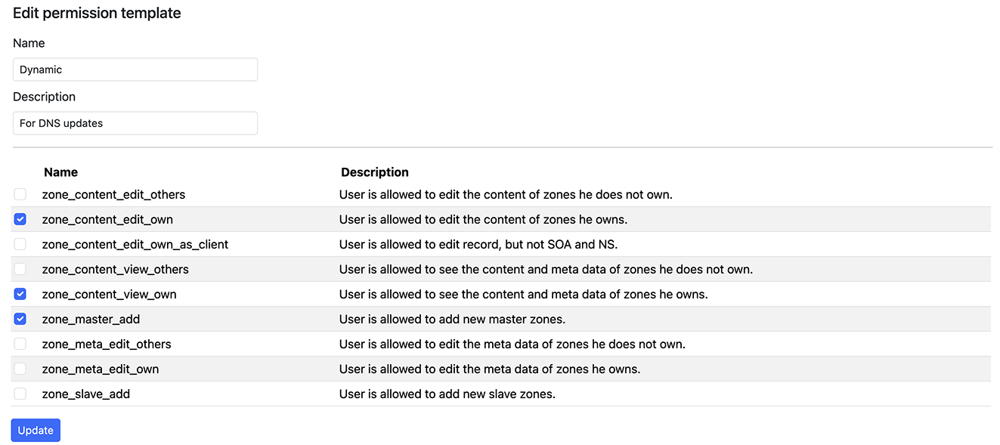
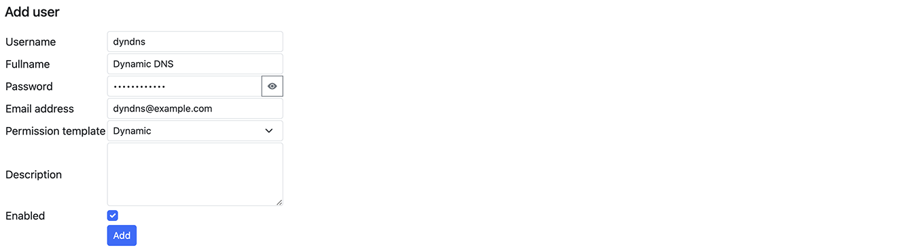
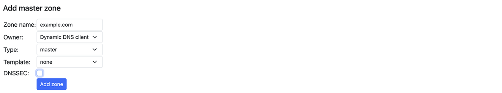
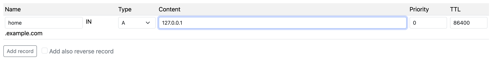

# Dynamic DNS Configuration

## Setting Up User Permissions

1. Create a permission template:
    - Navigate to `Users > Add permission template`
    - Provide a meaningful name (e.g., "dynamic") and description
    - Select required permissions:
        - `zone_master_add`
        - `zone_content_view_own`
        - `zone_content_edit_own` or `zone_content_edit_own_as_client` or `zone_content_edit_others`

2. Create a new user:
    - Navigate to `Users > Add user`
    - Fill in user details
    - Apply the previously created template

## Configuring DNS Zone

1. Log in as the new user
2. Select "Add master zone"
3. Enter your domain name
4. Navigate to the created zone
5. Add a record for dynamic updates

