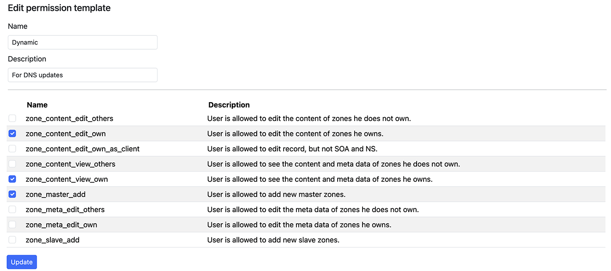
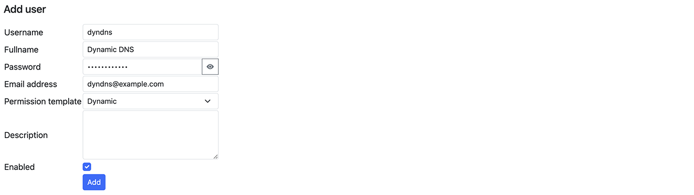
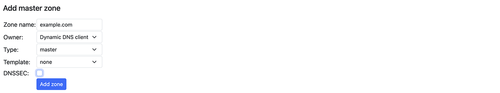
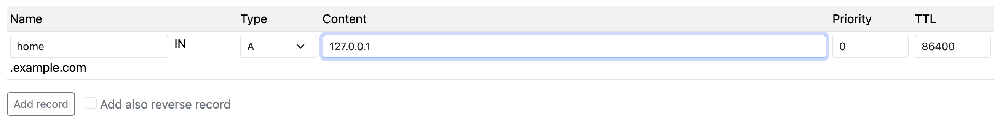

# Dynamic DNS Configuration

This guide will walk you through the process of setting up Dynamic DNS (DDNS) in Poweradmin.

## Setting Up User Permissions

You'll need to create a **dedicated** user with specific permissions for DDNS updates:

> Administrator (ueberuser) accounts are deliberately blocked from `dynamic_update.php`. DDNS credentials are typically stored in plaintext on routers, IoT devices, or `ddclient.conf` files - low-trust locations. Forcing a dedicated, narrowly-scoped account keeps admin credentials out of those files. If you authenticate with an admin account, the endpoint responds with `badauth2`.

1. Create a permission template:
    - Navigate to `Users > Add permission template`
    - Provide a meaningful name (e.g., "dynamic") and description
    - Select required permissions:
        - `zone_master_add`
        - `zone_content_view_own`
        - `zone_content_edit_own` or `zone_content_edit_own_as_client` or `zone_content_edit_others`



2. Create a new user:
    - Navigate to `Users > Add user`
    - Fill in user details
    - Apply the previously created template



## Configuring DNS Zone

After creating a user with appropriate permissions:

1. Log in as the new user
2. Select "Add master zone"
3. Enter your domain name
4. Navigate to the created zone
5. Add a record for dynamic updates




## Server-Side Configuration

The Dynamic DNS functionality in Poweradmin is provided by the `dynamic_update.php` script, which handles DNS record updates when IP addresses change.

### Current Behaviour

There are no dedicated configuration keys for DDNS. The endpoint is always available when the file is reachable, and the following values are fixed:

- **TTL**: All A and AAAA records created or refreshed through `dynamic_update.php` are written with a TTL of 60 seconds. This is hard-coded.
- **Authentication**: Always required (HTTP Basic Auth or `username` / `password` query parameters).
- **IPv4 and IPv6**: Both are always allowed; you control which records exist by what you send.
- **Automatic IP detection**: Always available via the special value `whatismyip` for `myip` / `myip6`.

To restrict who can use the endpoint, control access at three layers:

- **User permissions**: Only grant the DDNS permission template to accounts that should update records.
- **Zone ownership**: A user can only update records in zones they (or one of their groups) own.
- **Web server**: Restrict access to `/dynamic_update.php` and `/addons/clientip.php` by IP range or HTTPS-only if your update sources are predictable.

### Security Considerations

1. **Use HTTPS**: Always use HTTPS for DDNS updates to prevent credentials and updates from being intercepted.
2. **Create dedicated users**: Create specific users for DDNS updates with minimal permissions.
3. **IP restrictions**: Consider implementing IP restrictions for DDNS user accounts if your update sources have static IP addresses.
4. **Regular auditing**: Periodically review DDNS activity in logs to detect unusual patterns.

## Testing Your Configuration

After setup, you can test your configuration using:

```bash
curl -u username:password "https://yourserver.com/dynamic_update.php?hostname=host.yourdomain.com&myip=whatismyip&verbose=1"
```

A successful response in verbose mode will look like:

```
Your hostname has been updated.
```

Without `verbose=1` you will just receive `good\n` (or one of the short error codes documented in [Client Setup](client-setup.md)).

## Troubleshooting

If you encounter issues with your DDNS setup:

1. **Check permissions**: Ensure the user has proper permissions for zone editing
2. **Verify zone ownership**: The user must own or have access to the zone being updated
3. **Check authentication**: Verify credentials are correctly configured
4. **Review logs**: Check Poweradmin logs for detailed error messages
5. **Test manually**: Try manual updates with cURL to isolate client vs. server issues

For client setup instructions, see [Client Setup](client-setup.md).