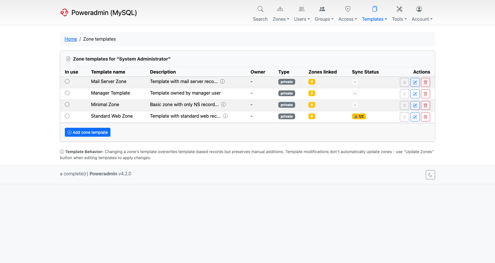
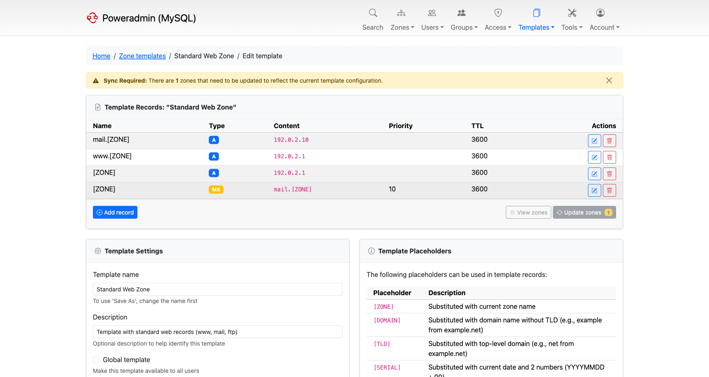

# DNS Templates

DNS templates in Poweradmin allow you to create standardized sets of DNS records that can be applied to multiple zones, streamlining zone management and ensuring consistency across domains.

## Template Management



Templates are managed through the Poweradmin interface and stored in the database. Each template can contain multiple DNS records of various types (A, CNAME, MX, etc.) that will be applied when the template is used.

Templates support placeholders that are automatically substituted:

- `[ZONE]` - replaced with the actual domain name
- `[SERIAL]` - replaced with current date + sequence (YYYYMMDD00)
- `[UNIXTIME]` - replaced with the current UNIX timestamp
- `[COUNTER]` - replaced with 1, the starting value for a simple incremental serial
- `[NS1]`, `[NS2]`, etc. - replaced with configured nameservers
- `[HOSTMASTER]` - replaced with configured hostmaster email

The serial placeholders (`[SERIAL]`, `[UNIXTIME]`, `[COUNTER]`) control the initial SOA serial of a zone created from the template; later record changes increment the serial automatically. When Poweradmin runs against the PowerDNS API backend, the `SOA-EDIT-API` zone metadata governs how subsequent serials are generated - it can be chosen per zone on the add-zone form or on the zone metadata page (`EPOCH` pairs with `[UNIXTIME]`, `INCREASE` with `[COUNTER]`), with defaults from `dns.soa_edit_api`.



### Saving an existing zone as a template

*Available since v4.2.0.*

Rather than building a template record by record, you can turn a zone you already have into
one. On the zone editor, **Save as Template** (`/zones/{id}/save-template`) asks for a
template name and description, then copies the zone's records into a new template.

The copy is not literal. The zone's own name is replaced with `[ZONE]`, and the configured
nameserver and hostmaster values are replaced with `[NS1]` and `[HOSTMASTER]`, so the
template applies cleanly to any other zone.

Two behaviours to expect:

- **Record types you are not allowed to add are left out**, and the page tells you which ones
  were skipped. A user who can read a zone containing record types their permissions do not
  cover still gets a usable template from the rest.
- **A default SOA record is added** if the source zone had none.

This is the quickest way to capture a house standard: build one zone the way you want every
zone to look, then save it as the template for the rest.

It requires the same rights as creating a template by hand - the `zone_templ_add` permission,
or superuser.

## Zone Template Application

### When Changing a Zone's Template

When you change a zone's template on the edit page:

- **Only template-generated records are overwritten** - the system specifically deletes records that were originally created from templates
- **Manual records are completely preserved** - any records you added manually remain untouched
- **Changes are immediate** - template application happens instantly when you save the change
- **SOA records are handled specially** - existing serial numbers are preserved and incremented appropriately

### How Poweradmin Tracks Template Records

Poweradmin maintains a database table (`records_zone_templ`) that tracks which DNS records were created from templates. This allows the system to:

- Identify which records can be safely replaced during template updates
- Preserve manually added records during template changes
- Maintain the relationship between zones and their source templates

## Template Synchronization

### Manual Updates Only

**Important**: Zones do NOT automatically update when templates are modified. This is by design to give administrators explicit control over when changes are applied.

### Methods to Apply Template Changes

**Individual Zone Update**:

1. Go to Edit Zone page
2. Pick a different template in the template dropdown
3. Click **Change**

Re-selecting the template the zone already uses does nothing - the form compares the
selection against the current template and skips the refresh when they match. To re-apply the
same template, use the bulk update below.

**Bulk Zone Update**:

1. Go to Edit Template page
2. Click "Update Zones" button
3. This updates ALL zones currently using that template

### Sync Indicators

Poweradmin shows which zones are out of sync with their template:

- The **Zone templates** list has a sync column per template: a warning badge with the `unsynced/total` count, or a green **Synced** badge when every linked zone is up to date.
- The template editor shows a **Sync Required** banner with the number of zones needing an update, and repeats that count as a badge on the **Update zones** button.

The zones themselves are still only updated when you ask for it.

## Permissions

### Zone Template Operations

Different template operations require different permissions:

- **Creating zone templates**: Requires `zone_templ_add` permission
- **Listing zone templates**: Requires `zone_templ_add` OR `zone_templ_edit` OR `user_is_ueberuser` permission
- **Editing/deleting zone templates**: Requires `user_is_ueberuser` OR (`zone_templ_edit` AND template ownership)
- **Adding/editing/deleting template records**: Requires `user_is_ueberuser` OR (`zone_templ_edit` AND template ownership)

### Applying Templates to Zones

- **Creating zones with templates**: Requires `zone_master_add` permission. A template can only be chosen on the **Add master zone** form and in bulk registration; the slave zone form offers no template.
- **Changing existing zone templates**: Requires zone editing permissions (`zone_content_edit_own` for owned zones or `zone_content_edit_others` for other zones) **and** `zone_master_add` or `zone_slave_add`. The editing permission only authorises removing the old template's records; writing the new template's records needs one of the add permissions. A user with editing rights alone ends up with the old records gone and no replacements.
- **Unlinking zones from templates**: Requires `user_is_ueberuser` OR zone editing permissions (`zone_content_edit_own`/`zone_content_edit_others` OR `zone_meta_edit_own`/`zone_meta_edit_others`)

### Permission Templates

Poweradmin also supports permission templates (different from zone templates):

- **Adding permission templates**: Requires `templ_perm_add` permission
- **Editing permission templates**: Requires `templ_perm_edit` permission
- **Deleting permission templates**: Requires `user_edit_templ_perm` permission

None of these permissions allows granting administrator rights: a non-administrator
cannot add `user_is_ueberuser` to a template, nor edit a template that already has it.
See [Permissions](permissions.md#template-permissions).

## Default Zone Template

A global zone template can be marked as the default. The marked template is pre-selected on the **Add master zone** form (instead of "none") and shown with a "(default)" suffix in the dropdown, so users know which template will be applied if they don't change the selection.

### Setting the default from the UI

On the **Zone templates** list, ueberusers see a star button next to each global template:

- An outline star icon - "Set as default": flags this template as the default. Any previously flagged template is cleared in the same operation.
- A filled star icon - "Unset as default": clears the flag.

A blue "default" badge marks the active row.

Only **global** templates (Type: `global` in the list) can be marked default. If a template is later converted to private, the default flag is cleared automatically so it cannot become an orphan.

### Setting the default via configuration

If you cannot mark a default through the UI, set `dns.default_zone_template` in `config/settings.php`. The value is either the template id or its name:

```php
'dns' => [
    'default_zone_template' => 'Standard',  // by name
    // 'default_zone_template' => 7,        // or by id
],
```

The DB-backed default (set via the UI) takes precedence over the config setting; the config setting is the fallback when no template is flagged in the database.

When the configured template is the active default but no row carries the DB flag, the list view shows a "default (config)" badge - a hint that the value comes from `settings.php` and cannot be cleared from the UI.

#### Edge cases

- If the configured name resolves to multiple global templates (template names are not strictly unique in the database), the setting is ignored and a warning is logged. Either rename one of the duplicates or use the template id.
- If the configured template no longer exists, the form silently falls back to "none" and a warning is logged. Update or remove the setting to clear the warning.
- Personal templates cannot be the default. Setting `dns.default_zone_template` to a private template id has no effect.

## Configuration

Template display in zone listings can be controlled via the `interface.display_template_in_zone_list` setting in your configuration file.

The default zone template is configured via `dns.default_zone_template` (see [Default Zone Template](#default-zone-template) above).

## See Also

- [Permissions](permissions.md) - For detailed permission requirements
- [Basic Configuration](../configuration/basic.md) - For template-related settings