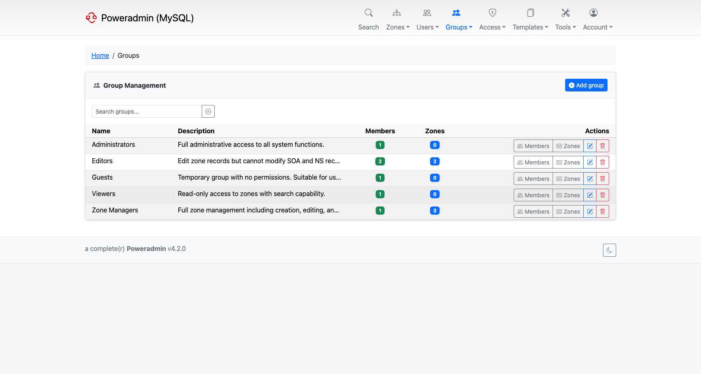
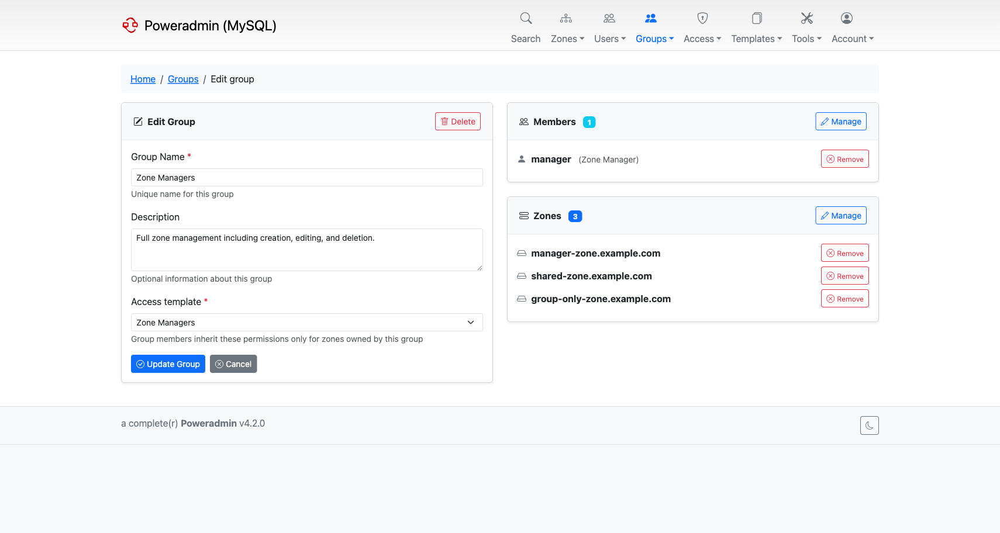
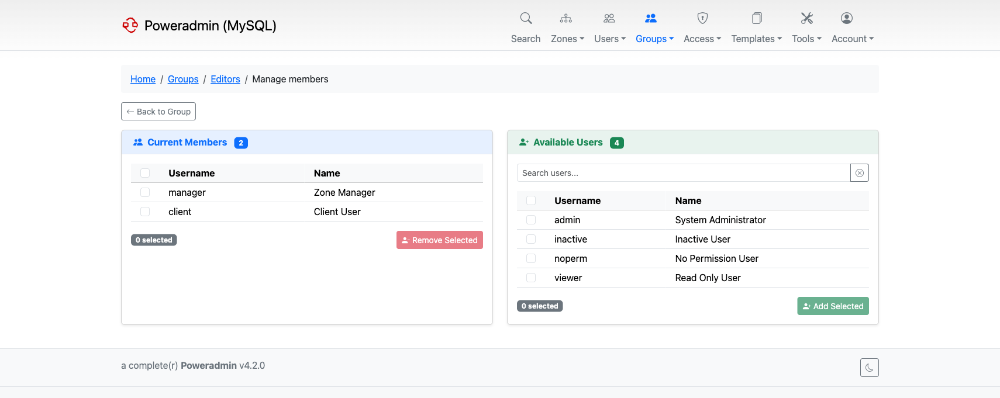
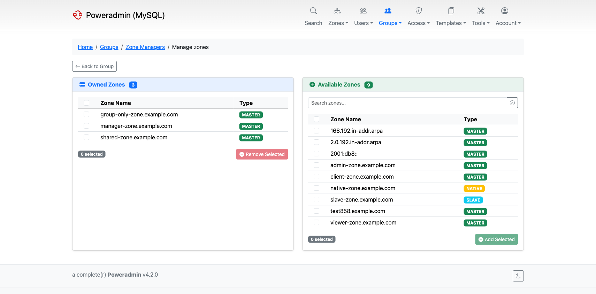

# User Groups

User groups allow you to organize users into teams and manage zone access collectively. Instead of assigning zones to individual users one at a time, you can assign zones to a group and all members automatically get access.

Groups are available starting from Poweradmin v4.2.0.

## Key Concepts

- **Groups** are collections of users that share access to a set of zones
- A user can belong to **multiple groups** simultaneously
- A zone can be owned by a **user, one or more groups, or both**
- Each group has an **access template** that defines what its members can do with the group's zones
- Permissions from all sources (user template + group memberships) are **combined** - if any source grants access, the user has it

## Group List

The group list shows all groups with their description, member count, and assigned zone count. From here you can create new groups, manage members and zones, edit, or delete groups.

Navigate to **Groups** in the top navigation bar to access the group list.

## Creating a Group

1. Click **Add group** from the group list
2. Enter a **Group Name** (must be unique)
3. Optionally add a **Description**
4. Select an **Access template** - this determines what permissions group members have for zones owned by this group
5. Click **Create Group**

After creation, you can add members and assign zones.

## Editing a Group

The edit page shows the group details on the left, with members and zones on the right. You can update the group name, description, and access template. Members and zones can be quickly removed from here, or managed in bulk through dedicated screens.

## Managing Members

The member management screen has two panels:

- **Current Members** (left) - users already in the group
- **Available Users** (right) - users that can be added

Select users with checkboxes and click **Add Selected** or **Remove Selected**. Changes take effect immediately.

## Managing Zones

Zone management works the same way as members:

- **Owned Zones** (left) - zones currently assigned to the group
- **Available Zones** (right) - zones that can be assigned

All group members get access to owned zones based on the group's access template.

## How Permissions Work

Poweradmin combines permissions from all sources. A user's effective permissions are the union of:

- Their **personal access template** (applies globally)
- Permissions from **each group they belong to** (apply only to that group's zones)

For example, if a user has a "Viewer" personal template but belongs to an "Editors" group that owns `example.com`, that user can edit records in `example.com` while having read-only access to everything else.

> **Note:** Group access templates only apply to zones owned by that group. They do not grant permissions for zones the user owns personally or through other groups.

## Access Templates

Access templates come in two types:

- **User templates** - assigned directly to users, apply globally
- **Group templates** - assigned to groups, apply only to group-owned zones

You can manage access templates under **Access** in the navigation bar. See [Permissions](permissions.md) for details on available permissions.

## SSO Group Mapping

If you use OIDC or SAML authentication, you can automatically assign users to groups based on their SSO claims. See the [OIDC](../configuration/oidc.md) or [SAML](../configuration/saml.md) configuration pages for setup details.

## MFA Enforcement

Groups can enforce MFA for all their members. This is done by adding the `user_enforce_mfa` permission to the group's access template. When this permission is present, all group members are required to set up two-factor authentication on their next login. See [MFA Enforcement](mfa.md) for details.

## Deleting a Group

Deleting a group removes the group and all its membership and zone associations. It does not delete the users or zones themselves. Click the delete button from the group list or the edit page.

> **Warning:** This action cannot be undone. Make sure the group is no longer needed before deleting.
