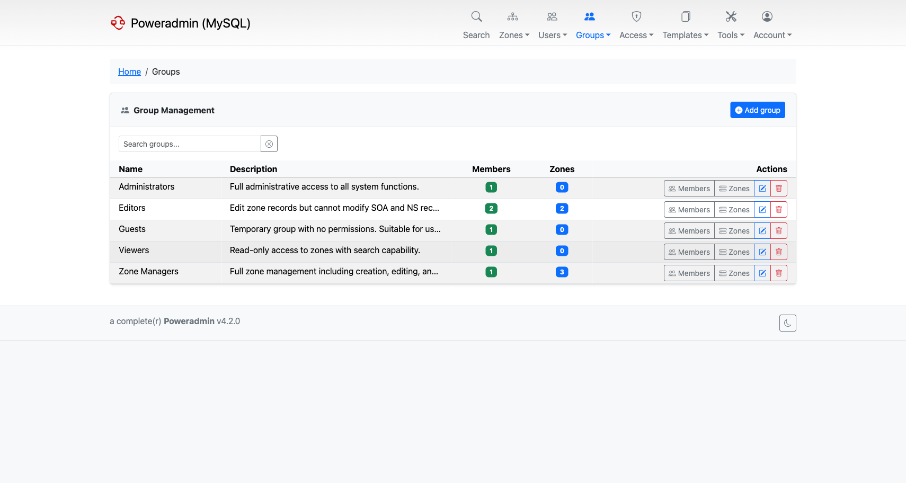
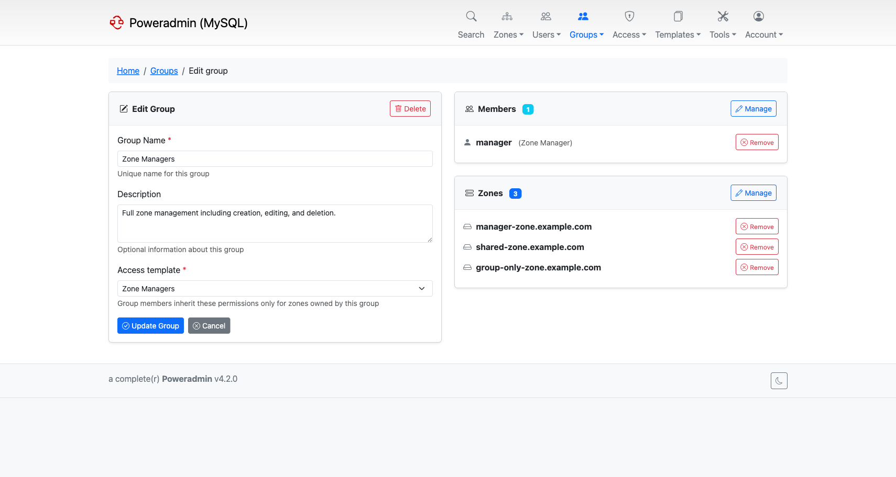
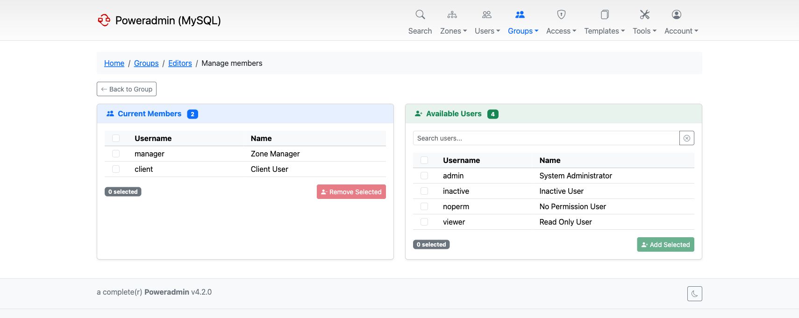
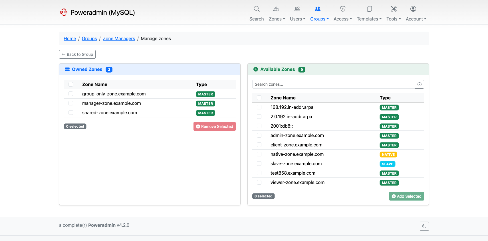

# User Groups

User groups allow you to organize users into teams and manage zone access collectively. Instead of assigning zones to individual users one at a time, you can assign zones to a group and all members automatically get access.

Groups are available starting from Poweradmin v4.2.0.

## Key Concepts

- **Groups** are collections of users that share access to a set of zones
- A user can belong to **multiple groups** simultaneously
- A zone can be owned by a **user, one or more groups, or both**
- Each group has a **permission template** whose permissions every member receives
- Permissions from all sources (user template + group memberships) are **combined** - if any source grants access, the user has it

## Group List

The group list shows all groups with their description, member count, and assigned zone count. From here you can create new groups, manage members and zones, edit, or delete groups.

Navigate to **Groups** in the top navigation bar to access the group list.

## Creating a Group

1. Click **Add group** from the group list
2. Enter a **Group Name** (must be unique)
3. Optionally add a **Description**
4. Select a **Permission template** - every member receives its permissions, see [How Permissions Work](#how-permissions-work)
5. Click **Create Group**

After creation, you can add members and assign zones.

## Editing a Group

The edit page shows the group details on the left, with members and zones on the right. You can update the group name, description, and permission template. Members and zones can be quickly removed from here, or managed in bulk through dedicated screens.

## Managing Members

The member management screen has two panels:

- **Current Members** (left) - users already in the group
- **Available Users** (right) - users that can be added

Select users with checkboxes and click **Add Selected** or **Remove Selected**. Changes take effect immediately.

## Managing Zones

Zone management works the same way as members:

- **Owned Zones** (left) - zones currently assigned to the group
- **Available Zones** (right) - zones that can be assigned

All group members get access to owned zones based on the group's permission template.

## How Permissions Work

Poweradmin combines permissions from all sources. A user's effective permissions are the union of:

- Their **personal permission template**
- The permission template of **each group they belong to**

Permissions are not tied to the group that granted them. An "own" permission such as
`zone_content_edit_own` applies to every zone the user owns, whether directly or through any
of their groups. An "others" permission applies to every zone.

For example, a user with a "Viewer" personal template who belongs to an "Editors" group that
owns `example.com` can edit records in `example.com`. If that user also owns `example.org`
personally, or through another group, they can edit records there too, because the edit
permission covers every zone they own.

> **Note:** A user who needs different rights on different sets of zones cannot get that
> from two groups with different templates: the user receives both templates and the broader
> one wins on all their zones. Give each such user a single level, or use the
> [change approval workflow](change-requests.md) to route their edits through review.
>
> Permissions that are not about zones take effect the same way: a group template carrying
> `user_is_ueberuser` makes each member a full administrator everywhere. The installer ships
> an `Administrators` group bound to exactly such a template. Creating and editing groups,
> and changing who belongs to one, is therefore restricted to administrators.

## Permission Templates

Permission templates come in two types:

- **User templates** - assigned directly to users
- **Group templates** - assigned to groups, and received by every member

Both kinds grant permissions the same way, see [How Permissions Work](#how-permissions-work).

You can manage permission templates under **Permissions** in the navigation bar. See [Permissions](permissions.md) for details on available permissions.

## SSO Group Mapping

If you use OIDC or SAML authentication, you can automatically assign users to groups based on their SSO claims. See the [OIDC](../configuration/oidc.md) or [SAML](../configuration/saml.md) configuration pages for setup details.

## MFA Enforcement

Groups can enforce MFA for all their members. This is done by adding the `user_enforce_mfa` permission to the group's permission template. When this permission is present, all group members are required to set up two-factor authentication on their next login. See [MFA Enforcement](mfa.md) for details.

## Deleting a Group

Deleting a group removes the group and all its membership and zone associations. It does not delete the users or zones themselves. Click the delete button from the group list or the edit page.

> **Warning:** This action cannot be undone. Make sure the group is no longer needed before deleting.
