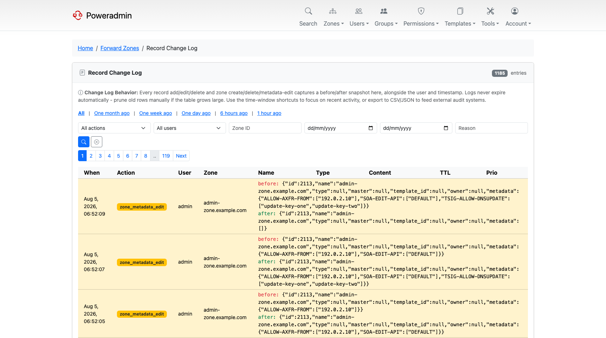

# Record Change Log

*Available since v4.5.0.*

The record change log answers "what changed, who changed it, and what did it look like
before". Where the zone activity log records that an operation happened, this log stores a
full before and after snapshot of every record and zone change, so you can read the actual
diff.



Open it from **Administration → Record Changes** on the dashboard, or from the **Zones**
menu. The page is at `/zones/changes`.

> **Note:** The change log is a superuser page. Regular users, including zone owners, do not
> see it. Zone owners can still read the per-zone activity log through the
> `zone_logs_view_own` permission - see [Permissions](permissions.md).

## Turning it on

The log writes to the `log_record_changes` table, which is part of database audit logging:

```php
return [
    'logging' => [
        'database_enabled' => true,
    ],
];
```

With `database_enabled` left off, nothing is recorded and the page stays empty. See
[Database Logging](../configuration/database-logging.md) for the other log tables this
setting controls.

## What gets recorded

| Action | Recorded when |
|--------|---------------|
| `record_create` | A record is added through the forms, bulk add, templates, or the API. Dynamic DNS updates are not logged - they write to the records table directly |
| `record_edit` | A record is changed; both the old and the new row are stored |
| `record_delete` | A record is removed |
| `zone_create` | A zone is created |
| `zone_delete` | A zone is deleted, along with how many records went with it |
| `zone_metadata_edit` | Zone metadata is changed through the metadata editor or the API |

Each row carries the acting user, the client IP, the timestamp, and the before/after
snapshots as JSON.

Rows are never expired automatically. On a busy installation the table grows without limit,
so prune it on your own schedule.

## Filtering

The toolbar narrows the list down:

- **Time window shortcuts** - one month, one week, one day, six hours, one hour, or all.
- **Action** - one of the six actions above.
- **User** - who made the change.
- **Zone ID** - restrict to a single zone.
- **Date range** - an explicit from/to pair.
- **Reason** - search the text of the change reason (see below).

## Changesets and change reasons

A bulk operation is one logical change made of many row changes. Poweradmin groups those
rows into a **changeset** so the log reads as one edit rather than fifty. The bulk record
add form and the bulk delete form both carry a **Reason** field, and the reason is stored
with the changeset and shown next to the username on every row that belongs to it.

The reason is optional by default. To make it mandatory:

```php
return [
    'logging' => [
        'require_change_comment' => true,
    ],
];
```

With this on, bulk record add and bulk delete refuse to submit without a reason. Reasons are
capped at 1000 characters.

## Exporting

The **Export** button downloads the currently filtered rows as CSV or JSON, with a
confirmation dialog showing how many rows are about to be exported. Use it to feed an
external audit or SIEM system.

## Emailing a change digest

`addons/send_record_changes_email.php` renders the same data as an HTML diff report and
mails it. It is built for cron:

```bash
php addons/send_record_changes_email.php \
    --to=ops@example.com \
    --subject="DNS changes, last 24h" \
    --since="2026-08-11 00:00:00"
```

Options:

| Option | Meaning |
|--------|---------|
| `--to=ADDR[,ADDR]` | Required. Recipients, comma-separated |
| `--subject=TEXT` | Required. Subject line |
| `--since=DATETIME` | Lower bound, UTC. Defaults to 24 hours ago |
| `--until=DATETIME` | Upper bound. Defaults to now |
| `--from=ADDR` | Sender override. Defaults to `dns.hostmaster` from the configuration |
| `--header=HTML` | Preamble inserted before the table |
| `--footer=HTML` | Postamble inserted after the table |
| `--dry-run` | Print the rendered HTML instead of sending it |
| `--help` | Show usage |

A daily digest at 06:00 looks like this:

```
0 6 * * * php /var/www/poweradmin/addons/send_record_changes_email.php --to=ops@example.com --subject="DNS changes, last 24h"
```

Mail delivery uses the configured transport, so set that up first - see
[Mail Configuration](../configuration/mail.md).

## Related pages

- [Database Logging](../configuration/database-logging.md) - the other audit log tables
- [Permissions](permissions.md) - who can read which logs
- [Zone Management](zones.md) - the per-zone activity log
