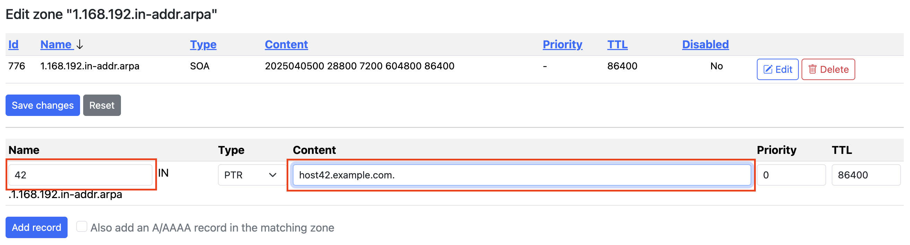
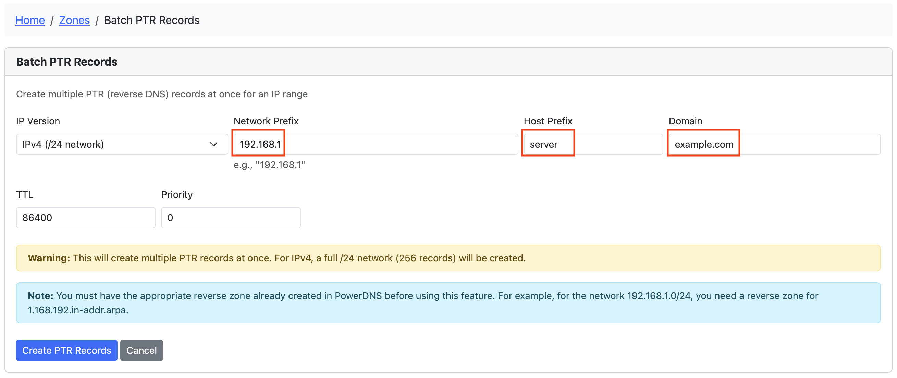
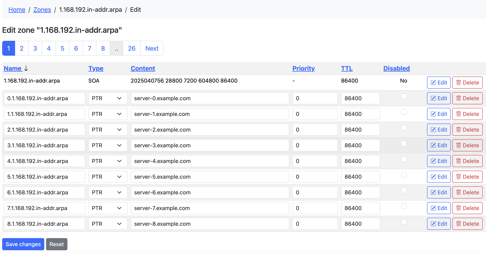
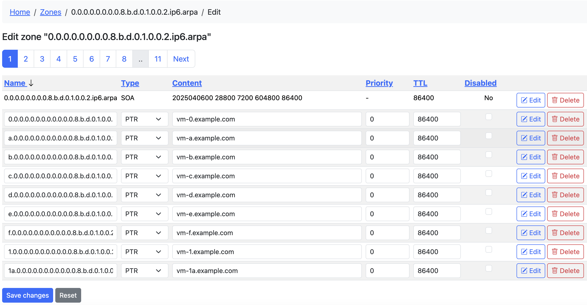

# Reverse DNS (PTR Records) Guide

This guide explains how to create and manage Reverse DNS (PTR) records in Poweradmin for PowerDNS.

## What are PTR Records?

PTR (Pointer) records provide reverse DNS resolution, mapping IP addresses to hostnames. They are used for:

- Email server verification
- Security controls and authentication
- Network troubleshooting
- Server identification

## Prerequisites

Before creating PTR records, you need:

1. The appropriate reverse zone must exist in PowerDNS
   - For IPv4: Create a zone like `1.168.192.in-addr.arpa` for the 192.168.1.0/24 network
   - For IPv6: Create a zone like `0.0.0.0.0.0.0.0.8.b.d.0.1.0.0.2.ip6.arpa` for 2001:db8::/64

2. Proper permissions to add records to these zones:
   - You need at least one of these permissions:
     - `zone_content_edit_own` - To edit zones you own
     - `zone_content_edit_others` - To edit any zone
   - For creating reverse zones, you need:
     - `zone_master_add` or `zone_slave_add` permissions

## Method 1: Adding Individual PTR Records

For single PTR records:

1. Go to the reverse zone's record list (e.g., `1.168.192.in-addr.arpa`)
2. Click "Add Record" at the top of the zone edit page
3. Enter the information:
   - **Name**: The last octet of the IP address (e.g., `42` for 192.168.1.42)
   - **Type**: PTR
   - **Content**: The fully qualified domain name (FQDN) this IP should resolve to (e.g., `host42.example.com.`)
   - **TTL**: Time-to-live value (e.g., 86400 for 1 day)
4. Click "Add Record"



## Method 2: Using Batch PTR Records Feature

For creating multiple PTR records at once:

1. Access the Batch PTR Records feature:
   - From the top navigation: Zones → Batch PTR Records
   - From the dashboard: Click the "Batch PTR Records" card
   
2. Complete the form:
   - **IP Version**: Choose IPv4 or IPv6
   - **Network Prefix**: 
     - For IPv4: The first three octets (e.g., `192.168.1`)
     - For IPv6: The /64 prefix (e.g., `2001:db8:1:1`)
   - **Host Prefix**: Base name for the hosts (e.g., `server`)
   - **Domain**: Domain suffix for PTR records (e.g., `example.com`)
   - **Number of IPv6 Records**: (IPv6 only) How many records to create
   - **TTL**: Time-to-live value
   - **Priority**: Usually 0 for PTR records
   
3. Click "Create PTR Records"



### Examples

#### IPv4 Example

- Network Prefix: `192.168.1`
- Host Prefix: `server`
- Domain: `example.com`

This will create 256 PTR records:
- `0.1.168.192.in-addr.arpa` → `server-0.example.com.`
- `1.1.168.192.in-addr.arpa` → `server-1.example.com.`
- ...through...
- `255.1.168.192.in-addr.arpa` → `server-255.example.com.`



#### IPv6 Example

- Network Prefix: `2001:db8:1:1`
- Host Prefix: `vm`
- Domain: `example.com`
- Number of records: 100

This will create 100 PTR records with hostnames like `vm-0.example.com` through `vm-99.example.com`



## Tips for Batch PTR Records

- **Run Multiple Times Safely**: You can run the batch tool multiple times - existing records will be skipped
- **Progress Reporting**: The tool reports how many records were created, skipped, or failed
- **Reverse Zone Required**: The appropriate reverse zone must exist before using this feature
- **Automated Creation**: All hostnames are generated automatically based on the pattern `{prefix}-{number}.{domain}`

## Permissions and Access Control

The Batch PTR Records feature follows Poweradmin's permission system:

1. **Required Feature Flag**:
   - The `add_reverse_record` option must be enabled in the Poweradmin configuration

2. **Required User Permissions**:
   - Either the `zone_content_edit_own` or `zone_content_edit_others` permission is required to access this feature
   - When accessed from a specific zone page, you also need ownership of that zone (if using `zone_content_edit_own`)

3. **Permission Hierarchy**:
   - `zone_content_edit_others` gives access to all zones
   - `zone_content_edit_own` limits access to zones you own
   - No edit permissions means no access to batch PTR records

4. **Administrative Setup**:
   - Administrators can assign these permissions through permission templates
   - Users who can only view zones will not see the Batch PTR Records option

## Troubleshooting

- **No matching reverse zone found**: Create the appropriate reverse zone first
- **Permission denied**: Ensure you have rights to add records to the reverse zone
- **No records created**: Check if records already exist (they will be skipped)
- **Feature not visible**: Check if you have the required permissions

## Delegating a Sub-Range (RFC 2317)

When you own a /24 reverse zone but want a different team or client to manage PTRs for only part of it (e.g. 10.0.0.64/25), use classless reverse delegation as defined in [RFC 2317](https://datatracker.ietf.org/doc/html/rfc2317). Poweradmin's ownership model is per-zone, so the trick is to create a smaller child zone for the sub-range and assign it to the delegate.

### Example: Delegate 10.0.0.64/25 to a client

Parent zone: `0.0.10.in-addr.arpa` (owned by you, covers 10.0.0.0/24).
Goal: the client manages PTRs for 10.0.0.64 through 10.0.0.127.

**1. Create the child zone**

From **Zones → Add master zone**, create:

- **Zone name**: `64/25.0.0.10.in-addr.arpa` (slash notation - preferred)
  - Range notation `64-127.0.0.10.in-addr.arpa` is also accepted.
- **Owner**: the client user (or a group the client belongs to)

Poweradmin's hostname validator accepts both notations. The slash form follows the RFC 2317 example syntax most resolvers and dig output assume.

**2. Add delegation NS records in the child zone**

In the new child zone, add NS records pointing to whichever nameservers will be authoritative for it (often the same servers as the parent).

**3. Add CNAME glue in the parent zone**

In `0.0.10.in-addr.arpa`, replace the PTR records for the 64-127 range with CNAMEs pointing into the child zone. For each delegated address:

| Name | Type | Content |
|---|---|---|
| `64` | CNAME | `64.64/25.0.0.10.in-addr.arpa.` |
| `65` | CNAME | `65.64/25.0.0.10.in-addr.arpa.` |
| ... | ... | ... |
| `127` | CNAME | `127.64/25.0.0.10.in-addr.arpa.` |

These CNAMEs tell any resolver doing reverse lookup for 10.0.0.64-127 to chase the answer into the delegated child zone.

**4. Client adds PTRs in the child zone**

The client (who owns the child zone, not the parent) adds PTR records in `64/25.0.0.10.in-addr.arpa`:

| Name | Type | Content |
|---|---|---|
| `64` | PTR | `host64.client.example.` |
| `100` | PTR | `mailrelay.client.example.` |

The client cannot edit the parent zone, and you cannot accidentally clobber their PTRs.

### When you don't need RFC 2317

If you're delegating on an octet boundary - the whole /24 inside a /16, for instance - just create the child zone directly (`5.10.in-addr.arpa` under `10.in-addr.arpa`) and assign the owner. No CNAMEs needed.

RFC 2317 only applies when the sub-range doesn't align with a DNS label boundary, i.e. anything smaller than /24 for IPv4 or anything not on a nibble boundary for IPv6.

## Per-Record-Type Default TTLs (4.5.0)

Admins can configure default TTLs per record type from **Tools → TTL defaults** (`/tools/record-type-defaults`). Values stored there take precedence over the legacy `dns.ttl_reverse` config and `dns.ttl` fallback. The same default applies to every record-creation path (UI forms, batch PTR, the v1/v2 record APIs, RRSets, bulk records, and the DNS wizard) when the caller omits a `ttl` field. Leave a row empty to fall back to the legacy chain.

The fallback chain (first non-null wins):

1. `record_type_defaults` row for the submitted type (admin-managed via the UI above)
2. `dns.ttl_reverse` for PTR records in reverse zones (legacy config)
3. `dns.ttl`

## Default TTL for PTR Records (legacy)

`dns.ttl_reverse` in `config/settings.php` is the legacy config-file knob that predates the per-type table. It still works as a fallback when no per-type row is configured: when set, it pre-fills the TTL field on the add-record form for reverse zones, applies to batch PTR creation, and is used for PTRs auto-created alongside a forward record. When unset, PTRs fall back to `dns.ttl`. Originally added in 4.4.0; extended to the v1/v2 record APIs, RRSets, bulk records, and the DNS wizard in 4.5.0.

```php
'dns' => [
    'ttl' => 86400,
    'ttl_reverse' => 300, // 5 minutes for all PTR records
],
```

## Best Practices

1. Use meaningful host prefixes that identify the purpose of the servers
2. Use consistent TTL values across your reverse zones
3. Ensure your forward (A/AAAA) and reverse (PTR) records match
4. Consider using shorter TTLs during migration periods