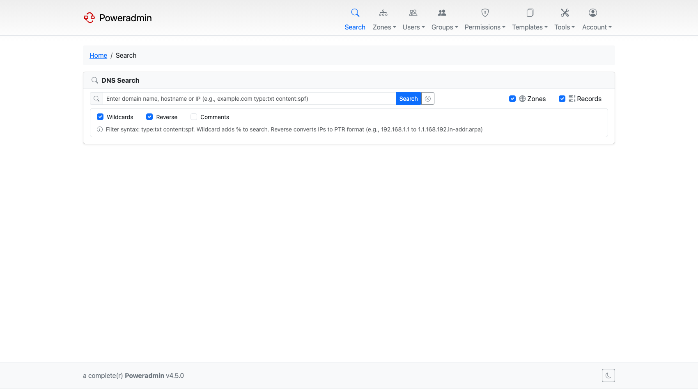

# Search

Search finds zones and records across everything you are allowed to see. It is reached from
**Search** in the top navigation (`/search`) and needs the `search` permission.

Results are scoped by your own permissions, so a user who can only see their own zones searches
only their own zones. Holding `search` alone does not widen what you can view.

## Options

Five checkboxes control the search:

| Option | Effect |
|--------|--------|
| Zones | Match zone names |
| Records | Match record names and record content |
| Wildcard | Match anywhere in the value. Unticked means an **exact** match |
| Reverse | Also match the PTR form of an IP address |
| Comments | Also search zone and record comments |

Two of these interact with the others:

- **Ticking Comments turns Wildcard on**, because an exact-match comment search is rarely useful.
- **Reverse only applies to a valid IPv4 or IPv6 address.** For anything else it is ignored. When
  it does apply, the query is converted to its PTR name - `10.0.0.5` becomes
  `5.0.0.10.in-addr.arpa` - and matched against reverse-zone record names.

Searching for a bare IP address automatically enables Records and Reverse, so looking up an
address finds both the A/AAAA record and its PTR without ticking anything.

Queries are converted to punycode before matching, so an internationalised domain name can be
typed in either form.

## Filters in the query box

Two filters can be typed directly into the search box. Both are removed from the text before the
rest of the query is matched, and both force a record search.

| Filter | Matching | Example |
|--------|----------|---------|
| `type:` | Exact, case-insensitive on input | `type:txt` finds TXT records |
| `content:` | Substring | `content:spf` finds records whose content contains `spf` |

They combine with an ordinary query, so `example.com type:mx` searches for `example.com` among MX
records only. A space after the colon is accepted (`type: mx`).

## Comment search

Searching comments needs the comment feature to be visible in the first place:

- Zone comments require `interface.show_zone_comments`
- Record comments require `interface.show_record_comments`

If a comment type is hidden by configuration, ticking **Comments** will not search it. See
[UI Customization Overview](../configuration/ui/overview.md).

## Results

Zones and records are listed separately, each with its own pagination and rows-per-page, starting
from your [rows-per-page preference](user-preferences.md).

Zone results sort by name or type, and also by record count (SQL backend only) and by owner name
if you have permission to see owners. Record results sort by name, type, priority, content, TTL or
disabled state.

Setting `interface.search_group_records` collapses records that share the same name, type and
content into a single row. It is off by default.

You can select zones or records from the results and delete them in bulk, subject to your delete
permissions.

## Related pages

- [Zone Management](zones.md)
- [Permissions](permissions.md)
- [User Preferences](user-preferences.md)
