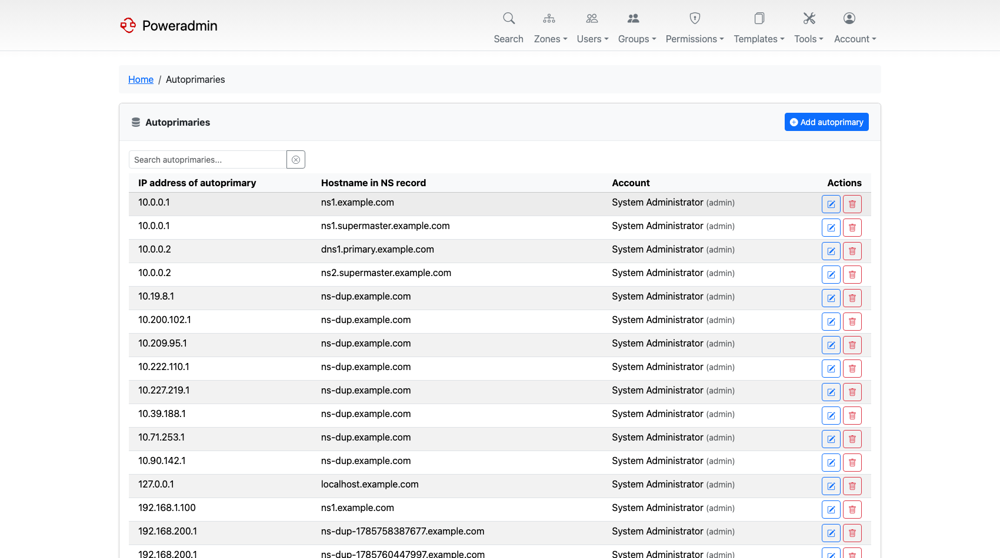

# Supermasters and Autoprimaries

A supermaster is a primary server that Poweradmin's PowerDNS instance trusts to create zones on
its own. When that server sends a NOTIFY for a zone the secondary does not have, PowerDNS
provisions the slave zone automatically instead of ignoring it. This saves adding every new zone
by hand on the secondary.

> **Note:** PowerDNS renamed this concept to **autoprimary** in 4.6. Poweradmin follows the
> connected server: the UI says "Autoprimaries" when the server supports the autoprimary API and
> "Supermasters" when it does not. The URLs, permissions and database table keep the older
> `supermaster` name in both cases, so this page uses whichever term matches what you will see.

## Finding the page

The list lives at `/supermasters`. It is not in the top navigation - reach it from the cards on
the dashboard, which appear only if you hold the relevant permission.

## Permissions

| Permission | Grants |
|------------|--------|
| `supermaster_view` | See the list |
| `supermaster_add` | Add a new entry |
| `supermaster_edit` | Edit **and** delete entries |

There is no separate delete permission - `supermaster_edit` covers both. See
[Permissions](permissions.md).

## Fields

Each entry has three fields, which map directly to PowerDNS's `supermasters` table:

| Field | Description |
|-------|-------------|
| IP address | The address the primary sends NOTIFY from. PowerDNS matches on this exactly, so it must be the source address, not just a name that resolves to it |
| Hostname in NS record | The nameserver hostname that appears in the zone's NS records |
| Account | A Poweradmin username. Zones auto-created from this supermaster are assigned to that user |

The IP address and hostname together form the primary key, so the same IP can appear more than
once with different nameserver hostnames. Editing and deleting identify an entry by both values.

Setting **Account** matters in practice: without it, auto-created zones arrive with no owner and
are invisible to non-administrator users. Those show up under "zones without owners" in the
[Database Consistency Check](../maintenance/consistency-check.md).

## Adding an entry

1. Open the supermasters list and choose **Add autoprimary** (or **Add supermaster**).

2. Enter the IP address, the nameserver hostname, and the account that should own zones created
   from it.

3. Save. The entry takes effect immediately - PowerDNS consults the table when a NOTIFY arrives.

For the secondary to actually build the zone, the primary must also allow it to transfer, and the
NOTIFY must come from the address you entered.

Adding, editing and deleting are all written to the activity log; see
[Database Logging](../configuration/database-logging.md).

## Related pages

- [Zone Management](zones.md) - creating slave zones by hand
- [Secondary Zone Import](secondary-zone-import.md) - pulling an existing zone over AXFR
- [PowerDNS API Configuration](../configuration/powerdns-api.md) - the status page reports whether
  each configured autoprimary is reachable
