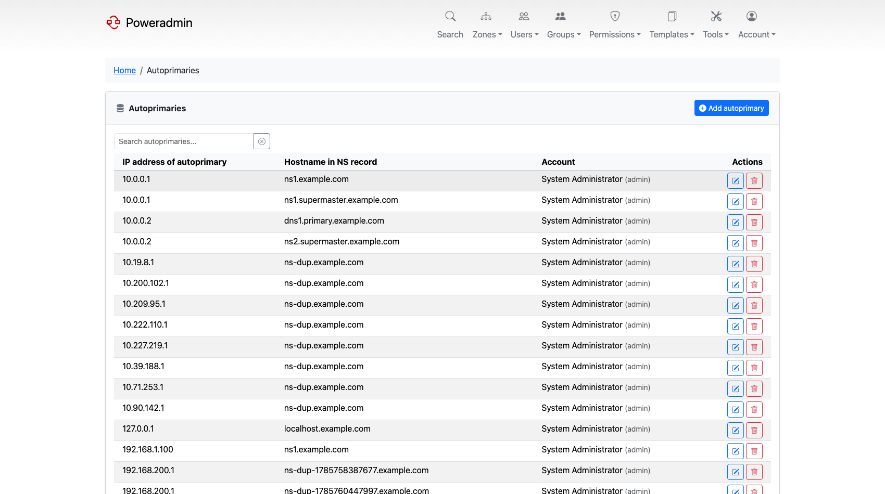

# Supermasters and Autoprimaries

A supermaster is a primary server that Poweradmin's PowerDNS instance trusts to create zones on
its own. When that server sends a NOTIFY for a zone the secondary does not have, PowerDNS
provisions the slave zone automatically instead of ignoring it. This saves adding every new zone
by hand on the secondary. PowerDNS documents the mechanism, including the NOTIFY-matching rules
Poweradmin cannot enforce, under
[Autoprimary operation](https://doc.powerdns.com/authoritative/modes-of-operation.html#autoprimary-operation).

> **Note:** PowerDNS renamed this concept to **autoprimary** in
> [4.5.0](https://doc.powerdns.com/authoritative/modes-of-operation.html#autoprimary-operation);
> 4.6 is when it gained an API and `pdnsutil` commands for managing autoprimaries. Poweradmin
> follows the connected server: the UI says "Autoprimaries" when the server supports the
> autoprimary API (4.6+) and "Supermasters" when it does not. The URLs, permissions and database table keep the older
> `supermaster` name in both cases, so this page uses whichever term matches what you will see.

## Finding the page

The list lives at `/supermasters`. It is not in the top navigation - reach it from the cards on
the dashboard, which appear only if you hold the relevant permission.

## Permissions

| Permission | Grants |
|------------|--------|
| `supermaster_view` | See the list |
| `supermaster_add` | Add a new entry |
| `supermaster_edit` | Edit **and** delete entries |

There is no separate delete permission - `supermaster_edit` covers both. See
[Permissions](permissions.md).

## Fields

Each entry has three fields, which map directly to PowerDNS's `supermasters` table:

| Field | Description |
|-------|-------------|
| IP address | The address the primary sends NOTIFY from. PowerDNS matches on this exactly, so it must be the source address, not just a name that resolves to it |
| Hostname in NS record | The nameserver hostname that appears in the zone's NS records |
| Account | A Poweradmin username. PowerDNS copies it into the `account` field of every zone it creates from this entry |

The IP address and hostname together form the primary key, so the same IP can appear more than
once with different nameserver hostnames. Editing and deleting identify an entry by both values.

PowerDNS creates these zones itself, so Poweradmin does not give them an owner by default. They
are invisible to non-administrator users and show up under "zones without owners" in the
[Database Consistency Check](../maintenance/consistency-check.md).

Since v4.6.0, set `dns.adopt_zone_owner_from_account` to `true` (Docker:
`PA_DNS_ADOPT_ZONE_OWNER_FROM_ACCOUNT=true`) to give such a zone to the user named in **Account**:

- With the API backend, the zone sync does it as soon as it finds the new zone.
- With either backend, the "zones without owners" repair in the consistency check assigns the
  zone to that user instead of the administrator who runs the repair. This also covers zones
  that arrived before the setting was turned on.

The account must match the username exactly, including case. A zone that already has an owner
or a group is never changed. A user at their [zone limit](users-roles.md#zone-limits) adopts no
more zones: the sync leaves the zone ownerless, and the repair gives it to the administrator.

## Adding an entry

1. Open the supermasters list and choose **Add autoprimary** (or **Add supermaster**).

2. Enter the IP address, the nameserver hostname, and the account that should own zones created
   from it.

3. Save. The entry takes effect immediately - PowerDNS consults the table when a NOTIFY arrives.

For the secondary to actually build the zone, the primary must also allow it to transfer, and the
NOTIFY must come from the address you entered.

Adding, editing and deleting are all written to the activity log; see
[Database Logging](../configuration/database-logging.md).

## Related pages

- [Zone Management](zones.md) - creating slave zones by hand
- [Secondary Zone Import](secondary-zone-import.md) - pulling an existing zone over AXFR
- [PowerDNS API Configuration](../configuration/powerdns-api.md) - the status page reports whether
  each configured autoprimary is reachable
