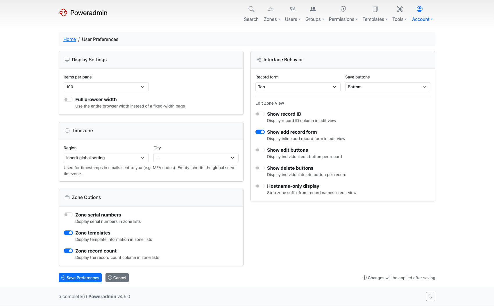

# User Preferences

Every logged-in user has a preferences page at `/user/preferences`, reached from the **Account**
menu. It overrides a subset of the site-wide interface settings for that user only - the
administrator's values in `config/settings.php` remain the defaults for everyone who has not
changed them.

There is no permission gate. Any user who can log in can set their own preferences, and they
cannot affect anyone else's.

## Display settings

| Preference | Overrides | Notes |
|------------|-----------|-------|
| Items per page | `interface.rows_per_page` | 10, 20, 50 or 100 |
| Full browser width | `interface.wide_layout` | Uses the whole window instead of a fixed-width page |

## Timezone

Chosen as a region and a city, giving an IANA timezone such as `Europe/Vilnius`. It is used for
timestamps in mail sent to you, for example MFA codes. Leaving it empty inherits the server-wide
`misc.timezone`.

## Zone options

These three toggles control optional columns in the zone lists.

| Preference | Overrides |
|------------|-----------|
| Zone serial numbers | `interface.display_serial_in_zone_list` |
| Zone templates | `interface.display_template_in_zone_list` |
| Zone record count | `interface.show_zone_record_count` |

## Interface behaviour

Where the record form and the save buttons sit, and what the zone editor shows.

| Preference | Overrides |
|------------|-----------|
| Record form position (top or bottom) | `interface.position_record_form_top` |
| Save buttons position (top or bottom) | `interface.position_save_button_top` |
| Show record ID | `interface.show_record_id` |
| Show add record form | `interface.show_add_record_form` |
| Show edit buttons | `interface.show_record_edit_button` |
| Show delete buttons | `interface.show_record_delete_button` |
| Hostname-only display | `interface.display_hostname_only` |

**Hostname-only display** strips the zone suffix from record names in the editor, so
`www.example.com` shows as `www`.

Two behaviours worth knowing:

- **Show record ID is hidden in [API backend mode](../configuration/powerdns-api.md)**, because
  PowerDNS does not expose stable numeric record IDs. Your saved value is preserved rather than
  cleared, so it returns if the instance moves back to the SQL backend.
- There is **no theme preference**. Light and dark are chosen with the toggle in the page footer,
  and the site-wide default stays with `interface.theme`.

Changes apply after saving.

## How it is stored

Preferences are rows in the `user_preferences` table, one per key, unique per user. Deleting a
user removes their preferences with them. Any key a user has never set simply falls back to the
configured default, so adding a new site-wide default immediately affects everyone who has not
overridden it.

## Related pages

- [UI Customization Overview](../configuration/ui/overview.md) - the site-wide defaults these
  override
- [Users and Roles](users-roles.md)
