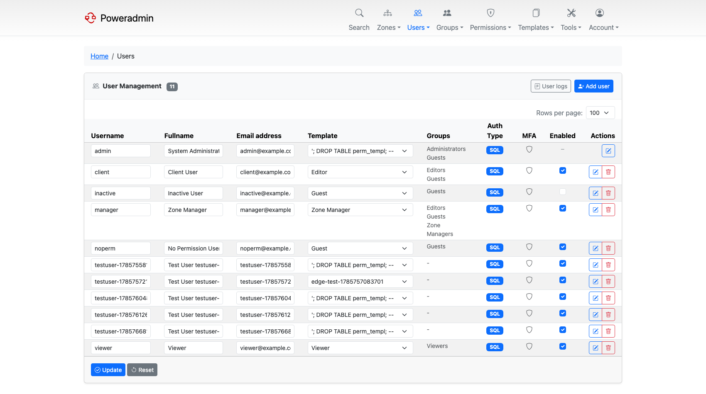

# Users and Roles

This document provides an overview of user roles and the permission management system in Poweradmin.

## Basics of User Management

Poweradmin implements a permission-based user management system with two primary user levels:

1. **Uberusers** - Users that can do anything within the interface (administrators)
2. **Limited users** - Users with restricted permissions based on assigned templates

## Permission Templates

Permission templates were introduced in version 2.0.0 and are built from a set of individual permissions. Each
permission allows users to perform specific actions, such as viewing zone contents, editing zones, or creating
supermasters. By adding or removing permissions to a template and assigning that template to users, you can control user
access rights.

## Understanding Uberuser Status

The `user_is_ueberuser` permission overrules any other permission the user may or may not have been assigned. It grants
full access to all features that would otherwise require specific permissions. This is typically reserved for
administrators.

## Zone Ownership

Ownership is a designation that marks users as "owners" for specific zones. However, ownership alone doesn't grant any
privileges for these zones. The actual abilities are determined by the permissions in the user's assigned template. For
example, if a user owns zones but lacks the `zone_content_view_own` permission, they won't be able to see those zones.

## Edit Access and Zone Integrity

Poweradmin assumes that users with edit permissions for a zone can be trusted with full access to that zone's contents,
because even partial edit access would allow a user to break the zone's functionality.

Deleting a zone is separate. Since version 4.1.0 it has its own permissions, `zone_delete_own` and
`zone_delete_others`, checked independently of the edit permissions. A user who can edit a zone cannot delete it unless
one of those is granted as well.

## Security Pitfalls

Granting any of these permissions gives a user broad influence over other accounts, so treat them as
administrative:

- `user_edit_templ_perm`
- `templ_perm_edit`
- `user_add_new`

They cannot be used to become an administrator. A user who is not already an administrator cannot put
`user_is_ueberuser` into a permission template, cannot edit a template that already carries it, and
cannot assign such a template to an account. See
[Permissions](permissions.md#template-permissions) for the details.

Anyone with root shell access to the server running Poweradmin, or to the PowerDNS database server,
effectively has uberuser rights regardless of the permission system.

## Additional Information

When configuring user permissions, keep the principle of least privilege in mind - only grant the permissions necessary
for a user to perform their required functions.