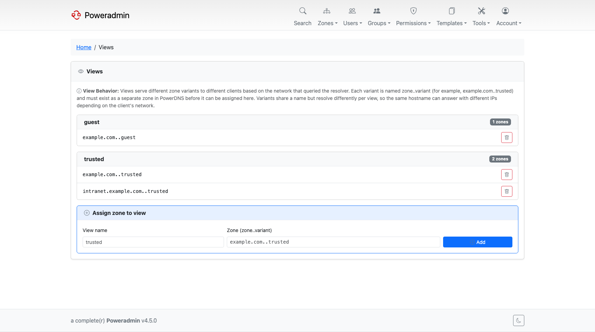
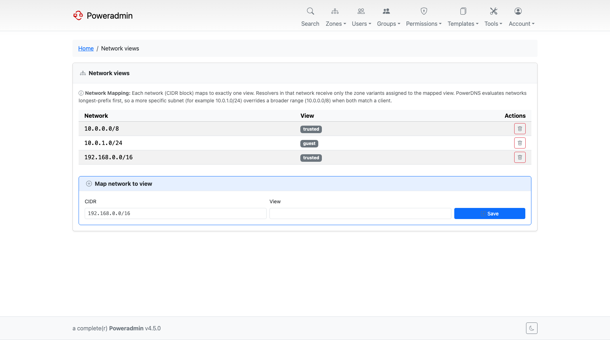

# Views and Networks

*Available since v4.4.0.*

PowerDNS 5.0 can answer the same query differently depending on which network the client
came from - the feature usually called split-horizon DNS. Poweradmin exposes two pages for
it: **Views**, which assigns zone variants to a view, and **Networks**, which maps client
networks to views.



## Requirements

Views have more prerequisites than most features, and three of them are on the PowerDNS side
rather than in Poweradmin:

| Requirement | Detail |
|---|---|
| PowerDNS 5.0 or newer | Older servers make the page report "Views require PowerDNS 5.0 or newer" instead of rendering |
| **The LMDB backend** | Views are an LMDB-only feature. The generic SQL backends (`gmysql`, `gpgsql`, `gsqlite3`) do not implement them |
| **`views=yes` in `pdns.conf`** | The setting is off by default, even on LMDB |
| Poweradmin's API backend | `dns.backend` must be `api`; see [PowerDNS API](../configuration/powerdns-api.md) |
| Superuser | Both pages are superuser-only |

The backend requirement is the one that catches people out. Running PowerDNS 5.1 on `gmysql`
looks like it should work, and the pages load, but PowerDNS rejects every view operation.
`pdnsutil` says so plainly:

```
None of the configured backends support views.
```

You get the same message on LMDB when `views=yes` is missing, so check both before
concluding the backend is wrong.

A minimal PowerDNS configuration for views:

```
launch=lmdb
lmdb-filename=/var/lib/powerdns/pdns.lmdb
views=yes
api=yes
api-key=your-api-key
webserver=yes
```

## How the two pieces fit together

1. You create a zone variant in PowerDNS, named `zone..variant`, for example
   `example.com..trusted`. The variant is a separate zone with its own records.
2. On the **Views** page you assign that variant to a view name, for example `trusted`.
3. On the **Networks** page you map a CIDR block, for example `10.0.0.0/8`, to the same
   view.

A resolver querying from `10.1.2.3` then gets the records from `example.com..trusted`, while
everyone else gets the plain `example.com`.

## Views

The Views page is at `/views`. It lists each view with the zone variants assigned to it, and
a form to add another.

Two things to know:

- **The variant zone must already exist in PowerDNS.** Poweradmin assigns an existing zone
  to a view; it does not create the variant for you. Create it with `pdnsutil`:

```bash
pdnsutil zone create example.com..trusted ns1.example.com
```

- **View names accept letters, digits, dots, underscores and hyphens.** Anything else is
  rejected.

To assign a zone, enter the view name (`trusted`) and the full variant zone name
(`example.com..trusted`). Removing an assignment takes the zone back out of the view; it does
not delete the zone.

## Networks



The Networks page is at `/networks`. Each network maps to exactly one view, and every
resolver in that network sees only the zone variants belonging to it.

PowerDNS evaluates networks **longest-prefix first**. A more specific subnet wins over a
broader one, so `10.0.1.0/24` mapped to `office` overrides `10.0.0.0/8` mapped to `internal`
for a client at `10.0.1.5`.

To add a mapping, enter the CIDR (`192.168.0.0/16`) and the view name (`trusted`).

## Related pages

- [PowerDNS API](../configuration/powerdns-api.md) - enabling the API backend
- [Zone Management](zones.md) - creating the variant zones themselves
