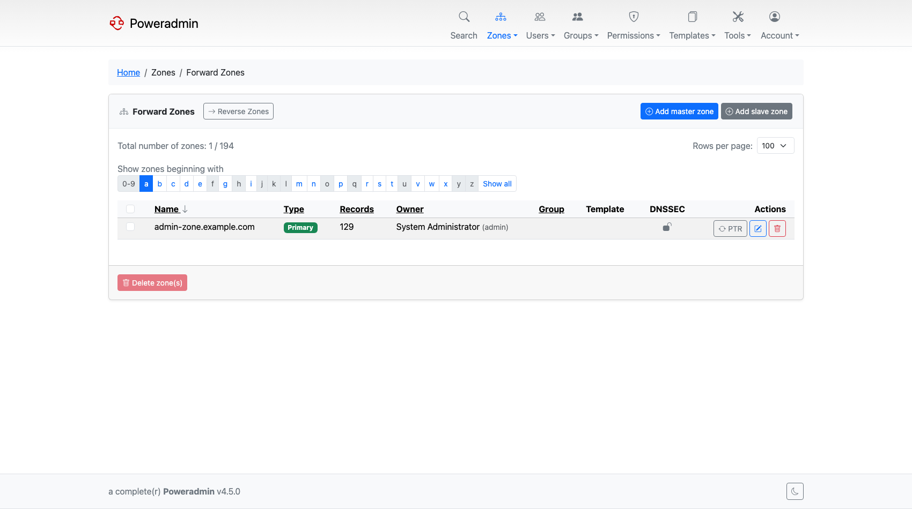
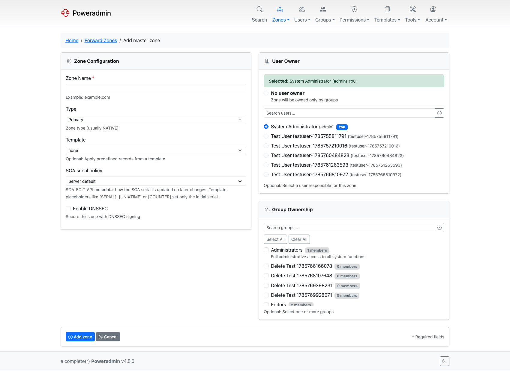
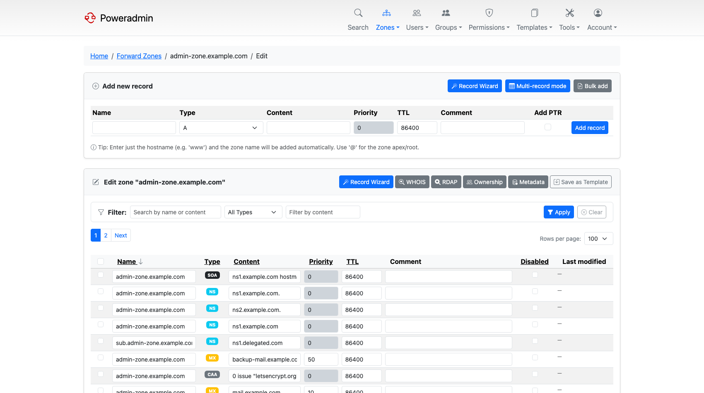

# Zone Management

Zones are the core objects in Poweradmin. Each zone corresponds to a DNS domain (or reverse network) managed by PowerDNS. This guide covers creating, editing, and managing zones.

## Zone Types

Choose the type based on your DNS architecture:

- **Master** - the authoritative source for the zone. Changes are made here and replicated to slave servers. Use this when Poweradmin is your primary DNS management interface.
- **Slave** - a read-only copy that receives updates from a master server. Use this when another DNS server holds the primary data and you want PowerDNS to serve as a secondary.
- **Native** - zones that rely on native database replication instead of DNS-based zone transfers (AXFR/IXFR). Use this when all your PowerDNS servers share the same database backend.

> **Tip:** If you are running a single PowerDNS server, **Native** is the simplest option since no zone transfers are needed.

### Catalog zones

PowerDNS 4.7 and later add two more kinds, used to distribute a list of zones between servers rather than to hold ordinary records. Poweradmin offers them on the add-zone form only when the connected server reports 4.7 or newer.

- **Producer** - the catalog itself, on a primary. PowerDNS generates its contents from the member zones, so you do not add records to it by hand.
- **Consumer** - the receiving end, on a secondary. It works like a Slave zone and needs the IP address of the primary it transfers the catalog from, so the add-zone form asks for one when you select it. Because its contents arrive by transfer, no template or DNSSEC option applies.

#### Managing catalog members

Poweradmin can assign zones to a catalog from either end.

From the **producer** side, open the Producer zone and use the **Catalog Members** button on the zone
editor. The page lists the zones the catalog currently publishes and lets you add or remove one at a
time.

From the **member** side, open the zone and use the **Catalog** selector in the zone details block.
It offers every producer zone you are allowed to manage, plus `none` to take the zone out of its
catalog. If the zone is already in a catalog whose producer this installation does not hold, the
selector shows that catalog name marked `not managed here` and leaves it untouched unless you pick
something else.

Two limits come from PowerDNS itself:

- Only **Primary** (Master) and **Producer** zones can be members. PowerDNS serves a catalog from
  those kinds only, so other kinds would accept the setting and then never be published. Poweradmin
  hides the selector for them.
- A zone belongs to at most one catalog, so adding it to a second one moves it.

Membership is governed by the same **zone meta edit** permission that covers zone type, primary IP
and template, and every change is written to the audit log.

### Read-only zones

**Secondary** (Slave) and **Consumer** (catalog) zones hold records that PowerDNS replicates from a primary, so Poweradmin treats their records as read-only. In the zone list these zones show a muted **Read-only** badge next to their type.

For a read-only zone, Poweradmin blocks every record-changing action across the UI, API, and automation:

- Adding, editing, or deleting records (zone editor, DNS wizards, bulk add, batch PTR)
- Editing per-record comments and the zone comment
- Applying a zone template
- Importing records from a zone file
- Dynamic DNS (DDNS) updates
- The public API record, RRset, and bulk endpoints, which return a clear "read-only zone" error instead of a permission error

To change the records in a read-only zone, edit them on the primary server - the changes replicate automatically. You can still change the zone's own configuration (such as the Secondary master IP) and delete the zone itself.

## Creating Zones

### Adding a Master Zone

1. Navigate to **Zones** and click **Add master zone**
2. Enter the **Zone name** (e.g., `example.com`)
3. Select an **Owner** - the user who will manage this zone
4. Optionally select a **Zone template** to pre-populate records (SOA, NS, etc.)
5. Enable **DNSSEC** if you want the zone signed by PowerDNS
6. Click **Add zone**

The zone is created with the records defined in the selected template. If no template is chosen, only a SOA record is created.

### Adding a Slave Zone

1. Navigate to **Zones** and click **Add slave zone**
2. Enter the **Zone name**
3. Enter the **IP address of master NS** that this slave will pull data from (several IPs can be given, separated by commas)
4. Select an **Owner**
5. Click **Add zone**

Slave zones are populated automatically by PowerDNS through zone transfers from the configured master server.

### Zone Templates

Zone templates let you define a standard set of records that are added when creating a new zone. This is useful for ensuring every zone starts with consistent SOA values, nameserver records, and common entries like MX or SPF records. See [DNS Templates](dns-templates.md) for details on creating and managing templates.

## Zone Editor

The zone editor is where you view and modify a zone's DNS records. It shows all records in a table with columns for name, type, content, TTL, and priority.

### Editing Records

Records are edited in the table itself:

- Change the name, type, content, TTL, or priority fields directly in the record row
- Click **Save changes** to apply, or **Reset** to discard

Enabling `interface.show_record_edit_button` adds an **Actions** column with a per-record edit button that opens the record on its own page. It is off by default, as is `interface.show_record_delete_button`, so a default install has no Actions column.

### Adding Records

By default the zone editor shows an **Add record** button that opens a separate page (`/zones/{id}/records/add`). Set `interface.show_add_record_form` to `true` to get an input row in the record table instead. Either way:

1. Enter the record **Name** (just the hostname part, e.g., `www`)
2. Select the record **Type** (A, AAAA, CNAME, MX, TXT, etc.)
3. Enter the **Content** (e.g., an IP address for A records)
4. Set the **TTL** and **Priority** if applicable
5. Click **Add Record**

### Optional Columns

Two columns are optional, and both are off by default:

- `interface.show_record_id` (added in 3.9.0) - adds the record ID column
- `interface.show_record_edit_button` and `interface.show_record_delete_button` (added in 4.1.0) - add the **Actions** column with per-record edit and delete buttons

### Sorting

You can sort records by clicking column headers. This helps when working with large zones to quickly find specific records.

## Zone Metadata

Starting in v4.3.0, the **Metadata** button on the zone editor opens an editor for the zone's
PowerDNS domain metadata - the per-zone settings that control transfers, notifies, serial
policy and DNSSEC behaviour. Each row is a metadata *kind* and one value.

Kinds with a fixed set of valid values (`SOA-EDIT`, `SOA-EDIT-API`, `SOA-EDIT-DNSUPDATE`,
`API-RECTIFY`, `NSEC3NARROW`) offer a dropdown instead of a free-text field. Kinds your
PowerDNS version does not support yet are listed but disabled, with the required version
shown. Kinds not in the built-in list can be added through the **Custom** entry.

Some kinds accept several values - `ALLOW-AXFR-FROM`, `ALLOW-DNSUPDATE-FROM`, `ALSO-NOTIFY`,
`TSIG-ALLOW-AXFR`, `TSIG-ALLOW-DNSUPDATE`, `GSS-ALLOW-AXFR-PRINCIPAL` and `PUBLISH-CDS`. Add
one row per value. Every other kind holds a single value.

### Restrictions with the PowerDNS API backend

When Poweradmin talks to PowerDNS over its HTTP API rather than directly to the database,
PowerDNS itself limits what can be written, and the editor marks the affected rows
**Read-only**:

| Kind | Behaviour |
|---|---|
| `SOA-EDIT`, `SOA-EDIT-API`, `API-RECTIFY`, `NSEC3PARAM`, `NSEC3NARROW` | Writable, but stored as zone properties rather than metadata entries |
| `PRESIGNED`, `LUA-AXFR-SCRIPT` | Read-only - PowerDNS exposes no API route to write them. Use `pdnsutil` or the database |
| `ENABLE-LUA-RECORDS` | Neither readable nor writable over the API metadata endpoint. Use `pdnsutil` or the database |
| `AXFR-MASTER-TSIG` | Read-only - PowerDNS requires a TSIG key id, which Poweradmin cannot supply yet |
| `CATALOG-HASH` | Read-only - PowerDNS maintains it for catalog zones |

Two further rules apply in this mode:

- **Custom kinds must start with `X-`.** PowerDNS rejects any other unknown kind.
- **`NSEC3NARROW` needs `NSEC3PARAM`.** PowerDNS ignores narrow mode unless the zone also
  carries NSEC3 parameters, so the editor asks for both.

Editing a restricted kind reports an error rather than silently doing nothing. Apart from
`CATALOG-HASH`, which PowerDNS maintains itself and Poweradmin keeps read-only in both modes,
none of these restrictions apply when Poweradmin writes to the PowerDNS database directly.

### Metadata over the API

The v2 API exposes the same data at `/api/v2/zones/{id}/metadata`, with `GET`, `PUT` and
`DELETE` on `/api/v2/zones/{id}/metadata/{kind}`. It enforces the same value vocabularies and
the same backend restrictions.

Reading requires the `zone_metadata_view_own` or `zone_metadata_view_others` permission (both
added in 4.5.0); anyone who may edit metadata keeps view access as well. `PUT` and `DELETE`
require `zone_meta_edit_own` or `zone_meta_edit_others`.

## Bulk Operations

Starting in v4.0.0, you can add multiple records to a zone at once:

1. Open a zone in the zone editor
2. Click **Add multiple records**
3. Fill in several record rows in the bulk form
4. Click **Add Records** to create them all at once

This is particularly useful when setting up a new zone or adding a batch of similar records.

## CSV Export

CSV export comes from the `csv_export` module, which is enabled by default
(`modules.csv_export.enabled`):

1. Open the zone in the zone editor
2. Open the **Export** dropdown and choose **CSV** (route `/zones/{id}/export/csv`)
3. The browser downloads a CSV file containing all records in the zone

This is useful for documentation, auditing, or migrating zone data to another system.

## Zone Ownership

Every zone has at least one owner. Ownership determines who can edit and manage the zone.

- **User ownership** - assign individual users as zone owners when creating or editing a zone
- **Group ownership** - assign zones to [Groups](groups.md) so all group members get access based on the group's permission template

A zone can have both individual user owners and group owners simultaneously. Permissions from all sources are combined - if any ownership path grants a user access, they have it.

> **Note:** When creating a zone, you must select at least one owner. Administrators can reassign ownership later.

### Restricting Ownership Assignment

Starting in v4.4.0, the `dns.zone_ownership_mode` setting controls which ownership pickers are available on the zone creation form, the bulk registration form, the zone import form, and the zone ownership page:

- `both` (default) - users and groups can both be assigned as owners
- `users_only` - only individual users can be assigned; the group picker is hidden
- `groups_only` - only groups can be assigned; the user picker is hidden, and group membership is the sole way to grant zone access

Use `groups_only` to enforce group-based access management across the installation. The setting also applies to the API. API v2 supports group-only zones (pass `owner_user_id: null` together with `group_ids`). On 4.4.x, API v1 cannot create group-only zones and returns an error when `zone_ownership_mode` is set to `groups_only`.

## Disabled Records

You can disable individual records without deleting them:

- In the zone editor, toggle the **disabled** checkbox on a record
- Disabled records remain in the database but are not served by PowerDNS
- Re-enable a record at any time by toggling it back on

This is useful for temporarily taking a record out of service during maintenance or troubleshooting, without losing the record configuration.

## Zone Deletion

To delete a zone, click the **delete icon** next to the zone in the zone list, or use the delete option from the zone editor.

Starting in v4.1.0, zone deletion uses two separate permissions:

- `zone_delete_own` - allows deleting zones you own
- `zone_delete_others` - allows deleting any zone, regardless of ownership

> **Warning:** Deleting a zone removes all its records permanently. This action cannot be undone. Make sure you have a backup or CSV export if you might need the data later.

See [Permissions](permissions.md) for a full list of available permissions and how to assign them through permission templates.
