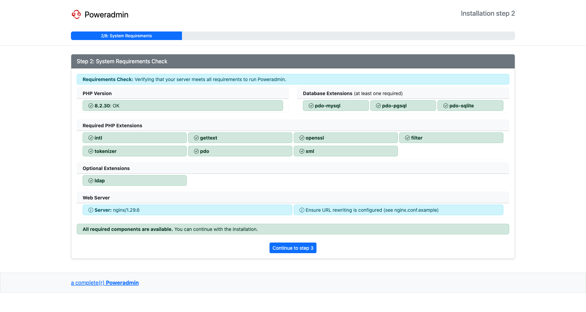
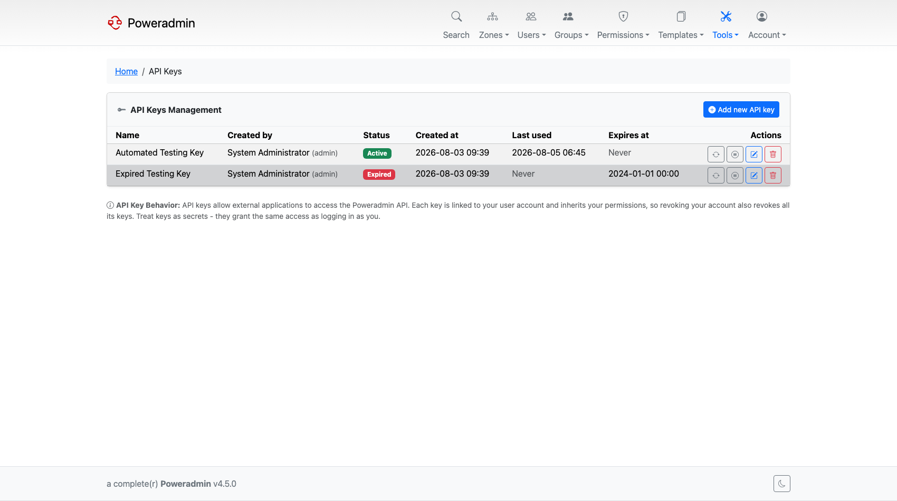
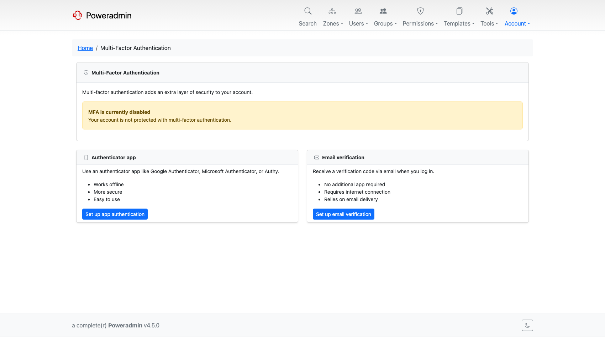
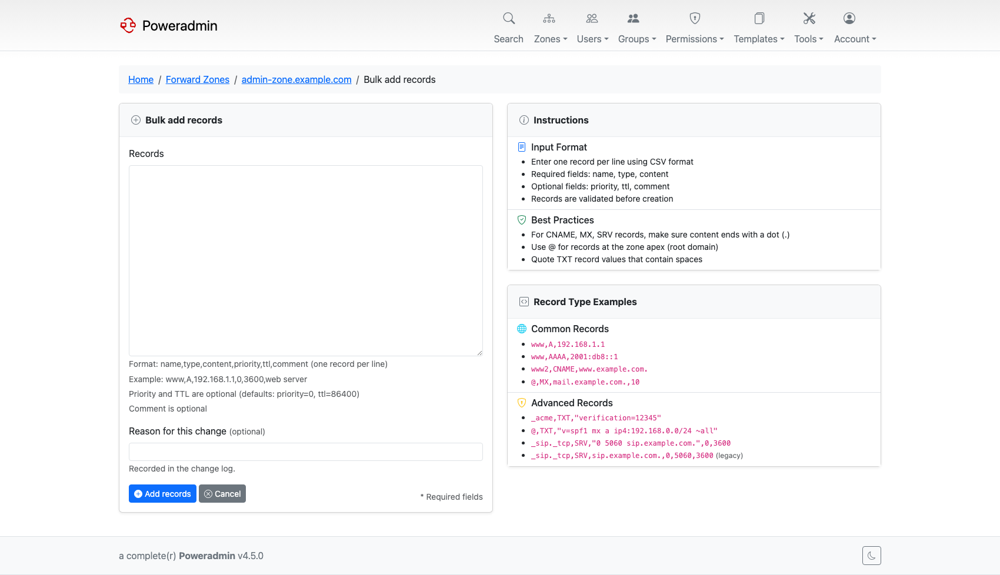
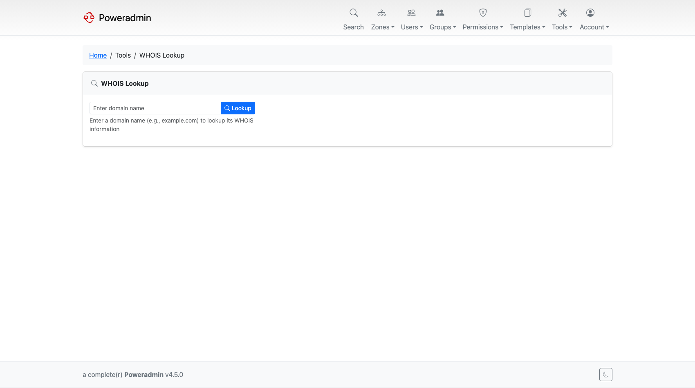

# What's New in 4.0.0

*Released 31 July 2025.*

4.0.0 was a rewrite. The configuration system, the installer, the interface and the internal
structure all changed, and a large amount of functionality arrived that 3.x never had: a REST
API, multi-factor authentication, bulk record operations, and lookup tools.

Because so much moved, this is the one upgrade in the 4.x line that needs real planning. Read
the [4.0.0 upgrade guide](../upgrading/v4.0.0.md) before starting.

## Highlights

### A new configuration system

Configuration moved from `inc/config.inc.php` to `config/settings.php`, a structured PHP
array grouped into sections (`dns`, `interface`, `security`, `database`, `logging`, and so
on) instead of a flat list of constants. A `config/migrate-config.php` helper converts an
existing 3.x file.

See [Basic Configuration](../configuration/basic.md) and
[Legacy Configuration](../configuration/legacy-configuration.md).

### A guided installer

The installer checks PHP extensions and permissions before it writes anything, and walks
through language, database, nameservers and the limited-rights database user in eight steps.

See [Web Installer Wizard](../installation/wizard.md).

### REST API with API keys

Poweradmin became scriptable. Zones, records, users and permission templates are all
reachable over HTTP, authenticated with per-key credentials that can be issued, regenerated
and revoked individually, and browsable through an OpenAPI document.

See [API Overview](../api/overview.md) and [API Configuration](../configuration/api.md).

> **Note:** The API introduced here was v1. It was superseded by v2 in 4.1.0 and removed in
> 4.5.0. New integrations should use v2.

### Multi-factor authentication and account protection

A full set of login defences arrived together:

- **MFA** with authenticator apps (TOTP), email codes, and recovery codes.
- **Self-service password reset** over email, with token lifetimes and rate limiting.
- **Account lockout** after repeated failures, tracked per account and per IP, with allow
  and deny lists.
- **Password policies** for length and character classes.
- **Google reCAPTCHA** v2 or v3 on the login form.

See [Multi-Factor Authentication](../user-guide/mfa.md),
[Password Policies](../configuration/password-policies.md) and
[Security Policies](../configuration/security-policies.md).

### Bulk record operations

Working with a zone stopped being one record at a time:

- **Bulk record add** enters many records in a single form.
- **Batch PTR creation** builds reverse records for a whole IP range.
- **Bulk delete** removes several records at once.
- **CSV export** dumps a zone's records.

See [Bulk and Batch Operations](../user-guide/bulk-operations.md) and
[Reverse DNS](../user-guide/reverse-dns.md).

### WHOIS and RDAP lookups

Registration data for a domain without leaving the application, over the classic WHOIS
protocol or over RDAP, with configurable servers and timeouts.

See [WHOIS Configuration](../configuration/whois.md) and
[RDAP Configuration](../configuration/rdap.md).

### A themed, responsive interface

A card-based dashboard, a Bootstrap layout that works on small screens, light and dark
styles, and a theme system that lets you point Poweradmin at your own templates.

See [Themes](../configuration/ui/themes.md) and [Layout](../configuration/ui/layout.md).

### A modern Docker image

The container moved to FrankenPHP and gained a hybrid configuration system, so the same image
can be driven from a settings file, from environment variables, or from Docker secrets.

See [Docker Installation](../installation/docker.md).

## Also in this release

| Feature | What it does | Where |
|---|---|---|
| Separate reverse zone list | Reverse zones get their own paginated page instead of being mixed into the zone list | [Reverse DNS](../user-guide/reverse-dns.md) |
| Zones-per-template page | See every zone using a template, and unlink zones from it | [DNS Templates](../user-guide/dns-templates.md) |
| Editable supermasters | Supermasters can be edited, not just added and deleted | [Users and Roles](../user-guide/users-roles.md) |
| User agreements | Force users to accept a versioned agreement, with an audit trail | [User Agreements](../configuration/user-agreements.md) |
| User preferences | Per-user display settings stored in the database | [Basic Configuration](../configuration/basic.md) |
| Configurable record types | Restrict which record types appear, separately for forward and reverse zones | [Record Type Customization](../configuration/record-types.md) |
| Duplicate PTR prevention | `dns.prevent_duplicate_ptr` stops several PTRs pointing at one address | [DNS Settings](../configuration/dns-settings.md) |
| Reverse zone sorting | Natural or hierarchical ordering, plus hostname-only display | [UI Overview](../configuration/ui/overview.md) |
| Database consistency checks | An admin page that scans for orphaned and inconsistent DNS data | [Maintenance](../maintenance/index.md) |
| PowerDNS status page | Server health and statistics from inside Poweradmin | [PowerDNS API](../configuration/powerdns-api.md) |
| Email template previews | Preview transactional emails in HTML and plain text, light and dark | [Mail Configuration](../configuration/mail.md) |
| HTML email templates | Branded new-account, password-reset and MFA messages | [Mail Configuration](../configuration/mail.md) |

## Patch releases

| Release | Added |
|---------|-------|
| v4.0.1 | Support for a PowerDNS schema in a separate MySQL database |
| v4.0.3 | Basic Auth credentials for the PowerDNS metrics endpoint |
| v4.0.4 | Long TXT and DKIM records accepted; the 255-byte validation was removed |
| v4.0.5 | `interface.show_forward_zone_associations` on the reverse zone list; DNSSEC signing is no longer pre-selected when creating a zone; delete confirmations became CSRF-protected POST forms |
| v4.0.9 | The sign-zone button was separated from the zone edit form, so saving a zone can no longer sign it by accident |
| v4.0.10, v4.0.11 | Bug fixes and translation updates only |

## Next

- [Upgrade guide for 4.0.0](../upgrading/v4.0.0.md)
- [What's New in 4.1.0](v4.1.0.md)
- [Release notes on GitHub](https://github.com/poweradmin/poweradmin/releases/tag/v4.0.0)
