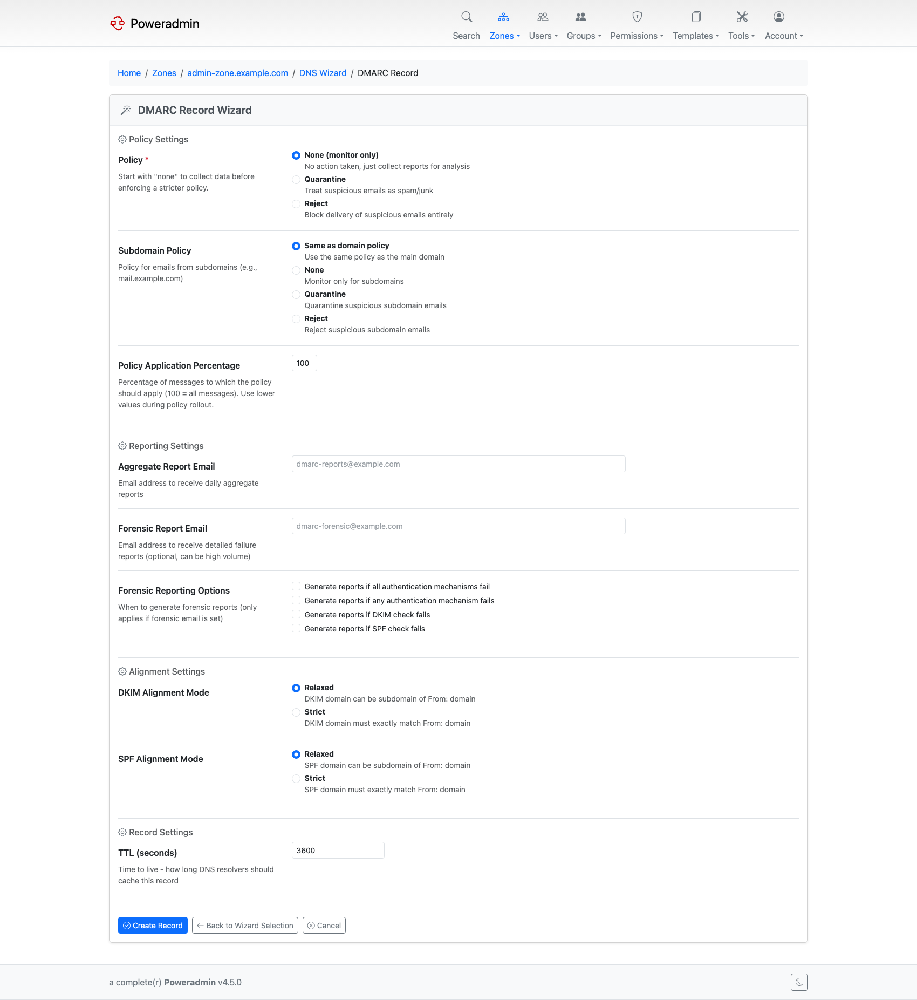
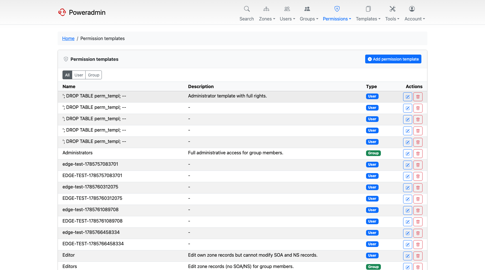

# What's New in 4.1.0

*Released 8 February 2026.*

4.1.0 is about who you are and where Poweradmin lives. Single sign-on through SAML and OIDC
arrived, URLs became readable, and Poweradmin learned to run under a subdirectory or behind a
reverse proxy. Alongside that: guided wizards for the record types nobody remembers the
syntax for, and API v2.

## Highlights

### SAML 2.0 and OpenID Connect single sign-on

Users can log in through an identity provider instead of a local password. Both protocols
support automatic user provisioning on first login and mapping IdP groups onto Poweradmin
permission templates.

OIDC ships with presets for Azure AD, Google, Keycloak, Okta, Authentik and Auth0, plus a
generic provider for anything else. SAML covers Azure AD, Okta, Auth0, Keycloak and generic
IdPs, and publishes its own SP metadata endpoint.

A new `auth_method` column records how each account authenticates, so editing an SSO user in
the web UI no longer resets them to password login.

See [OIDC Authentication](../configuration/oidc.md) and
[SAML Authentication](../configuration/saml.md).

### Clean URLs

Symfony Routing replaced the old `index.php?page=...` scheme with readable paths like
`/zones/forward` and `/users/5/edit`, across roughly 140 named routes.

Two settings came with it, and both matter for anything other than a simple root install:

- `interface.base_url_prefix` lets Poweradmin live under a subdirectory.
- `interface.application_url` gives it the public base URL, so links in emails and SSO
  redirects are correct rather than guessed from the request.

See [Layout](../configuration/ui/layout.md) and
[Reverse Proxy](../installation/reverse-proxy.md).

### DNS record wizards

Guided forms for the record types with fiddly syntax: DMARC, SPF, DKIM, CAA, TLSA and SRV.
Each asks for the parts in plain terms and assembles the record.

See [DNS Wizards](../configuration/dns-wizards.md).

### API v2

A second API version with a consistent response envelope, RRset endpoints, a bulk record
endpoint, and per-endpoint permission validation. List payloads are nested under `data`
rather than returned bare, which is the difference that catches most v1 clients out.

See [API Overview](../api/overview.md) and [Endpoints](../api/endpoints.md).

### Permission overhaul

Deleting a zone stopped being implied by the right to edit it. Two new permissions,
`zone_delete_own` and `zone_delete_others`, split it out, and existing editors were granted
them automatically on upgrade so nothing broke.

Four preconfigured permission templates ship with the release, covering the roles most
installations end up building by hand: Zone Manager, DNS Editor, Read Only and No Access.
A separate `api_manage_keys` permission lets non-administrators manage their own API keys.

See [Permissions](../user-guide/permissions.md).

### The modern theme and custom CSS

A second complete theme, `modern`, with a collapsible Bootstrap 5 sidebar instead of a top
navigation bar. Both themes can be restyled without forking by dropping `custom_light.css`
and `custom_dark.css` next to the theme.

See [Themes](../configuration/ui/themes.md) and [Custom CSS](../configuration/ui/custom-css.md).

## Also in this release

| Feature | What it does | Where |
|---|---|---|
| User avatars | Profile pictures from the OAuth provider or Gravatar | [Avatar System](../configuration/avatars.md) |
| Forgot username | Email-based username reminder, rate limited | [Username Recovery](../configuration/username-recovery.md) |
| User preferences page | A real page for a user's own display settings | [Basic Configuration](../configuration/basic.md) |
| LDAP session caching | `ldap.session_cache_timeout` avoids an LDAP round trip on every request | [LDAP Integration](../configuration/ldap.md) |
| Zone edit UI toggles | Show or hide the add-record form and the per-record edit and delete buttons | [UI Overview](../configuration/ui/overview.md) |
| Disabled records | Records can be flagged disabled rather than deleted | [Zone Management](../user-guide/zones.md) |
| DNSSEC pre-flight validation | The zone is checked for problems before signing, and at zone creation | [DNSSEC](../configuration/dnssec.md) |
| Custom TLD whitelist | `dns.custom_tlds` allows internal TLDs such as `dn42` or `home` in CNAME targets | [DNS Settings](../configuration/dns-settings.md) |
| RFC 2317 delegation | Correct handling of classless reverse delegation names | [Reverse DNS](../user-guide/reverse-dns.md) |
| Symfony Mailer | Replaces the hand-rolled SMTP client, and adds a `logger` transport for development | [Mail Configuration](../configuration/mail.md) |
| Zone access notifications | Email users when access to a zone is granted or revoked | [Mail Configuration](../configuration/mail.md) |
| Database SSL/TLS | `database.ssl` and friends for MySQL and PostgreSQL | [MySQL](../database/mysql-configuration.md), [PostgreSQL](../database/postgresql-configuration.md) |
| Immutable containers | Run the image read-only, configured entirely from the environment | [Docker Installation](../installation/docker.md) |
| Performance indexes | Nine indexes across the log, user, permission and template tables | [Database Schema](../database/schema.md) |

## Patch releases

| Release | Added |
|---------|-------|
| v4.1.1 | Guidance on the DNSSEC add-key page explaining Combined Signing Keys |
| v4.1.2 | WHOIS and RDAP buttons on zone list rows; `PA_LOGGING_*` environment variables |
| v4.1.3 | Non-root and rootless container execution |
| v4.1.4 | A search fix only |

## Next

- [Upgrade guide for 4.1.0](../upgrading/v4.1.0.md)
- [What's New in 4.2.0](v4.2.0.md)
- [Release notes on GitHub](https://github.com/poweradmin/poweradmin/releases/tag/v4.1.0)
