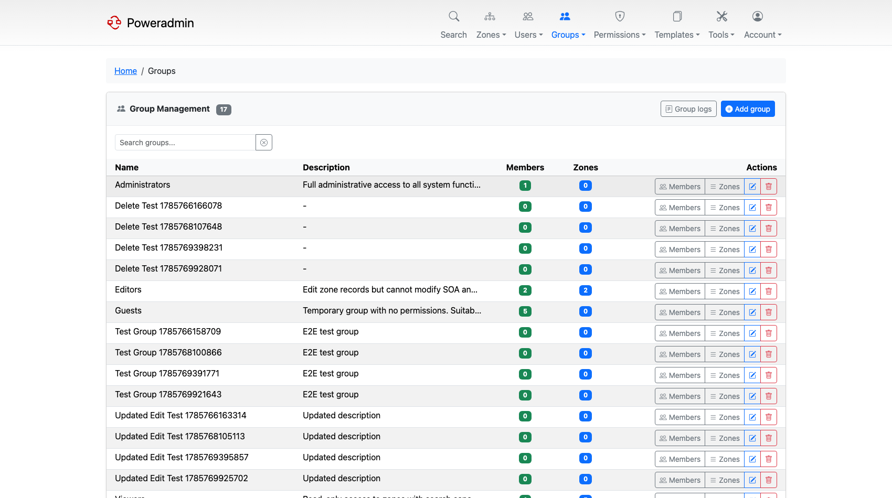
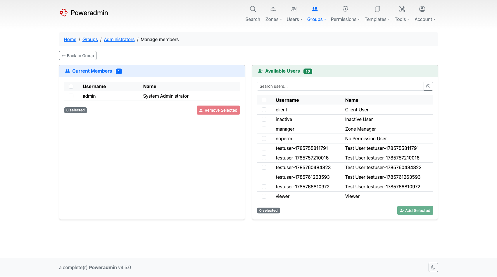
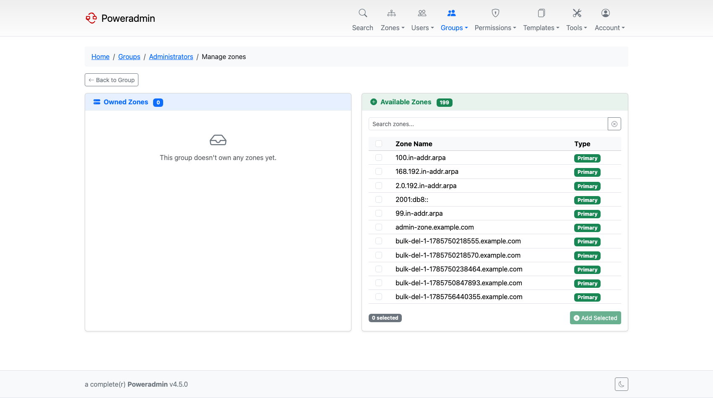
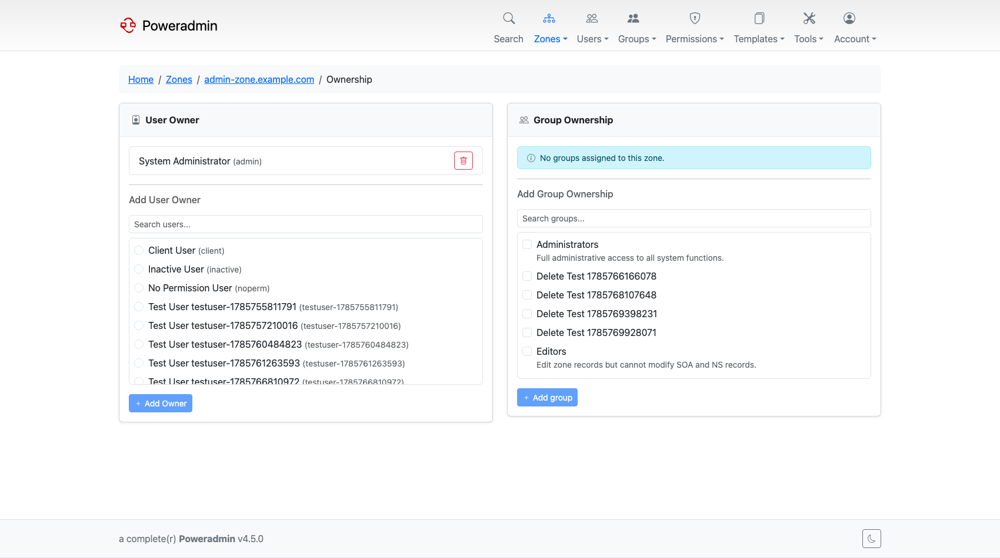
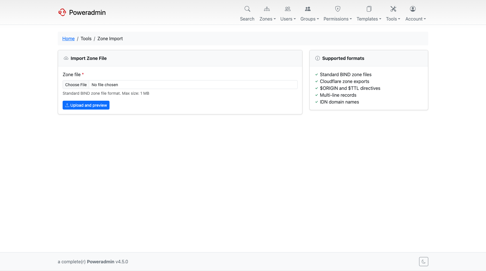

# What's New in 4.2.0

*Released 19 March 2026.*

4.2.0 answers a question that gets asked as soon as more than a handful of people share an
installation: how do you manage access by team rather than by individual? User groups, group
permission templates and group-based zone ownership are the answer. Alongside that, the
module system made several features optional, and BIND zone files became importable.

> **Note:** The generated release notes for 4.2.0 on GitHub are cumulative rather than
> incremental, because 4.1.0 and 4.2.0 were developed on parallel branches. Several features
> listed there - SAML, OIDC, avatars, forgot username, database SSL, the zone deletion
> permission split, DNS wizards, WHOIS and RDAP - actually shipped in
> [4.1.0](v4.1.0.md). This page lists only what 4.2.0 genuinely added.

## Highlights

### User groups

Groups are first-class. A group has its own permission template, its own members, and its own
set of zones. Members inherit the group's permissions on top of whatever they hold
individually.

Five group permission templates ship out of the box: Administrators, Zone Managers, Editors,
Viewers and Guests. The existing user templates were renamed at the same time, so DNS Editor
became Editor, Read Only became Viewer, and No Access became Guest.

See [User Groups](../user-guide/groups.md).

### Group-based zone ownership

A zone can be owned by a group instead of, or in addition to, individual users. The `owner`
column became nullable, so a zone can belong purely to a group and stay accessible when the
person who created it leaves.

A dedicated ownership page manages both kinds of owner for a zone.

See [Zone Management](../user-guide/zones.md) and [User Groups](../user-guide/groups.md).

### The module system

WHOIS, RDAP, DNS wizards, CSV export, email previews and zone import/export became modules.
Each can be enabled or disabled independently, and each can be restricted to administrators,
through a `modules` block in the configuration or through `PA_MODULE_*` environment variables
in Docker.

This is how you strip the interface down to what your users actually need.

See [Basic Configuration](../configuration/basic.md).

### BIND zone file import and export

Upload a zone file to create a zone, or merge it into an existing zone with a conflict
strategy that decides what happens when a record already exists. Zones can be exported back
out as BIND files.

See [Zone Import/Export](../configuration/zone-import-export.md).

### MFA enforcement

Multi-factor authentication stopped being purely opt-in. The `user_enforce_mfa` permission
and the `security.mfa.enforced` setting let you require it for particular users or for whole
groups, and the user list gained an MFA status column so you can see who has enrolled.

See [Multi-Factor Authentication](../user-guide/mfa.md).

### API v2 expansion

Three new endpoint families: zone owners (including batch assignment through a `user_ids`
array), zone templates with full CRUD over their records, and groups with their members and
zones.

See [Endpoints](../api/endpoints.md).

## Also in this release

| Feature | What it does | Where |
|---|---|---|
| Save zone as template | Turn an existing zone into a reusable template | [DNS Templates](../user-guide/dns-templates.md) |
| Per-record comments | Comments attach to a single record rather than the whole RRset | [Zone Management](../user-guide/zones.md) |
| Group activity log | An audit page for group creation, membership and zone changes | [Database Logging](../configuration/database-logging.md) |
| User list improvements | Pagination, group membership and MFA columns, username shown alongside full name | [Users and Roles](../user-guide/users-roles.md) |
| Collapsible sidebar | Sidebar sections can be collapsed in the modern theme | [Themes](../configuration/ui/themes.md) |
| Deprecated record type warnings | The record type selector flags types that are no longer recommended | [Record Type Customization](../configuration/record-types.md) |
| Two-column zone creation | The add-zone forms were reorganised | [Zone Management](../user-guide/zones.md) |
| IPv6 display shortening | Long IPv6 addresses and reverse zone names are abbreviated in listings | [Reverse DNS](../user-guide/reverse-dns.md) |
| Custom CA certificates | `TRUSTED_CA_FILE` mounts a CA bundle into the container | [Docker Installation](../installation/docker.md) |
| Five new locales | Indonesian, Korean, Swedish, Ukrainian and Vietnamese | [Basic Configuration](../configuration/basic.md) |

## Patch releases

| Release | Added |
|---------|-------|
| v4.2.1 | IDN and punycode conversion for record names and content; IPv6 batch PTR with correct nibble expansion; database logging of user creation, deletion and SSO logins; rootless containers |
| v4.2.2 | `TRUSTED_PROXIES` for real client IPs behind a proxy; the API Keys menu shown to holders of `api_manage_keys`; a `.za` WHOIS server |
| v4.2.3 | Forwarded-IP headers trusted only from private and loopback peers |
| v4.2.4 | OIDC and SAML URLs pinned to `interface.application_url`; SOA, NS and apex records pinned to the top of the record list; CSV export quotes values that spreadsheets would treat as formulas |
| v4.2.5 | A per-zone Logs button on the zone editor; large forms handled correctly when they exceed PHP's `max_input_vars` |

> **Warning:** v4.2.5 changed the zone edit form. If you maintain a forked theme, re-sync
> your `edit.html` against the shipped version. The new hidden marker fields are what tell
> the form which rows changed, and without them a zone save silently persists nothing.

## Next

- [Upgrade guide for 4.2.0](../upgrading/v4.2.0.md)
- [What's New in 4.3.0](v4.3.0.md)
- [Release notes on GitHub](https://github.com/poweradmin/poweradmin/releases/tag/v4.2.0)
