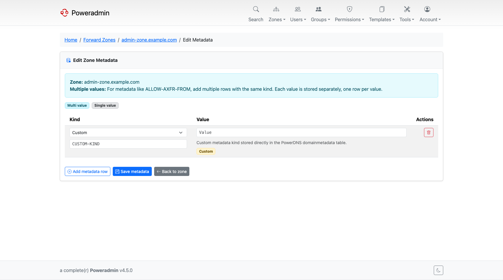
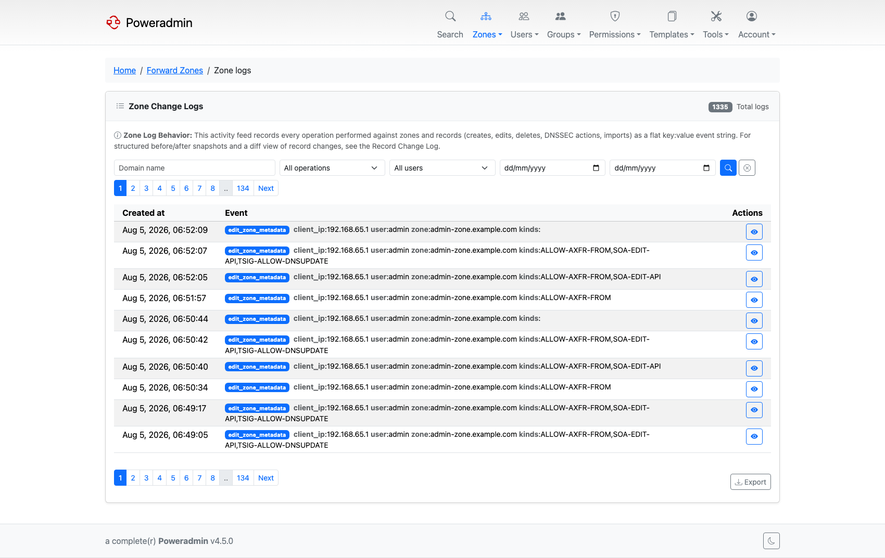
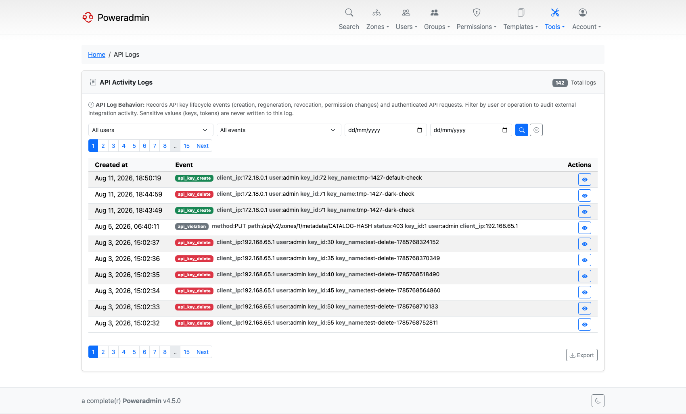

# What's New in 4.3.0

*Released 23 April 2026.*

4.3.0 removed a long-standing assumption: that Poweradmin has direct access to the PowerDNS
database. With API backend mode it can run entirely against the PowerDNS HTTP API, which
opens the door to managed and cloud-hosted PowerDNS. The release also added a proper editor
for zone metadata and rebuilt audit logging.

> **Warning:** `md5` and `md5salt` password hashing is no longer accepted for new hashes.
> Existing hashes still validate, so current users can still log in, but change
> `security.password_encryption` to `bcrypt` before upgrading.

## Highlights

### PowerDNS API backend mode

Set `dns.backend` to `api` and Poweradmin stops touching the PowerDNS database. Every DNS
read and write goes through the PowerDNS HTTP API instead.

```php
return [
    'dns' => [
        'backend' => 'api',
    ],
    'pdns_api' => [
        'url' => 'http://powerdns-server:8081',
        'key' => 'YOUR_API_KEY',
        'server_name' => 'localhost',
    ],
];
```

This helps when the PowerDNS database is on a network you cannot reach, when PowerDNS is a
managed service, or when you simply prefer API-first integration. Zone ownership, groups and
permissions stay in Poweradmin's own tables either way, so switching modes preserves them,
and you can switch back by setting `backend` to `sql`.

Two things to plan for. Every read and write becomes one or more HTTP calls rather than a
single SQL query, so pages that load many zones or records depend on PowerDNS response time.
And both `pdns_api.url` and `pdns_api.key` are required - Poweradmin refuses to start in API
mode without them.

See [PowerDNS API](../configuration/powerdns-api.md).

### Zone metadata editor

PowerDNS `domainmetadata` got a first-class editor. Known kinds come with inline guidance,
kinds with a fixed vocabulary offer a dropdown, multi-value kinds such as `ALLOW-AXFR-FROM`
are managed one row at a time, and custom kinds can be entered directly. Users without edit
rights get a read-only view.



The same data is available over the API at `/api/v2/zones/{id}/metadata`.

See [Zone Metadata](../user-guide/zones.md#zone-metadata).

### Audit logging overhaul

A new `AuditService` records structured events across user management, zone ownership,
templates, DNSSEC, MFA, API keys, SSO authentication, failed permission checks, and every API
v2 operation.

Every log page was rebuilt on top of it, with filters for operation type, user, group and
date range, CSV and JSON export, a details modal with one-click copy, and client IP and
authentication method visible throughout.



A dedicated **API Logs** page surfaces API key activity from the new `log_api` table.



See [Database Logging](../configuration/database-logging.md).

### SSO permission template mapping

Running behind an identity provider got more predictable:

- A `perm_templ_source` column records whether a user's permission template came from an
  administrator or from the IdP, so IdP changes can revoke stale SSO mappings without
  touching manually assigned ones.
- `default_permission_template` applies only to new SSO users, leaving existing users alone.
- New environment variables for SSO permission template and group mappings.

See [OIDC Authentication](../configuration/oidc.md) and
[SAML Authentication](../configuration/saml.md).

### API v1 deprecation

v1 was formally deprecated, with a sunset date announced through an HTTP header and the
OpenAPI document. It was removed in [4.5.0](v4.5.0.md).

See [API Overview](../api/overview.md).

## Also in this release

| Feature | What it does | Where |
|---|---|---|
| Access template visibility | `permissions.show_user_access_templates` and `show_group_access_templates` hide the per-user or per-group template pickers | [Permissions](../configuration/permissions.md) |
| Dashboard statistics toggle | `interface.show_dashboard_stats` shows or hides the zone, record, user and group counts | [UI Overview](../configuration/ui/overview.md) |
| Login language switcher | The language selector on the login page became a globe dropdown | [Basic Configuration](../configuration/basic.md) |
| Custom WHOIS and RDAP servers | `modules.whois.custom_servers` and the RDAP equivalent map TLDs to specific servers | [WHOIS](../configuration/whois.md), [RDAP](../configuration/rdap.md) |
| Logging restructure | Audit logging and diagnostic logging documented as the two independent systems they are | [Logging Setup](../configuration/logging.md) |
| Selective template updates | Template changes are applied selectively rather than replacing everything | [DNS Templates](../user-guide/dns-templates.md) |
| Disabled field in bulk import | Bulk record import honours the disabled column | [Bulk Operations](../user-guide/bulk-operations.md) |
| `PA_DNS_BACKEND` | Selects SQL or API mode in a container | [Docker Installation](../installation/docker.md) |

## Patch releases

| Release | Added |
|---------|-------|
| v4.3.1 | A clear error when `settings.defaults.php` is missing |
| v4.3.2 | In API mode: DNSSEC status on forward zones, owners and record counts sourced from PowerDNS, reverse zones synced on first visit; DNSSEC signing events logged in the zone activity feed |
| v4.3.3 | LUA template records applied to IPv4 reverse zones; consistency checks skipped in API mode; fresh containers auto-initialise the MySQL and PostgreSQL schema |
| v4.3.4 | A per-zone Logs button; `user_passwd_edit_others` required to change another user's password; duplicate email addresses rejected; reverse zones creatable from CIDR notation; a simpler dashboard for non-administrators; OIDC logout parameters and session regeneration after SSO login |

> **Warning:** v4.3.4 changed the zone edit form in the same way v4.2.5 did. Forked themes
> must re-sync `edit.html` or zone saves silently persist nothing.

## Next

- [Upgrade guide for 4.3.0](../upgrading/v4.3.0.md)
- [What's New in 4.4.0](v4.4.0.md)
- [Release notes on GitHub](https://github.com/poweradmin/poweradmin/releases/tag/v4.3.0)
