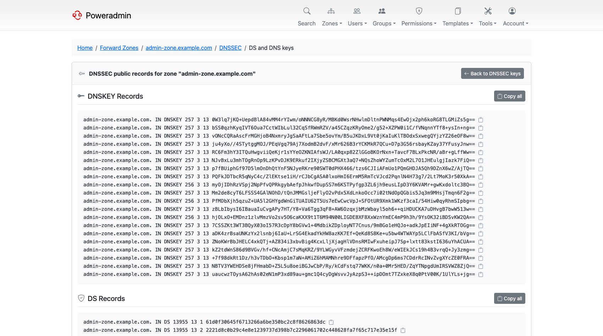
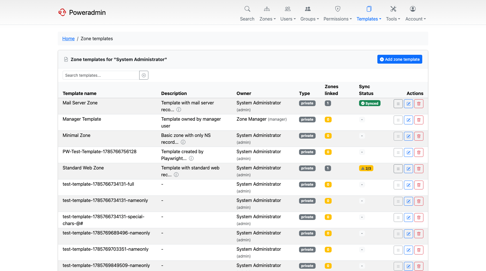

# What's New in 4.4.0

*Released 23 July 2026.*

Until 4.4.0, Poweradmin showed the same interface no matter which PowerDNS ran behind it. You
could pick a record type your server did not support, or set a metadata kind it ignored, and
the only feedback was a server error, or silence. 4.4.0 fixed that: when the PowerDNS API is
configured, Poweradmin asks the server what it is and adjusts itself.

> **Warning:** This release needs its database migration on all three backends. The zone
> template pages fail without it. Coming from 4.2.x, run the 4.3.0 migration first.

## Highlights

### PowerDNS version awareness

With the PowerDNS API configured, Poweradmin detects the server version and adapts:

- The dashboard shows the connected version.
- Record types the server does not support disappear from the selectors.
- Metadata kinds it does not know are shown with a "Requires X.Y+" hint instead of failing.
- Terminology follows the server: zone kinds are labelled Primary and Secondary on 4.5+,
  Producer and Consumer kinds appear on 4.7+, and Supermasters becomes Autoprimaries on 4.6+,
  which is when PowerDNS exposed an API for them (the concept was renamed in 4.5.0).
- On PowerDNS 5.0+ with the LMDB backend, the record list can show last-modified timestamps; the
  gsql backends do not populate them.

If the version cannot be detected, because the API is down or not configured, nothing is
hidden and you get the full interface as before. Direct-database installations are unaffected.

See [PowerDNS API](../configuration/powerdns-api.md).

### Views and networks

On PowerDNS 5.0, split-horizon DNS became manageable from the interface. Assign zone variants
to views, map client networks to those views, and resolvers get answers appropriate to where
they queried from.

> **Note:** Views are an LMDB-only PowerDNS feature and need `views=yes` in `pdns.conf`. The
> generic SQL backends do not implement them, whatever version they run.

See [Views and Networks](../user-guide/views-networks.md).

### DNSSEC key import and export

On PowerDNS 4.7+, an existing PEM private key can be imported into a zone, and active keys
can be exported back out. DS and DNSKEY records gained copy-to-clipboard buttons for pasting
into a registrar's form.

See [DNSSEC](../configuration/dnssec.md).

### Zone ownership modes

Poweradmin has always had two ownership models, users and groups, and every installation
carried both. `dns.zone_ownership_mode` lets you choose: `users_only`, `groups_only`, or
`both`. The default is `both`, which is the old behaviour. When you restrict the mode, the
interface and the APIs follow it.

In every mode the APIs now refuse to remove a zone's last owner, so zones can no longer be
left ownerless.

See [DNS Settings](../configuration/dns-settings.md).

### Default zone template

A superuser can mark one template as the default, from the template list or through
`dns.default_zone_template`. It is then pre-selected on the add-zone forms.

See [DNS Templates](../user-guide/dns-templates.md).

## Also in this release

| Feature | What it does | Where |
|---|---|---|
| Pinned record types | `dns.top_record_types` keeps your most-used types at the top of every record type selector | [Record Type Customization](../configuration/record-types.md) |
| Reverse zone TTL | `dns.ttl_reverse` gives PTR records a separate default TTL | [DNS Settings](../configuration/dns-settings.md) |
| Zone owner in PowerDNS account field | `dns.sync_zone_owner_to_account` writes the oldest owner's username into PowerDNS's `account` field for other tooling to read | [DNS Settings](../configuration/dns-settings.md) |
| Zone health markers | Disabled zones and zones missing a SOA are flagged in the zone list | [Zone Management](../user-guide/zones.md) |
| Group-ownership sorting | The zone list can be sorted by owning group | [Zone Management](../user-guide/zones.md) |
| Manual PowerDNS sync | In API mode, a button on the Forward Zones page refreshes the list from PowerDNS on demand | [PowerDNS API](../configuration/powerdns-api.md) |
| Zone owners can read audit logs | Owners see activity for their own zones; previously administrator-only | [Permissions](../user-guide/permissions.md) |
| IP-aware search | Paste a bare IP address and it searches record content and anchors reverse lookups to the right PTR zone | [Zone Management](../user-guide/zones.md) |
| IPv6 batch PTR matching mode | Batch PTR creation can restrict itself to hosts that already match | [Reverse DNS](../user-guide/reverse-dns.md) |
| 1:n SSO group mapping | One IdP group can map to several Poweradmin groups | [OIDC](../configuration/oidc.md), [SAML](../configuration/saml.md) |
| Read-only external identity fields | Full name and email are read-only for OIDC and SAML accounts; LDAP fields stay editable | [Users and Roles](../user-guide/users-roles.md) |
| Custom branding | `interface.favicon_path` and `interface.logo_path` point at your own files | [Layout](../configuration/ui/layout.md) |
| Per-user preferences | Hostname-only record display and a per-user timezone for MFA emails moved from global config to the account page | [UI Overview](../configuration/ui/overview.md) |
| PowerDNS API timeout | `pdns_api.timeout` (default 10s), GET requests retried once, API failures surfaced as an administrator banner | [PowerDNS API](../configuration/powerdns-api.md) |
| Accurate API status codes | Zone and user endpoints return 404, 409 and 500 where a blanket 400 was returned before | [API Overview](../api/overview.md) |
| Eight new locales | Croatian, Estonian, Finnish, Hungarian, Latvian, Romanian, Serbian and Slovak, bringing the total to 28 fully translated languages | [Basic Configuration](../configuration/basic.md) |

## Next

- [Upgrade guide for 4.4.0](../upgrading/v4.4.0.md)
- [What's New in 4.5.0](v4.5.0.md)
- [Release notes on GitHub](https://github.com/poweradmin/poweradmin/releases/tag/v4.4.0)
