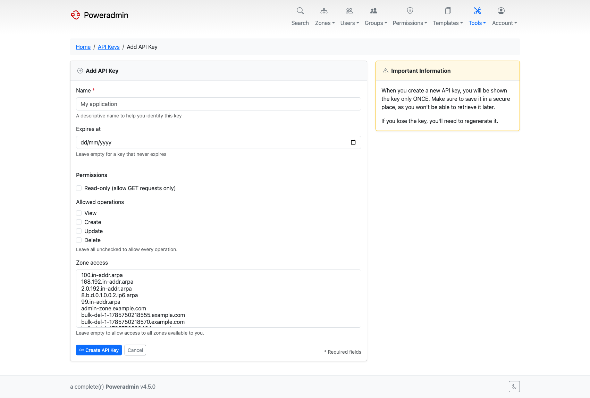
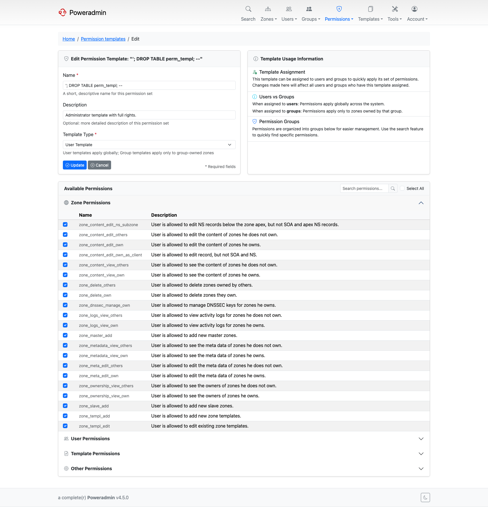
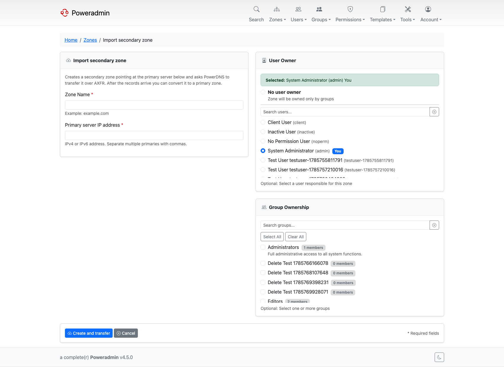
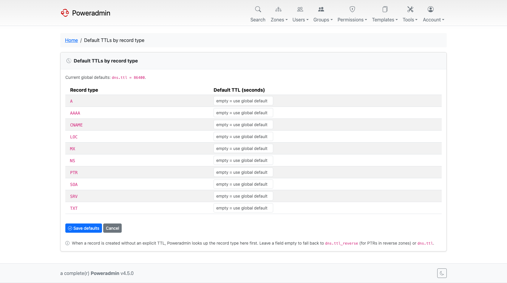

# What's New in 4.5.0

> **Warning:** Not yet released. 4.5.0 is in development on the `develop` branch. The current
> stable release is v4.4.0. This page describes what the release will contain.

4.5.0 is about knowing what happened and controlling who can do what. A structured change log
records the before and after of every record change. API keys stopped being all-or-nothing.
Ten new permissions break apart rights that previously required superuser. And API v1,
deprecated in 4.3.0, is gone.

## Highlights

### Record change log

Every record and zone change is stored with a full before and after snapshot, so the log
shows the actual diff rather than just the fact that something changed.

Bulk edits are grouped into a **changeset** carrying an optional reason, which can be made
mandatory with `logging.require_change_comment`. A cron-friendly script,
`addons/send_record_changes_email.php`, mails the same data as an HTML digest.

See [Record Change Log](../user-guide/record-change-log.md).

### Granular API keys

An API key no longer has to inherit everything its owner can do. Keys can be read-only,
restricted to a list of operations, and scoped to specific zones.

Restrictions only narrow access, never widen it, and existing keys stay unrestricted after
the upgrade until you edit them.

See [API Authentication](../api/authentication.md#restricting-what-a-key-can-do).

### Serial policy management

PowerDNS rewrites zone serials according to its `SOA-EDIT` and `SOA-EDIT-API` metadata.
Poweradmin can now manage both:

- Pick the policy per zone in the metadata editor, or preset it for new zones with
  `dns.soa_edit` and `dns.soa_edit_api`. The `*_options` settings restrict what appears in
  the selectors.
- With `interface.display_signed_serial_in_zone_list` and the API backend, zone lists show
  the serial PowerDNS actually serves alongside the stored one when they differ.
- Zone template SOA records understand the `[UNIXTIME]`, `[COUNTER]` and `[SERIAL]`
  placeholders.

See [DNS Settings](../configuration/dns-settings.md) and
[DNS Templates](../user-guide/dns-templates.md).

### Ten new permissions

Rights that previously meant handing out superuser can now be delegated:

| Permission | Grants |
|---|---|
| `zone_dnssec_manage_own` | DNSSEC key management for owned zones, without superuser |
| `zone_logs_view_own`, `zone_logs_view_others` | Reading the zone activity log |
| `user_logs_view`, `group_logs_view` | Reading the user and group activity logs |
| `zone_metadata_view_own`, `zone_metadata_view_others` | Seeing zone metadata, split out of `zone_content_view_*` |
| `zone_ownership_view_own`, `zone_ownership_view_others` | Seeing who owns a zone, split the same way |
| `zone_content_edit_ns_subzone` | Editing delegation NS records below the apex, while apex NS and SOA stay locked |

The four metadata and ownership view permissions are granted automatically on upgrade to any
template that already held the matching `zone_content_view_*`, so nothing a user could see
before disappears.

See [Permissions](../user-guide/permissions.md).

### API v1 is removed

Every `/api/v1/*` path answers `410 Gone` with a `Link` header pointing at v2. v1 was
deprecated in [4.3.0](v4.3.0.md) with a published sunset date. Migrate integrations to v2
before upgrading.

The v2 API gained DNSSEC endpoints (`GET` and `POST /api/v2/zones/{id}/dnssec`), a dynamic
DNS endpoint, and richer user objects that expose permission templates and groups.

See [API Overview](../api/overview.md).

### Secondary zone import over AXFR

Pull a zone from a live primary server, watch the transfer land, then convert it to a primary
zone. This is the migration path for taking over a domain hosted elsewhere.

See [Secondary Zone Import](../user-guide/secondary-zone-import.md).

### LDAP synchronisation and provisioning

LDAP caught up with the SSO providers. Full name and email can be synchronised from the
directory on login, users can be created on first login, and LDAP groups can be mapped onto
permission templates and Poweradmin groups.

See [LDAP Integration](../configuration/ldap.md).

### Per-record-type default TTLs

Administrators can set a default TTL for each record type on the **TTL defaults** page
(`/tools/record-type-defaults`), reached from the dashboard card of that name.
Every creation path honours it when the caller omits a TTL: the forms, batch PTR, the record
APIs, RRsets, bulk records and the DNS wizards.

See [Per-Record-Type Default TTLs](../user-guide/reverse-dns.md#per-record-type-default-ttls-450).

## Also in this release

| Feature | What it does | Where |
|---|---|---|
| Presigned zone awareness | Zones with `PRESIGNED` metadata are recognised and key operations are gated off | [DNSSEC](../configuration/dnssec.md) |
| Read-only replicated zones | Records of Secondary and Consumer zones are blocked from editing across UI, API and DDNS, with a Read-only badge | [Zone Management](../user-guide/zones.md) |
| Catalog membership | Zones can be added to and removed from a catalog, either from the Producer zone's Catalog Members page or from the Catalog selector on a member zone | [Zone Management](../user-guide/zones.md) |
| Consumer zone creation | Creating a catalog Consumer now asks for the primary it transfers from, and stops seeding the zone with an SOA and template records it should not have | [Zone Management](../user-guide/zones.md) |
| Zone overlap guard | `dns.parent_zone_ownership_check` blocks creating a zone that overlaps one owned by someone else | [DNS Settings](../configuration/dns-settings.md) |
| Pending NOTIFY indicator | The zone list marks zones whose serial PowerDNS has not acknowledged yet | [Zone Management](../user-guide/zones.md) |
| Views prerequisite detection | Views and Networks stay hidden unless the server can actually serve them, and name the missing prerequisite instead of failing on the first change | [Views and Networks](../user-guide/views-networks.md) |
| Changed-records-only submit | Large zone edits submit only modified rows, avoiding `max_input_vars` truncation | [Zone Management](../user-guide/zones.md) |
| Comment author and timestamp | Record comments show who wrote them and when | [Zone Management](../user-guide/zones.md) |
| Bulk owner assignment | The consistency page can assign an owner to all orphaned zones at once | [Maintenance](../maintenance/index.md) |
| Per-request API logging | `logging.api_request_logging` logs every public API request; 401 and 403 violations are logged regardless | [Database Logging](../configuration/database-logging.md) |
| MFA rate limiting | Wrong second-factor codes are throttled separately from password attempts | [Security Policies](../configuration/security-policies.md) |
| Skip MFA for external IdP | `security.mfa.skip_for_external_auth` trusts the identity provider's own MFA | [Security Policies](../configuration/security-policies.md) |
| IdP superuser provisioning off by default | An identity provider cannot grant `user_is_ueberuser` unless you opt in | [OIDC](../configuration/oidc.md), [SAML](../configuration/saml.md) |
| OIDC `form_post` response mode | Per-provider opt-in, HTTPS only | [OIDC Authentication](../configuration/oidc.md) |
| Trusted proxies | `security.trusted_proxies` declares which peers may set forwarded-IP headers | [Reverse Proxy](../installation/reverse-proxy.md) |
| Full-width layout | A per-user "full browser width" preference and a site-wide `interface.wide_layout` default | [Layout](../configuration/ui/layout.md) |
| Zone list column toggles | Owner, group and record-count columns can be hidden | [UI Overview](../configuration/ui/overview.md) |
| Admin-managed settings | An `app_settings` table layered above `settings.php`, groundwork for moving settings into the UI | [Admin-Managed Settings](../configuration/admin-managed-settings.md) |
| CSRF on every POST | All POST routes are validated unless explicitly exempted, internal API writes included | [Security Policies](../configuration/security-policies.md) |
| New record types | HHIT and BRID (DRIP, PowerDNS 5.1), RESINFO and WALLET validators; reserved TLDs recognised | [Record Type Customization](../configuration/record-types.md) |
| CAA issuer label corrected | The wizard's `;` option is now labelled "Disallow all CAs", matching what RFC 8659 says the value means | [DNS Wizards](../configuration/dns-wizards.md) |
| DDNS address family routing | Each address in a `myip` list updates the record type matching its family, and an update naming a family it has no valid address for is refused | [Dynamic DNS](../user-guide/ddns/overview.md) |
| Fifteen new locales | Arabic, Bulgarian, Bosnian, Danish, Greek, Persian, Irish, Hebrew, Hindi, Malay, Brazilian Portuguese, Slovenian, Albanian, Thai and Traditional Chinese, with right-to-left support, bringing the total to 43 | [Basic Configuration](../configuration/basic.md) |

## Next

- [Upgrade guide for 4.5.0](../upgrading/v4.5.0.md)
- [What's New in 4.4.0](v4.4.0.md)
