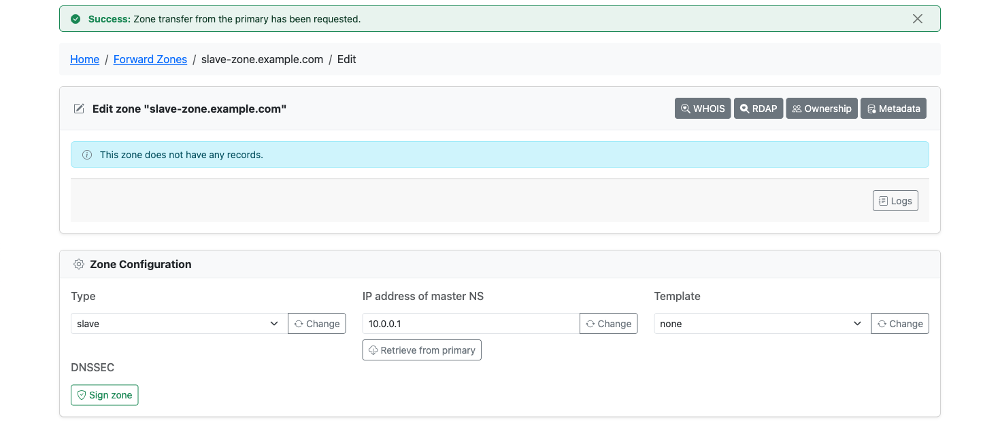
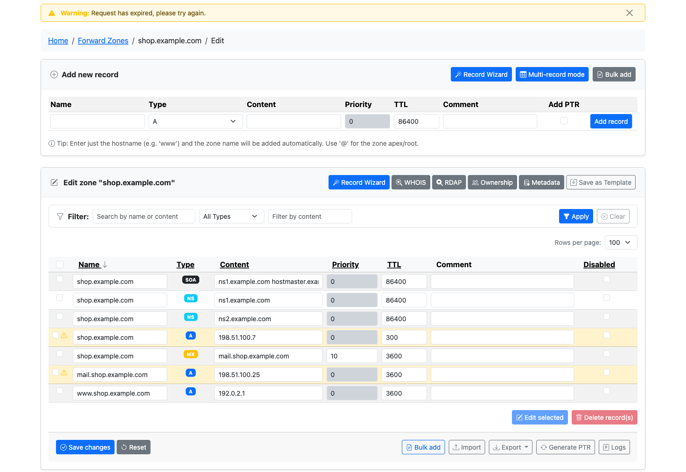

# What's New in 4.6.0

> **Warning:** In development. 4.6.0 is the `develop` branch and has no tag yet. This page
> lists what has landed so far and grows until the release is cut. The latest release is
> v4.4.1, and 4.3.x remains the stable line recommended for production.

4.6.0 so far brings an opt-in change approval workflow, a handful of operational knobs and
a large internal cleanup. Zone changes can be routed through a reviewer before they are
written, secondary zones can be pulled from their primary on demand, an installation can
stop bumping the SOA serial on saves that change nothing, and every setting from earlier
releases can now be set from a Docker environment variable. Underneath, the web forms and
the API were moved onto the same service layer, which closed a number of gaps where the two
behaved differently.

## Highlights

### Change approval workflow

With `approval.enabled` on, a user who holds a change request permission but cannot edit
a zone gets the normal editor, and the save button reads **Submit for approval**. The
changes are stored as a change request with a reason instead of being written. Reviewers -
users with a change approve permission and the edit permission for the zone, or
administrators - see a pending count in the **Zones** menu, open the request, read the
before and after of every row with a warning when the zone moved on since filing, and
approve or reject it with a comment. Approval applies the changes as the reviewer and bumps
the serial once; the record change log attributes them to the request and its requester.
Zone deletion can be requested the same way; an approved deletion keeps a zone file
snapshot that reviewers can download from the request. The zone lists carry a pending count
per zone, and a request whose apply failed can be tried again by a reviewer once the cause
is fixed. `approval.require_review_for_all` sends every change through review, editors and
administrators included.

Four permissions come with it (`zone_change_request_own`, `zone_change_request_others`,
`zone_change_approve_own`, `zone_change_approve_others`), none granted by default. Email to
reviewers and requesters is a separate switch, `notifications.change_request_enabled`, and
`notifications.change_request_soa_contact` also mails the zone's SOA contact. The
API v2 gains `/change-requests` endpoints to file, list, approve, reject and cancel, and
direct record writes to a reviewed zone answer 403 with a pointer to them. Bulk tools,
zone creation and dynamic DNS updates stay direct in this first version.

See [Change Requests](../user-guide/change-requests.md).

### Retrieve a secondary zone from its primary

The edit page of a Secondary zone offers **Retrieve from primary** next to the primary IP.
It asks PowerDNS to transfer the zone right away instead of waiting for the next SOA
refresh, and reports whether the request was accepted. The button appears only with the
PowerDNS API backend, because the SQL backend has no way to trigger a transfer, and it needs
the zone meta edit permission.

See [Zone Management](../user-guide/zones.md#read-only-zones).

### Optional serial bump on unchanged saves

Saving a zone with no record changes has always bumped the SOA serial, and still does by
default, because that is how operators force a NOTIFY. `dns.bump_serial_on_unchanged_save`
lets an installation opt out: with `false`, a zone save or single record edit that changes
nothing leaves the serial alone and says so. A save that does change a record bumps once, as
before. In Docker the setting is `PA_DNS_BUMP_SERIAL_ON_UNCHANGED_SAVE`.

See [DNS Settings](../configuration/dns-settings.md#serial-bump-on-unchanged-saves).

### Every setting reachable from Docker

Twelve settings from 4.3.0 and earlier had no environment variable, so a container had to
mount a `settings.php` to change them. They now have one each: the database charset, the
password policy's special-character set, the lockout IP whitelist and blacklist, the two
permission template visibility flags, the dashboard statistics toggle, the four avatar
settings and the pinned record types.

See [Docker](../installation/docker.md#key-environment-variables) and the full table in
[DOCKER.md](https://github.com/poweradmin/poweradmin/blob/develop/DOCKER.md).

### Stale zone saves keep your edits

When another user saved the zone first and the conflict strategy rejects your form, the
editor now re-renders with your submitted records and comment in place, marks the rows that
differ from what the zone holds, and lets you re-check and resubmit instead of retyping.
With the `last_writer_wins` strategy a stale form is saved as before.

See [Basic Configuration](../configuration/basic.md#miscellaneous-settings) for the strategies.

## Also in this release

| Change | What it does | Where |
|---|---|---|
| Zero TTL accepted in the API | The v2 record create, update, bulk and RRset endpoints accept `ttl: 0` (do not cache), as the web editor does; only negative values are refused. Integer fields such as `ttl` and `priority` reject fractional strings like `"0.5"` instead of truncating them | [API Overview](../api/overview.md) |
| `canonical_id` in the zone list | `GET /zones` returns `canonical_id` next to `id`, the identifier the other zone endpoints take, ahead of aligning the two | [API Endpoints](../api/endpoints.md) |
| Bulk actions checked before writing | An unknown `action` in `POST /zones/{id}/records/bulk` is refused with 400 before any operation is applied, and the add-record form refuses a blank content or type with a field-specific message | [API Endpoints](../api/endpoints.md) |
| Change requests in the API | `POST /zones/{id}/change-requests` files a request, `GET /change-requests` lists them, and `/change-requests/{id}/approve` and `/reject` decide; write endpoints on a reviewed zone answer 403 | [Change Requests](../user-guide/change-requests.md#api-v2) |
| Zone type change needs the target grant | Converting a zone into another kind requires the same permission as creating one of that kind: `zone_slave_add` for Secondary and Consumer, `zone_master_add` for the rest | [Permissions](../user-guide/permissions.md) |
| One permission rule for zone actions | A zone action is granted when any template the user holds, directly or through a group, grants it and the user owns the zone. The stricter hybrid rule that required the grant to come from an owning group is gone | [Permissions](../user-guide/permissions.md) |
| Primary zone over delegation records | A primary zone can be created where the parent only holds delegation records for it (#802) | [Zone Management](../user-guide/zones.md) |
| Unknown SOA-EDIT-API values rejected | The add-zone form refuses a serial policy value it does not know instead of silently dropping it | [DNS Settings](../configuration/dns-settings.md) |
| Record edit and comment in one request | On the API backend a record edit and its comment reach PowerDNS in a single call (#1556) | [PowerDNS API](../configuration/powerdns-api.md) |
| API user passwords follow the policy | Passwords set through the API are hashed with the configured algorithm and must satisfy the password policy, the same as the web form | [Password Policies](../configuration/password-policies.md) |
| API zone creation matches the web form | Zone names are converted to punycode, the third-level check applies, and a template the caller may not use is refused | [API Overview](../api/overview.md) |
| API records stored as punycode | Record names and content are normalised to punycode and duplicate records are refused, matching the web editor | [API Overview](../api/overview.md) |
| Signed zones stay consistent over the API | Record writes through the API rectify the zone, so DNSSEC ordering data is not left stale | [DNSSEC](../configuration/dnssec.md) |
| Last super admin protected | The last remaining superuser cannot be deleted, from the web or the API, and record comments are cleaned up when a zone is deleted | [Users and Roles](../user-guide/users-roles.md) |
| API events attributed to the key | Audit entries for API requests name the API principal, and the SAML logout entry keeps the acting user | [Database Logging](../configuration/database-logging.md) |
| Request validation rules enforced | Length, list and allowed-value rules on form fields are checked instead of being dropped | |
| Zero session timeout rejected | `interface.session_timeout = 0` is refused at startup instead of logging every user out on their next request | [Basic Configuration](../configuration/basic.md) |
| 768-bit DNSSEC key option removed | No algorithm accepts it, so the add-key form no longer offers it | [DNSSEC](../configuration/dnssec.md) |
| API-mode reverse zones listed correctly | With the API backend, reverse zones are listed under their canonical id | [PowerDNS API](../configuration/powerdns-api.md) |
| Zone record counts on signed zones | The zone list and the internal zone endpoint report the true record count on DNSSEC-signed zones, and empty non-terminal rows are not counted anywhere. The internal endpoint also returns `master`, `account`, `owner` and `record_count` | |
| Turning off LDAP needs a password | `PUT /api/v2/users/{id}` with `use_ldap=false` must carry a `password`, since the LDAP placeholder cannot be kept as a login password | [API Overview](../api/overview.md) |
| CNAME checks ignore case | CNAME uniqueness and NS/MX target checks compare names case-insensitively on every database, and the internal validation endpoint validates through the configured backend in API mode | |
| Basic auth challenge on 401 | With `api.basic_auth_enabled` on, an unauthenticated API request answers with `WWW-Authenticate: Basic realm="..."` using `api.basic_auth_realm` | [API Configuration](../configuration/api.md) |
| `dnssec.debug` removed | The setting and `PA_DNSSEC_DEBUG` had no effect since the pdnsutil provider was dropped | [DNSSEC](../configuration/dnssec.md) |
| Internals reorganised | The code under `lib/` now follows its layers strictly: domain and application services are grouped by concern, their interfaces live in `Domain/Port`, web controllers are grouped by route, `BaseController` moved to `Application\Controller`, every entry point boots through one `Kernel`, and modules reach core services through a `ModuleServices` contract. Behaviour is unchanged; addon code that imports these classes needs its `use` lines updated | [Development Setup](../contributing/development.md#project-structure) |
| `bin/poweradmin` console | A first command-line entry point with `zone:list`, running the same use cases as the web interface without a session (`bin/poweradmin --as-user=1 zone:list`) | [Development Setup](../contributing/development.md#project-structure) |
| Owner picker follows the create rule | The add-zone forms list other users only for callers who may assign them, and an owner id that does not exist is refused instead of creating a zone nobody owns (#1558) | [Zone Management](../user-guide/zones.md#zone-ownership) |

## Next

- [What's New in 4.5.0](v4.5.0.md)
